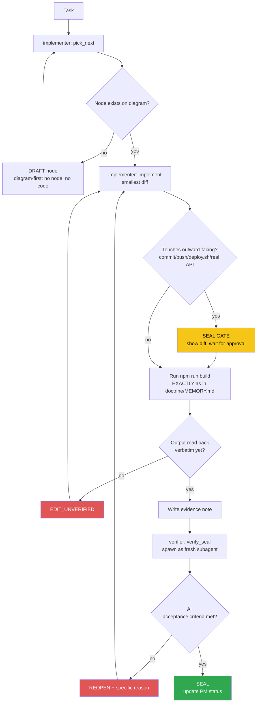

<!-- Diagram: dev-loop -->
<!-- Dev loop: plan - implement - verify - seal -->
DNA: 'smallest_diff / edit_x_read_back_proof_x_independent_verdict'
Auth: 65537 | Version: 1.0.0
Law: LAI-13 - monotonic ratchet (PENDING -> IN_PROGRESS -> SEALED, never demote)

> Every change to the code repo enters here and exits as SEALED or
> REOPENED — no state in between.

> **Language note:** rows below dated before 2026-08-22 are written in
> Vietnamese (historical record, kept verbatim per the no-rewrite evidence
> rule). New rows from 2026-08-22 onward are written in English — see
> `NORTHSTAR.md` → Language & token policy.

## PM status
> Older SEALED nodes (2026-08-20 through 2026-08-25, 41 nodes; then a 2nd
> pass 2026-08-30 covering 7 more nodes dated 2026-08-29; then a 3rd pass
> 2026-09-03 covering every remaining full-content SEALED row, 14 nodes
> dated 2026-08-30 through 2026-09-02; then a 4th pass 2026-09-06 covering
> the 2 nodes dated 2026-09-05, `issue-63-account-settings-page` and
> `issue-61-forgot-reset-password`) moved to
> `haven/diagrams/dev-loop-archive.md` to keep this file small — every
> worker session reads this file in full. Nothing deleted: the archive
> has each row's full original text verbatim. The compact rows below
> point to it; open the archive only when you need the full story
> behind an old node. `pick_next` only needs non-archived rows. Run
> `/hub-tokens` periodically — if this file flags >15KB again, repeat
> this archiving pass for nodes older than the current work session.
> [note, 3rd pass] after this pass the active file is still ~17.8KB, over
> the 15KB threshold — every remaining SEALED row is now a pointer, the
> only full-content rows left are the 5 non-SEALED nodes (never
> archived per LAI-13/the rule above); further reduction isn't possible
> through archiving alone.
> [note, 4th pass] same limitation as the 3rd pass's note — the 5
> non-SEALED nodes are the floor, every SEALED row is already a pointer
> again after this pass.

| Node | State | Notes |
|---|---|---|
| `dashboard-visit-list-page` | SEALED | 2026-09-02 — archived, see `haven/diagrams/dev-loop-archive.md`. Evidence: `evidence/implementer/2026-09-02-dashboard-visit-list-page.md`. |
| `dashboard-visit-count-integration` | SEALED | 2026-09-02 — archived, see `haven/diagrams/dev-loop-archive.md`. Evidence: `evidence/implementer/2026-09-02-dashboard-visit-count-integration.md`. |
| `release-skill-branch-cleanup` | SEALED | 2026-09-01 — archived, see `haven/diagrams/dev-loop-archive.md`. Evidence: `evidence/implementer/2026-09-01-release-skill-branch-cleanup.md`. |
| `ci-trigger-staging` | SEALED | 2026-09-01 — archived, see `haven/diagrams/dev-loop-archive.md`. Evidence: `evidence/implementer/2026-09-01-ci-trigger-staging.md`. |
| `docs-readme-issue7-close-sync` | SEALED | 2026-09-01 — archived, see `haven/diagrams/dev-loop-archive.md`. Evidence: `evidence/implementer/2026-09-01-docs-readme-issue7-close-sync.md`. |
| `issue-7-coverage-tooling` | SEALED | 2026-09-01 — archived, see `haven/diagrams/dev-loop-archive.md`. Evidence: `evidence/implementer/2026-09-01-issue-7-coverage-tooling.md`. |
| `issue-7-useinittable-composable-tests` | SEALED | 2026-09-01 — archived, see `haven/diagrams/dev-loop-archive.md`. Evidence: `evidence/implementer/2026-09-01-issue-7-useinittable-composable-tests.md`. |
| `issue-7-usehelper-composable-tests` | SEALED | 2026-09-01 — archived, see `haven/diagrams/dev-loop-archive.md`. Evidence: `evidence/implementer/2026-09-01-issue-7-usehelper-composable-tests.md`. |
| `readme-env-example-cleanup` | SEALED | 2026-08-31 — archived, see `haven/diagrams/dev-loop-archive.md`. Evidence: `evidence/implementer/2026-08-31-readme-env-example-cleanup.md`. |
| `rename-repo-refs-cleanup` | SEALED | 2026-08-31 — archived, see `haven/diagrams/dev-loop-archive.md`. Evidence: `evidence/implementer/2026-08-31-rename-repo-refs-cleanup.md`. |
| `github-pages-base-path-rename` | SEALED | 2026-08-31 — archived, see `haven/diagrams/dev-loop-archive.md`. Evidence: `evidence/implementer/2026-08-31-github-pages-base-path-rename.md`. |
| `agent-hub-token-cleanup-20260830` | SEALED | 2026-08-30 — archived, see `haven/diagrams/dev-loop-archive.md`. Evidence: `evidence/implementer/2026-08-30-agent-hub-token-cleanup.md`. |
| `issue-63-account-settings-page` | SEALED | 2026-09-05 — archived, see `haven/diagrams/dev-loop-archive.md`. Evidence: `evidence/implementer/2026-09-05-issue-63-account-settings-page.md`. |
| `issue-61-forgot-reset-password` | SEALED | 2026-09-05 — archived, see `haven/diagrams/dev-loop-archive.md`. Evidence: `evidence/implementer/2026-09-05-issue-61-forgot-reset-password.md`. |
| `agent-hub-archive-pass-4` | SEALED | Operator: "archive đi" (after `/hub-tokens` flagged this file at 20,933B, >15KB threshold, 2 full SEALED entries not yet archived). Moved `issue-63-account-settings-page` and `issue-61-forgot-reset-password` (both dated 2026-09-05) to `dev-loop-archive.md` verbatim, replaced with compact pointer rows here. Chore, no `src/` code touched. Verifier independently confirmed (fresh subagent): branch `chore/archive-diagram-pass-4` off `staging`; `git diff staging --stat` touches only the 2 diagram `.md` files; both archived rows byte-for-byte identical to `git show staging:...` via `diff`; active file `wc -c` = 19,425B; `grep` counts 64 SEALED = 64 archived-pointer; `npm run build` re-run green (`✓ built in 5.28s`, same pre-existing warning only). Evidence: `evidence/implementer/2026-09-06-agent-hub-archive-pass-4.md`, `evidence/verifier/2026-09-06-agent-hub-archive-pass-4-seal.md`. |
| `gitignore-worker-runs-log-fix` | SEALED | Operator noticed (via verifier's side-note on `agent-hub-archive-pass-4`) that `agent-hub/evidence/worker-runs.log` is silently gitignored. Confirmed directly: `.gitignore:3` has a blanket `*.log` (boilerplate from repo init; lines 4-8 already cover the real `npm-debug.log*`/`yarn-debug.log*`/`pnpm-debug.log*`/`lerna-debug.log*` cases specifically), and `worker-runs.log` is the ONLY `.log` file anywhere in this repo outside `node_modules`/`dist` (`find . -name "*.log"` confirmed) — so it's the sole thing that blanket rule actually catches. `git log -- agent-hub/evidence/worker-runs.log` was empty — the file has NEVER been committed, despite `doctrine/MEMORY.md`'s invariant "evidence/ is committed; 'bad' notes are kept too." Fix: remove the redundant/overly-broad `*.log` line (the 5 specific patterns below it already cover intended debug-log noise), force-add the existing 3-line log so its history starts now. Evidence: `evidence/implementer/2026-09-06-gitignore-worker-runs-log-fix.md`. Verifier independently confirmed (fresh subagent): branch `fix/gitignore-worker-runs-log` off `staging`; `git diff staging -- .gitignore` shows only the `*.log` line removed, nothing else touched; `git check-ignore -v agent-hub/evidence/worker-runs.log` re-run → exit 1 (no longer ignored); `find . -name "*.log" -not -path "*/node_modules/*" -not -path "*/dist/*"` re-run → only `agent-hub/evidence/worker-runs.log`; `git log staging --oneline -- agent-hub/evidence/worker-runs.log` empty, confirming file was never committed before this branch; file's 3 lines unchanged. `npm run build` re-run green (`✓ built in 5.43s`, same pre-existing chunk-size warning only), `npm run lint` re-run clean (exit 0, no output). Evidence: `evidence/verifier/2026-09-06-gitignore-worker-runs-log-fix-seal.md`. |
| `issue-60-duplicate-item` | SEALED | [issue #60](https://github.com/datvt243/resume-vuejs-website/issues/60) — via `/todo`. "Nhân bản" (duplicate) button on education/experience/project/award/certificate/reference items — copy all fields except `_id`, pre-fill the create form, let user edit before saving as new. Real trap found in `VeeForm.vue`'s `watch(() => props.document, ...)`: setting `document._id` falsy triggers an internal `reset()` that wipes whatever was just `setValues()`'d — naively clearing `_id` for a duplicate would silently blank the pre-filled form. Worked around WITHOUT touching the shared `VeeForm.vue` (avoids blast-radius across every form in the app): keep `document._id` truthy (the ORIGINAL doc's id) while the duplicate modal is open, track a separate `isDuplicating` ref for title/submit-text, then null out `_id` on the values right before `updateDoc` so it POSTs (create) not PUTs (update). Evidence: `evidence/implementer/2026-09-06-issue-60-duplicate-item.md`. Verifier independently confirmed (fresh subagent): branch `feature/issue-60-duplicate-item` off `staging` (not main/staging); read all 9 touched files' real diffs (`git diff staging -- <file>`), confirmed `isDuplicating` ref, `showModalDuplicateDoc` keeping `_id` truthy, `handleUpdate` nulling `_id` when duplicating, 3-way title/submit-text logic (checked in the correct precedence: `isDuplicating` before `_id`), and consistent emit/button wiring in all 3 `Item.vue` + inline buttons/Dropdown entry in the other 3 pages; independently read `VeeForm.vue` verbatim and confirmed the exact `watch(() => props.document, doc => {...; if (!doc._id) { reset() }}, { deep: true })` load-bearing claim, plus `defaultId` used by education/certificate/experience/reference/project models and the inline `_id` field in `award.model.ts`; confirmed `PageAward.vue`'s `document.school`→`document.name` incidental fix is correct against `award.model.ts` (field is `name`, no `school` field exists); re-ran `npm run build` (`✓ built in 6.03s`, same hashes) and `npm run lint` (exit 0, no output) myself, matching the note; re-ran `npm run test -- --run` myself — identical signature (`Test Files 1 failed | 9 passed (10)`, `Tests 2 failed | 74 passed (76)`, both failures named `BUG (real, verified...)` inside `VeeForm.spec.ts`); confirmed `git diff staging --stat -- src/components/veevalidate/` is empty on this branch, which logically guarantees the failures pre-date this diff (untouched code). All 6 forbidden states clear; diagram edit is a pure append (AppendOnly). Evidence: `evidence/verifier/2026-09-06-issue-60-duplicate-item-seal.md`. |
| `issue-59-profile-completion` | SEALED | [issue #59](https://github.com/datvt243/resume-vuejs-website/issues/59) — via `/todo`. Real % completion for `PageHome.vue`'s "Profile Information" section, which already had a UI shell + hardcoded `profileCompletion = 72` explicitly marked "số liệu mẫu" (sample data, feature never built). New `useProfileCompletion.ts`: introspects each model's `valid: yup => ...` via `schema.describe().tests` to find real `required` fields (matches issue's own suggested approach), compares against real `candidateStore` data. 8 sections weighted equally (not by raw required-field count) — 2 object sections (Thông tin cơ bản, Thông tin chung) vs 6 list sections (education/experience/project/award/certificate/reference, "complete" = has ≥1 record) — to avoid the object sections dominating the % just from having more required fields, matching the issue's own missing-SECTION framing ("chưa có Reference, chưa điền Certificate"). **Process note (not a code defect):** implementer initially wrote this diff directly on `staging` before branching — caught before any commit, recovered via `git stash` + branch + `stash pop`, no history damage, disclosed here per NORTHSTAR "no session state exception." Evidence: `evidence/implementer/2026-09-06-issue-59-profile-completion.md`. Verifier independently confirmed (fresh subagent): branch `feature/issue-59-profile-completion` off `staging`, current HEAD; confirmed via `git fsck --unreachable` archaeology that the `BranchBeforeCode` slip left a dangling `git stash` merge-commit ("On staging: issue-59 profile-completion diff, mistakenly written on staging", parent = `staging`'s tip at the time) that is NOT reachable from `staging`, and `staging`'s tip byte-for-byte equals `origin/staging`'s tip — zero committed history damage, so this is judged NOT a `MAIN_EDIT` (that forbidden state requires committed changes on a protected branch; nothing was ever committed to `staging`) and does not block SEAL. Independently re-ran the real `node -e` yup check (`required().describe().tests` → `[{name:'required'}]`, plain `.describe().tests` → `[]`) confirming `isRequiredField`'s introspection claim; read `information.model.ts`/`generalInformation.model.ts` directly and confirmed `careerGoal` (`valid: yup => yup.string()`) and `introduction` (`defaultDescription(...)` with no `required:true`, defaults to `yup.string().trim()`) both genuinely lack `.required()`; read `PageHome.vue` in full and confirmed the old hardcoded `72`/"số liệu mẫu" text is gone, replaced by `useProfileCompletion()` + a real `missingSections` list; re-ran `npx vitest run src/composables/useProfileCompletion.spec.ts` (8/8 pass), `npm run build` (`✓ built in 5.22s`, same chunk names/sizes), `npm run lint` (exit 0, no output), and `npm run test -- --run` (`Test Files 1 failed | 10 passed (11)`, `Tests 3 failed | 81 passed (84)`, identical signature to the note) myself; confirmed `git diff staging --stat -- src/components/veevalidate/` is empty on this branch, so the 3 failures pre-date this diff. All 6 forbidden states clear; diagram edit is a pure in-place row update (`AppendOnly`). Evidence: `evidence/verifier/2026-09-06-issue-59-profile-completion-seal.md`. |
| `issue-58-avatar-upload` | SEALED | [issue #58](https://github.com/datvt243/resume-vuejs-website/issues/58) — via `/todo`. Backend investigated directly (`resume-nodejs-api`): zero `avatar` references anywhere in `src/`, and the only existing image-upload middleware (`uploadImagesMiddleware`, issue #72) is scoped to project/certificate/award `images[]` sub-documents via a `/:id/images` route — architecturally can't serve a single candidate-level avatar (no record id, wrong shape). Frontend claim in the issue ("field type 'file' support đã có sẵn trong modelItem") is only half true: the TS `inputType` union lists `'file'`, but `VeeForm.vue`'s `objComponent` renderer map has NO entry for it — no `FrmFile.vue` exists. Scope narrowed to avoid 2 real risks: (1) building a full `FrmFile.vue` + wiring into the real `informationModel`/`updateDoc` payload would let an unpersisted `avatar` value leak into the PUT/PATCH body, which the backend's `Joi.object()` (`unknown(false)` by default, same fact established in `issue-63`) would reject wholesale — breaking basic-info save entirely; (2) backend has nowhere to persist it anyway. Implemented as a standalone, non-`VeeForm` avatar picker + local preview block in `PageInformation.vue`, mirroring the EXISTING accepted pattern in this exact codebase — `PageHome.vue`'s "Đính kèm CV" section already does local-file-select + disclosed-not-yet-saved for a different field. No new model field, no `VeeForm.vue` change, no submitted-payload risk. Evidence: `evidence/implementer/2026-09-06-issue-58-avatar-upload.md`. Verifier independently confirmed (fresh subagent): branch `feature/issue-58-avatar-upload` off `staging`, `git reflog` shows a clean "branch: Created from staging" event with merge-base == staging's tip (fast-forward, no drift), no dangling stash from this session (the only stash present is unrelated, from an older `fix/issue-pages-base-path` branch) — no repeat of `issue-59`'s write-before-branch slip; read `git diff staging -- src/pages/dashboard/PageInformation.vue` directly and confirmed the new block's refs (`avatarInput`, `avatarPreviewUrl`, `avatarFileName`, `avatarUrl`, `initials`) are 100% local and never appear near `formFields`/`document`/`handleUpdate` (grep-confirmed no cross-reference) — zero payload-leak path into `handleUpdate`'s submitted values; independently `grep -rni avatar` on the real backend repo (`resume-nodejs-api/src/`) → zero hits; read `uploadImages.middleware.ts` + `award.route.ts` directly, confirmed the route is `POST /:id/images`, filename keyed by `req.params.id`, `.array('images', ...)` appended to a specific sub-document — genuinely not reusable as-is for a candidate-level singular avatar; read `candidate.validate.ts` directly, confirmed `schemaCandidate` has no `avatar` field; read `VeeForm.vue`'s `objComponent` map directly (`{checkbox, currency, select, textarea, ckediter, password, date, text, default}`) — no `'file'` key, falls back to `default: FrmInput`; confirmed no `FrmFile.vue` exists under `src/components/veevalidate/part/` (10 `Frm*.vue` files, none named `File`); read `PageHome.vue`'s "đính kèm CV" section directly and confirmed it's the exact same shape (`fileInput` ref, `selectedFileName`, `triggerFilePicker`, `handleSelectFile`, toast disclosing "chưa được gửi lên") being mirrored. Re-ran `npm run build` myself (`✓ built in 5.37s`, matches), `npm run lint` myself (exit 0, no output, matches), `npm run test -- --run` myself (`Test Files 1 failed \| 10 passed (11)`, `Tests 2 failed \| 82 passed (84)`, both failures the same pre-existing named `BUG (real, verified...)` cases in `VeeForm.spec.ts`, matches note exactly), and `git diff staging --stat -- src/models/information.model.ts src/components/veevalidate/` myself (empty, matches). All 6 forbidden states clear; diagram edit is a pure in-place row update (`AppendOnly`). Evidence: `evidence/verifier/2026-09-06-issue-58-avatar-upload-seal.md`. |
| `issue-57-manual-reorder` | SEALED | [issue #57](https://github.com/datvt243/resume-vuejs-website/issues/57) — via `/todo`. Backend investigated directly (`resume-nodejs-api`): `education.model.ts` (and by the same pattern, experience/project/award/certificate/reference) has NO `order`/`sortIndex` field on the Mongoose schema — issue's own text confirms this needs backend schema + validator changes, which are out of this repo's scope. Unlike `issue-58`/`issue-61`/`issue-63` (part of the feature had a real backend endpoint to build against), NOTHING backend-side exists here to persist any order value — a naive "drag reorder, but it silently reverts on next fetch" would be WORSE than no feature (looks like it worked, then quietly undoes itself). Design choice: implement manual order as **browser-local persistence** (`localStorage`, keyed per candidate + collection) instead of faking server sync — genuinely solves the issue's real pain point (user wants control over display order) without misrepresenting it as synced across devices; disclosed as browser-local, not a workaround dressed as the real thing. Scoped to Education/Experience/Project only (the 3 sections named in the issue's own TITLE, which also share one consistent UI pattern — a dedicated `Item.vue` wrapper + `ListTransition`). Award/Certificate/Reference use 2 different UI patterns (inline `ItemTemplate`, `TableDefault` — the latter is a shared component used elsewhere, touching it for drag support is a separate, larger-blast-radius task) — left as explicit follow-up, not silently dropped. New `useManualOrder.ts` composable (generic, collection-agnostic), native HTML5 drag-and-drop (no new dependency — `grep` confirmed no drag/sortable library in `package.json`). **REOPEN round 1** (2026-09-06): verifier found `fa-solid fa-grip-vertical` used in all 3 pages' drag handle but never registered in `src/plugins/initFontAwesomeIcon.js`, confirmed via an empirical mount test (`Could not find one or more icon(s)`, no `<svg>` rendered). Implementer fixed with a 2-line addition (`faGripVertical` import + `library.add(...)`), matching the file's established pattern. **Re-verification (this pass, fresh subagent):** independently confirmed `faGripVertical` now imported and passed to `library.add(...)` in `initFontAwesomeIcon.js`; wrote my own throwaway mount test (`FontAwesomeIcon` + real `initFontAwesomeIcon` plugin, icon `fa-solid fa-grip-vertical`, `console.error` spy) — real `<svg>` rendered, zero `console.error` calls, file deleted after; re-ran `npx vitest run src/composables/useManualOrder.spec.ts` (7/7 pass); re-read `resume-nodejs-api/src/models/education.model.ts` directly, confirmed no `order`/`sortIndex` field; re-read `useManualOrder.ts` and the 3 page diffs directly, logic matches the note exactly, no backend call added; re-ran `npm run build` (`✓ built in 4.93s`, same chunk sizes), `npm run lint` (exit 0, no output), `npm run test -- --run` (`Test Files 12 passed (12)`, `Tests 91 passed (91)`). Confirmed branch `feature/issue-57-manual-reorder`, not main/staging. Confirmed the note's disclosed pre-existing gap (`fa-solid fa-copy` in 6 files since issue #60/v1.6.0, `fa-solid fa-camera` in `PageInformation.vue` since issue #58/v1.8.0 — same registration-gap bug class, already shipped) is real (grep-confirmed neither is in `initFontAwesomeIcon.js`) and correctly left unfixed here per LAI-13 (bugs in old SEALED nodes get their own new node, not folded into this diff) — recommending a dedicated `fontawesome-icon-registration-gaps` follow-up node. All 6 forbidden states clear. Evidence: `evidence/implementer/2026-09-06-issue-57-manual-reorder.md`, `evidence/verifier/2026-09-06-issue-57-manual-reorder-reopen.md` (round 1), `evidence/verifier/2026-09-08-issue-57-manual-reorder-seal.md` (this pass). |
| `fontawesome-icon-registration-gaps` | SEALED | Operator-directed follow-up, recommended by `issue-57-manual-reorder`'s verifier pass. Same bug class as that node's REOPEN round 1 (`faGripVertical` missing from `src/plugins/initFontAwesomeIcon.js`'s whitelist): `fa-solid fa-copy` (issue #60, 6 files, shipped `v1.6.0`) and `fa-solid fa-camera` (issue #58, `PageInformation.vue`, shipped `v1.8.0`) are both currently live in production with invisible icons + a `console.error` on every render. Fix: register both in `initFontAwesomeIcon.js`. Also adding a regression guard so a 4th instance of this bug class can't silently ship again — a test that scans every `icon="fa-..."` string actually used in `src/` and asserts each one resolves against the registered library. **Verified (fresh subagent):** independently confirmed `faCopy`+`faCamera` both imported and passed to `library.add(...)`; confirmed branch `fix/fontawesome-icon-registration-gaps` off `staging` (`merge-base staging HEAD` == `staging`'s tip, no commits, clean cut); independently REPEATED the falsification test with a DIFFERENT icon than the implementer used (`faCamera` instead of `faCopy`, for independent coverage) — temp-removed it via Edit, re-ran `npx vitest run src/plugins/initFontAwesomeIcon.spec.ts`, got a real failure correctly naming `pages/dashboard/PageInformation.vue -> "camera"` as the sole offender, restored the file, re-ran, passed again — the regression guard is real, not just described as working; confirmed via `git diff staging --stat -- src/composables/ src/pages/` (empty) and `git diff staging --stat` (only `initFontAwesomeIcon.js` +4 lines and this diagram row) that no other file was touched; re-ran `npm run build` myself (`✓ built in 5.39s`, same chunk sizes/warning, matches), `npm run lint` myself (exit 0, no output, matches — confirmed the ESM `__dirname` fix in the spec file is real: `path.dirname(fileURLToPath(import.meta.url))`, correct pattern), and `npm run test -- --run` myself (`Test Files 1 failed \| 12 passed (13)`, `Tests 3 failed \| 89 passed (92)`, identical signature to the note, same pre-existing `VeeForm.spec.ts` failures). All 6 forbidden states clear; diagram edit is a pure in-place row update (`AppendOnly`). Evidence: `evidence/implementer/2026-09-08-fontawesome-icon-registration-gaps.md`, `evidence/verifier/2026-09-08-fontawesome-icon-registration-gaps-seal.md`. |
| `hub-init` | PENDING | Placeholder — chưa có task thật nào chạy qua `/worker` sau khi hub được khởi tạo (2026-08-20). Việc khởi tạo hub bản thân nó nằm NGOÀI vòng implementer/verifier (bootstrap một lần), nên không tự SEAL — node đầu tiên sẽ do `/worker implementer "<task>"` thật tạo ra qua `pick_next`. |
| `issue-8-jwt-localstorage` | BLOCKED_ON_BACKEND | [issue #8](https://github.com/datvt243/vue-resume-web/issues/8) — cần backend set httpOnly cookie, ngoài phạm vi repo frontend. Không tạo diff giả. Issue giữ OPEN. Evidence: `evidence/implementer/2026-08-20-issue-8-jwt-localstorage-blocked.md`. |
| `loading-countdown-redesign` | SEALED | 2026-08-29 — archived, see `haven/diagrams/dev-loop-archive.md`. Evidence: `evidence/implementer/2026-08-29-loading-countdown-redesign.md`.
| `open-to-work-field` | SEALED | 2026-08-29 — archived, see `haven/diagrams/dev-loop-archive.md`. Evidence: `evidence/implementer/2026-08-29-open-to-work-field.md`.
| `home-dashboard-summary` | SEALED | 2026-08-29 — archived, see `haven/diagrams/dev-loop-archive.md`. Evidence: `evidence/implementer/2026-08-29-home-dashboard-summary.md`.
| `home-dashboard-itviec-style` | SEALED | 2026-08-29 — archived, see `haven/diagrams/dev-loop-archive.md`. Evidence: `evidence/implementer/2026-08-29-home-dashboard-itviec-style.md`.
| `sidebar-welcome-style` | SEALED | 2026-08-29 — archived, see `haven/diagrams/dev-loop-archive.md`. Evidence: `evidence/implementer/2026-08-29-sidebar-welcome-style.md`.
| `sidebar-cv-status-stats` | SEALED | 2026-08-29 — archived, see `haven/diagrams/dev-loop-archive.md`. Evidence: `evidence/implementer/2026-08-29-sidebar-cv-status-stats.md`.
| `sidebar-welcome-merge-stats` | SEALED | 2026-08-29 — archived, see `haven/diagrams/dev-loop-archive.md`. Evidence: `evidence/implementer/2026-08-29-sidebar-welcome-merge-stats.md`.
| `issue-8-jwt-localstorage-recheck-20260825` | BLOCKED_ON_BACKEND | Operator: "#7 và #8" via `/todo`. Rechecked the existing `issue-8-jwt-localstorage` finding (not re-editing that row — LAI-13 forbids mutating an old node's PM status) rather than assuming it's stale: confirmed the anti-pattern is unchanged in `src/stores/auth.ts:13,44` (path only changed `.js`→`.ts` post issue #13 migration), confirmed the issue's own stated precondition (fix #5 first) is satisfied (issue #5 CLOSED/SEALED), confirmed no backend cookie-auth support exists to react to. No diff created (would be a fake diff) — implementer reported `blocked` per `/todo`'s rule, loop stopped immediately, no verifier pass needed (nothing to verify). Issue #8 stays OPEN. Evidence: `evidence/implementer/2026-08-25-issue-8-jwt-localstorage-recheck.md`. |
| `issue-7-veeform-component-tests` | SEALED | 2026-08-30 — archived, see `haven/diagrams/dev-loop-archive.md`. Evidence: `evidence/implementer/2026-08-30-issue-7-veeform-component-tests.md`. |
| `issue-8-jwt-localstorage-recheck-20260830` | BLOCKED_ON_BACKEND | Operator: "#8" via `/todo`. New node per LAI-13 (does not edit the 2 prior rows). Backend (`../backend`) shows real auth-related activity since the last recheck (`refactor(auth): consolidate duplicate v1/v2 auth implementations`, `feat(auth): add email verification`) — worth re-checking, not assumed stale. Found `src/utils/helper-auth.ts:19` now has a `req.cookies[fieldName]` read fallback that didn't exist before, but confirmed it's inert: no `cookie-parser` middleware installed/wired anywhere in the backend (`req.cookies` is never populated, dead code path), and zero `res.cookie`/`httpOnly` calls anywhere in backend `src/` — login still returns the token only in the JSON body. The issue's stated precondition (backend sets `Set-Cookie: token=<jwt>; HttpOnly; Secure; SameSite=Strict`) remains unmet. No diff created (would be a fake diff) — implementer reported `blocked` per `/todo`'s rule, loop stopped immediately, no verifier pass needed. Issue #8 stays OPEN. Evidence: `evidence/implementer/2026-08-30-issue-8-jwt-localstorage-recheck.md`. |
| `issue-8-jwt-localstorage-recheck-20260902` | BLOCKED_ON_BACKEND | Operator: "#8" via `/todo`. New node per LAI-13 (does not edit the 3 prior rows). Backend (`resume-nodejs-api`, renamed from `../backend` since the last recheck) shows real activity since 2026-08-30 (`feat(candidate): add profile visit tracking`, 2 release bumps v1.2.0/v1.2.1, a Visit-schema bugfix, agent-hub/CI chores) — none of it touches auth/cookies, worth re-checking not assumed stale. Re-confirmed byte-for-byte the same blocked state as 2026-08-30: `helper-auth.ts:19`'s `req.cookies[fieldName]` fallback still inert (no `cookie-parser` in `package.json`/`node_modules`), zero `res.cookie`/`httpOnly` anywhere in backend `src/`, `auth.controller.ts` still returns `{ token, tokenRefresh }` in the JSON body only. No diff created (would be a fake diff) — implementer reported `blocked` per `/todo`'s rule, loop stopped immediately, no verifier pass needed. Issue #8 stays OPEN. Evidence: `evidence/implementer/2026-09-02-issue-8-jwt-localstorage-recheck.md`. |
| `issue-55-cv-preview-print` | SEALED | 2026-09-02 — archived, see `haven/diagrams/dev-loop-archive.md`. Evidence: `evidence/implementer/2026-09-02-issue-55-cv-preview-print.md`. |
| `eslint-cleanup-95-findings` | SEALED | 2026-08-20 — archived, see `haven/diagrams/dev-loop-archive.md`. Evidence: `evidence/implementer/2026-08-20-eslint-cleanup-95-findings.md`. |
| `eslint-lint-actually-runs` | SEALED | 2026-08-20 — archived, see `haven/diagrams/dev-loop-archive.md`. Evidence: `evidence/implementer/2026-08-20-eslint-lint-actually-runs.md`. |
| `issue-1-router-history` | SEALED | 2026-08-20 — archived, see `haven/diagrams/dev-loop-archive.md`. Evidence: `evidence/implementer/2026-08-20-issue-1-router-history.md`. |
| `issue-10-grouptags-mutate-prop` | SEALED | 2026-08-20 — archived, see `haven/diagrams/dev-loop-archive.md`. Evidence: `evidence/implementer/2026-08-20-issue-10-grouptags-mutate-prop.md`. |
| `issue-11-pageinformation-duplicate-key` | SEALED | 2026-08-20 — archived, see `haven/diagrams/dev-loop-archive.md`. Evidence: `evidence/implementer/2026-08-20-issue-11-pageinformation-duplicate-key.md`. |
| `issue-12-token-refresh` | SEALED | 2026-08-20 — archived, see `haven/diagrams/dev-loop-archive.md`. Evidence: `evidence/implementer/2026-08-20-issue-12-token-refresh.md`. |
| `issue-13-js-to-ts-migration` | SEALED | 2026-08-20 — archived, see `haven/diagrams/dev-loop-archive.md`. Evidence: `evidence/implementer/2026-08-20-issue-13-js-to-ts-migration.md`. |
| `issue-14-useinittable-computed` | SEALED | 2026-08-20 — archived, see `haven/diagrams/dev-loop-archive.md`. Evidence: `evidence/implementer/2026-08-20-issue-14-useinittable-computed.md`. |
| `issue-15-auth-error-handling` | SEALED | 2026-08-20 — archived, see `haven/diagrams/dev-loop-archive.md`. Evidence: `evidence/implementer/2026-08-20-issue-15-auth-error-handling.md`. |
| `issue-16-20-ci-cd` | SEALED | 2026-08-20 — archived, see `haven/diagrams/dev-loop-archive.md`. Evidence: `evidence/implementer/2026-08-20-issue-16-20-ci-cd.md`. |
| `issue-17-suburl-dry` | SEALED | 2026-08-20 — archived, see `haven/diagrams/dev-loop-archive.md`. Evidence: `evidence/implementer/2026-08-20-issue-17-suburl-dry.md`. |
| `issue-18-dead-code` | SEALED | 2026-08-20 — archived, see `haven/diagrams/dev-loop-archive.md`. Evidence: `evidence/implementer/2026-08-20-issue-18-dead-code.md`. |
| `issue-19-tabledefault-merge-style` | SEALED | 2026-08-20 — archived, see `haven/diagrams/dev-loop-archive.md`. Evidence: `evidence/implementer/2026-08-20-issue-19-tabledefault-merge-style.md`. |
| `issue-2-login-post` | SEALED | 2026-08-20 — archived, see `haven/diagrams/dev-loop-archive.md`. Evidence: `evidence/implementer/2026-08-20-issue-2-login-post.md`. |
| `issue-3-veeform-mutate-props` | SEALED | 2026-08-20 — archived, see `haven/diagrams/dev-loop-archive.md`. Evidence: `evidence/implementer/2026-08-20-issue-3-veeform-mutate-props.md`. |
| `issue-34-converttotruncate-length` | SEALED | 2026-08-20 — archived, see `haven/diagrams/dev-loop-archive.md`. Evidence: `evidence/implementer/2026-08-20-issue-34-converttotruncate-length.md`. |
| `issue-35-axios-network-error` | SEALED | 2026-08-20 — archived, see `haven/diagrams/dev-loop-archive.md`. Evidence: `evidence/implementer/2026-08-20-issue-35-axios-network-error.md`. |
| `issue-4-veeform-reset-typo` | SEALED | 2026-08-20 — archived, see `haven/diagrams/dev-loop-archive.md`. Evidence: `evidence/implementer/2026-08-20-issue-4-veeform-reset-typo.md`. |
| `issue-5-xss-vhtml-toast` | SEALED | 2026-08-20 — archived, see `haven/diagrams/dev-loop-archive.md`. Evidence: `evidence/implementer/2026-08-20-issue-5-xss-vhtml-toast.md`. |
| `issue-6-api-url-env-vars` | SEALED | 2026-08-20 — archived, see `haven/diagrams/dev-loop-archive.md`. Evidence: `evidence/implementer/2026-08-20-issue-6-api-url-env-vars.md`. |
| `issue-64-base-hide-finally` | SEALED | 2026-08-20 — archived, see `haven/diagrams/dev-loop-archive.md`. Evidence: `evidence/implementer/2026-08-20-issue-64-base-hide-finally.md`. |
| `issue-9-usehelper-reactive-loading` | SEALED | 2026-08-20 — archived, see `haven/diagrams/dev-loop-archive.md`. Evidence: `evidence/implementer/2026-08-20-issue-9-usehelper-reactive-loading.md`. |
| `issue-high-36-37-batch` | SEALED | 2026-08-20 — archived, see `haven/diagrams/dev-loop-archive.md`. Evidence: `evidence/implementer/2026-08-20-issue-high-36-37-batch.md`. |
| `issue-low-batch-cleanup` | SEALED | 2026-08-20 — archived, see `haven/diagrams/dev-loop-archive.md`. Evidence: `evidence/implementer/2026-08-20-issue-low-batch-cleanup.md`. |
| `issue-medium-batch-cleanup` | SEALED | 2026-08-20 — archived, see `haven/diagrams/dev-loop-archive.md`. Evidence: `evidence/implementer/2026-08-20-issue-medium-batch-cleanup.md`. |
| `auth-input-icon-style` | SEALED | 2026-08-22 — archived, see `haven/diagrams/dev-loop-archive.md`. Evidence: `evidence/implementer/2026-08-22-auth-input-icon-style.md`. |
| `dashboard-shell-redesign` | SEALED | 2026-08-22 — archived, see `haven/diagrams/dev-loop-archive.md`. Evidence: `evidence/implementer/2026-08-22-dashboard-shell-redesign.md`. |
| `dashboard-sidebar-layout` | SEALED | 2026-08-22 — archived, see `haven/diagrams/dev-loop-archive.md`. Evidence: `evidence/implementer/2026-08-22-dashboard-sidebar-layout.md`. |
| `description-i18n-edit-roundtrip` | SEALED | 2026-08-22 — archived, see `haven/diagrams/dev-loop-archive.md`. Evidence: `evidence/implementer/2026-08-22-description-i18n-edit-roundtrip.md`. |
| `description-i18n-object-render` | SEALED | 2026-08-22 — archived, see `haven/diagrams/dev-loop-archive.md`. Evidence: `evidence/implementer/2026-08-22-description-i18n-object-render.md`. |
| `i18n-object-fields-remaining` | SEALED | 2026-08-22 — archived, see `haven/diagrams/dev-loop-archive.md`. Evidence: `evidence/implementer/2026-08-22-i18n-object-fields-remaining.md`. |
| `login-ui-redesign` | SEALED | 2026-08-22 — archived, see `haven/diagrams/dev-loop-archive.md`. Evidence: `evidence/implementer/2026-08-22-login-ui-redesign.md`. |
| `register-auth-redirect-guard` | SEALED | 2026-08-22 — archived, see `haven/diagrams/dev-loop-archive.md`. Evidence: `evidence/implementer/2026-08-22-register-auth-redirect-guard.md`. |
| `register-password-date-currency-validation` | SEALED | 2026-08-22 — archived, see `haven/diagrams/dev-loop-archive.md`. Evidence: `evidence/implementer/2026-08-22-register-password-date-currency-validation.md`. |
| `register-ui-redesign` | SEALED | 2026-08-22 — archived, see `haven/diagrams/dev-loop-archive.md`. Evidence: `evidence/implementer/2026-08-22-register-ui-redesign.md`. |
| `docs-known-bugs-table-sync` | SEALED | 2026-08-25 — archived, see `haven/diagrams/dev-loop-archive.md`. Evidence: `evidence/implementer/2026-08-25-docs-known-bugs-table-sync.md`. |
| `issue-62-dark-mode-body-attr-override` | SEALED | 2026-08-25 — archived, see `haven/diagrams/dev-loop-archive.md`. Evidence: `evidence/implementer/2026-08-25-issue-62-dark-mode-body-attr-override.md`. |
| `issue-62-dark-mode-toggle` | SEALED | 2026-08-25 — archived, see `haven/diagrams/dev-loop-archive.md`. Evidence: `evidence/implementer/2026-08-25-issue-62-dark-mode-toggle.md`. |
| `issue-7-stores-composables-tests` | SEALED | 2026-08-25 — archived, see `haven/diagrams/dev-loop-archive.md`. Evidence: `evidence/implementer/2026-08-25-issue-7-stores-composables-tests.md`. |
| `issue-7-vitest-setup` | SEALED | 2026-08-25 — archived, see `haven/diagrams/dev-loop-archive.md`. Evidence: `evidence/implementer/2026-08-25-issue-7-vitest-setup.md`. |
| `run-dev-skill` | SEALED | 2026-08-25 — archived, see `haven/diagrams/dev-loop-archive.md`. Evidence: `evidence/implementer/2026-08-25-run-dev-skill.md`. |

| `issue-8-jwt-localstorage-recheck-20260908` | BLOCKED_ON_BACKEND | Operator: "#8" via `/todo`. New node per LAI-13 (does not edit the 4 prior rows). Backend (`resume-nodejs-api`) shows real activity since 2026-09-02 (Docker support #114, prod-port fix #115, v1.3.0 release, agent-hub chores) plus one auth-touching commit checked directly (`03bcb66 feat(auth): add logout-all endpoint to revoke all sessions (#74)`) — that endpoint adds session *revocation* (blacklist check), not a new token-storage mechanism, so it doesn't unblock this. Re-confirmed byte-for-byte the same blocked state: no `cookie-parser` in `package.json`, zero `res.cookie`/`httpOnly`/`Set-Cookie` anywhere in backend `src/`, `auth.controller.ts` read in full — `authLogin`/`authRefreshToken` still return the token in the JSON body only. No diff created (would be a fake diff) — implementer reported `blocked` per `/todo`'s rule, loop stopped immediately, no verifier pass needed. Issue #8 stays OPEN. Evidence: `evidence/implementer/2026-09-08-issue-8-jwt-localstorage-recheck.md`. |

| `issue-56-public-resume-page` | SEALED | 2026-09-08 — archived, see `haven/diagrams/dev-loop-archive.md`. Evidence: `evidence/implementer/2026-09-08-issue-56-public-resume-page.md`. |

| `remove-report-tokens` | SEALED | 2026-09-09 — archived, see `haven/diagrams/dev-loop-archive.md`. Evidence: `evidence/implementer/2026-09-09-remove-report-tokens.md`. |

| `tailwindcss-setup` | SEALED | 2026-09-12 — archived, see `haven/diagrams/dev-loop-archive.md`. Evidence: `evidence/implementer/2026-09-12-tailwindcss-setup.md`. |

| `tailwindcss-auth-pages` | SEALED | 2026-09-12 — archived, see `haven/diagrams/dev-loop-archive.md`. Evidence: `evidence/implementer/2026-09-12-tailwindcss-auth-pages.md`. |

| `tailwindcss-modal-rewrite` | SEALED | 2026-09-12 — archived, see `haven/diagrams/dev-loop-archive.md`. Evidence: `evidence/implementer/2026-09-12-tailwindcss-modal-rewrite.md`. |

| `tailwindcss-dropdown-toast-navbar` | SEALED | 2026-09-12 — archived, see `haven/diagrams/dev-loop-archive.md`. Evidence: `evidence/implementer/2026-09-12-tailwindcss-dropdown-toast-navbar.md`. |

| `tailwindcss-crud-pages-utilities` | SEALED | 2026-09-13 — archived, see `haven/diagrams/dev-loop-archive.md`. Evidence: `evidence/implementer/2026-09-13-tailwindcss-crud-pages-utilities.md`. |

| `tailwindcss-button-component-system` | SEALED | 2026-09-13 — archived, see `haven/diagrams/dev-loop-archive.md`. Evidence: `evidence/implementer/2026-09-13-tailwindcss-button-component-system.md`. |

| `tailwindcss-dropdown-menu-styling` | SEALED | 2026-09-13 — archived, see `haven/diagrams/dev-loop-archive.md`. Evidence: `evidence/implementer/2026-09-13-tailwindcss-dropdown-menu-styling.md`. |

| `tailwindcss-badge-alert` | SEALED | 2026-09-13 — archived, see `haven/diagrams/dev-loop-archive.md`. Evidence: `evidence/implementer/2026-09-13-tailwindcss-badge-alert.md`. |

| `tailwindcss-form-controls` | SEALED | 2026-09-13 — archived, see `haven/diagrams/dev-loop-archive.md`. Evidence: `evidence/implementer/2026-09-13-tailwindcss-form-controls.md`. |

| `tailwindcss-remaining-utilities-sweep` | SEALED | 2026-09-13 — archived, see `haven/diagrams/dev-loop-archive.md`. Evidence: `evidence/implementer/2026-09-13-tailwindcss-remaining-utilities-sweep.md`. |

| `tailwindcss-grid-system` | SEALED | 2026-09-13 — archived, see `haven/diagrams/dev-loop-archive.md`. Evidence: `evidence/implementer/2026-09-13-tailwindcss-grid-system.md`. |

| `tailwindcss-navbar-component-system` | SEALED | 2026-09-13 — archived, see `haven/diagrams/dev-loop-archive.md`. Evidence: `evidence/implementer/2026-09-13-tailwindcss-navbar-component-system.md`. |

| `tailwindcss-color-utilities` | SEALED | 2026-09-13 — archived, see `haven/diagrams/dev-loop-archive.md`. Evidence: `evidence/implementer/2026-09-13-tailwindcss-color-utilities.md`. |

| `tailwindcss-spinner-border` | SEALED | 2026-09-13 — archived, see `haven/diagrams/dev-loop-archive.md`. Evidence: `evidence/implementer/2026-09-13-tailwindcss-spinner-border.md`. |

| `tailwindcss-root-tokens-and-remaining-gaps` | SEALED | 2026-09-13 — archived, see `haven/diagrams/dev-loop-archive.md`. Evidence: `evidence/implementer/2026-09-13-tailwindcss-root-tokens-and-remaining-gaps.md`. |

| `tailwindcss-bootstrap-removal` | SEALED | 2026-09-14 — archived, see `haven/diagrams/dev-loop-archive.md`. Evidence: `evidence/implementer/2026-09-14-tailwindcss-bootstrap-removal.md`. |

| `tailwindcss-post-ship-review-fixes` | SEALED | 2026-09-14 — archived, see `haven/diagrams/dev-loop-archive.md`. Evidence: `evidence/implementer/2026-09-14-tailwindcss-post-ship-review-fixes.md`. |
| `fix-register-login-autofill-autocomplete` | SEALED | 2026-09-15 — archived, see `haven/diagrams/dev-loop-archive.md`. Evidence: `evidence/implementer/2026-09-15-fix-register-login-autofill-autocomplete.md`. |
| `fix-forgot-password-button-row` | SEALED | 2026-09-16 — archived, see `haven/diagrams/dev-loop-archive.md`. Evidence: `evidence/implementer/2026-09-16-fix-forgot-password-button-row.md`. |
| `fix-dropdown-menu-default-hidden` | SEALED | 2026-09-16 — archived, see `haven/diagrams/dev-loop-archive.md`. Evidence: `evidence/implementer/2026-09-16-fix-dropdown-menu-default-hidden.md`. |
| `fix-ckeditor-light-theme-colors` | SEALED | 2026-09-16 — archived, see `haven/diagrams/dev-loop-archive.md`. Evidence: `evidence/implementer/2026-09-16-fix-ckeditor-light-theme-colors.md`. |
| `fix-header-dropdown-outline-theme` | SEALED | 2026-09-16 — archived, see `haven/diagrams/dev-loop-archive.md`. Evidence: `evidence/implementer/2026-09-16-fix-header-dropdown-outline-theme.md`. |
| `issue-117-public-slug` | SEALED | 2026-09-16 — archived, see `haven/diagrams/dev-loop-archive.md`. Evidence: `evidence/implementer/2026-09-16-issue-117-public-slug.md`. |

| `issue-120-import-cv-pdf-linkedin` | BLOCKED_ON_BACKEND | Task: "#120" (operator, via `/todo`) — GitHub issue #120, "[ENHANCEMENT] Import CV từ file PDF hoặc LinkedIn export". Issue's own scope note says a NEW backend parse endpoint is required ("Cần issue backend riêng cho phần parse"). Checked the sibling backend repo (`/Users/_david/Workspace/Project/resume/resume-nodejs-api`, per the `issue-8-jwt-localstorage`/`issue-117-public-slug` precedent of rechecking cross-repo dependencies rather than trusting the issue text at face value) before concluding blocked: the only PDF-related endpoints (`POST /upload-cv`, `GET /cv-file`) are store-and-download only (`uploadCV.middleware.ts` + `candidate.controller.ts:66-83`, `multer` saves the raw file, no text extraction/parsing anywhere) — zero structured-data output to map into Education/Experience forms. `gh issue list --repo datvt243/resume-nodejs-api --state all --search "parse OR pdf OR linkedin OR import"` confirms no backend issue tracks the needed parse endpoint yet either. No frontend plumbing exists to extend (`grep -rli "upload-cv\|uploadCV\|import.*cv\|linkedin" src/` → only an unrelated `socialMedia.linkedin` URL field). Not creating a stubbed/cosmetic upload UI with nothing real to call — would misrepresent progress. Issue #120 stays OPEN. Evidence: `evidence/implementer/2026-09-17-issue-120-import-cv-pdf-linkedin-blocked.md`. |

| `issue-121-qr-code-public-link` | SEALED | Task: "#121" (operator, via `/todo`) — GitHub issue #121, "[ENHANCEMENT] QR code cho public share-link". Pure frontend, no backend dependency (unlike #120 the same session). Added `qrcode@^1.5.4` npm dep (issue's own scope allows "a light existing npm library"); new `src/components/QrCode.vue` (canvas preview via `QRCode.toCanvas`, PNG download via `canvas.toDataURL`, SVG download via `QRCode.toString(...,{type:'svg'})`); wired into `PageInformation.vue`'s existing "Link CV công khai" block as `<QrCode :value="publicLink" />`, reusing the SAME `publicLink` computed already driving the text link (issue #117) — QR follows slug-first/email-fallback for free, satisfying the issue's own note about pointing at the slug when available. `npm install qrcode` unexpectedly rewrote `yarn.lock` (no root cause found, reverted via `git checkout -- yarn.lock` before commit — final diff only touches `package.json`/`package-lock.json`). `npm run build` → `✓ built in 4.01s`, only the pre-existing chunk-size advisory (new lib isolated to `PageInformation`'s own code-split chunk, 5KB→30.23KB, main bundle unchanged). `npm run test` → 112/115 passing; the 3 failures are `VeeForm.spec.ts`, confirmed pre-existing/unrelated (still fail with this diff `git stash`ed on clean `staging`). New `src/components/QrCode.spec.ts` (4 tests, all passing) — real automated verification since no live authenticated browser tab was available this session (checked `curl :9888/json/list`, no page target) to click through the dashboard UI; `curl`-confirmed the dev server transforms the new component with no compile error as a secondary check. `npm run lint` exit 0. Branch `feature/issue-121-qr-code-public-link` (from `staging`; kept after merge per `feature/*` convention). Evidence: `evidence/implementer/2026-09-18-issue-121-qr-code-public-link.md`. **SEALED by verifier** (fresh subagent, `evidence/verifier/2026-09-18-issue-121-qr-code-public-link-seal.md`): independently re-derived every claim, did not just trust the prose. `git branch --show-current` = `feature/issue-121-qr-code-public-link` (not main/staging, `NoMainEdit` clear); `git log staging..HEAD` = empty, working tree dirty/uncommitted — no outward-facing action taken, matches the note. `git diff --stat staging` = exactly `package.json` (+1), `package-lock.json` (+185/-16 lines), `src/pages/dashboard/PageInformation.vue` (+2), plus untracked `src/components/QrCode.vue`/`QrCode.spec.ts` — matches the note's Diff table, no extra files, no `yarn.lock` change (`git status --porcelain -- yarn.lock` empty). Read both real diffs directly: `PageInformation.vue`'s diff is exactly `import QrCode` + `<QrCode :value="publicLink" />`; `QrCode.vue` confirms `QRCode.toCanvas(canvasRef.value, props.value, {...})` on mount/watch, `downloadPng()` via `canvasRef.value.toDataURL('image/png')`, `downloadSvg()` via `QRCode.toString(props.value, {type:'svg',...})` — all exactly as claimed. `QrCode.spec.ts` has 4 tests (empty-value no-render, mount+encode, re-encode on prop change, SVG-button triggers `toString` with `type:'svg'`) — PNG-click itself isn't directly asserted in a test (only indirectly, matching the note's own honest "verified indirectly + code read" framing for that one row) — disclosed, not hidden, not a REOPEN-worthy gap given `downloadPng` is a 2-line wrapper around a real browser API. Re-ran `npm run build` (`PageInformation-P7lAiCvu.js 30.23 kB`, `✓ built in 4.36s`, only the pre-existing chunk-size advisory), `npm run lint` (exit 0, no output), `npx vitest run src/components/QrCode.spec.ts` (4/4 passing, same harmless jsdom navigation stderr), and `npm run test` full suite (`1 failed | 16 passed (17)` files, `3 failed | 112 passed (115)` tests, all 3 failures in `VeeForm.spec.ts`) — every number matches the note exactly. `git diff --stat staging -- src/components/veevalidate/` is empty — this diff structurally cannot have caused the `VeeForm.spec.ts` failures regardless of the flakiness explanation. `qrcode@1.5.4`: `npm view qrcode dist.unpackedSize` = 135364 bytes, runtime deps `dijkstrajs`/`pngjs`/`yargs` (small, pure-JS, no native/build step) — reasonable, matches "light existing npm library." Checked `haven/` for leaked code (`CODE_IN_HAVEN`) — only `dev-loop.prime-mermaid.md` (the diagram itself) touched, no `.vue`/`.js`/`.ts` leaked. Diagram diff before this SEAL edit was exactly the new `issue-121` row appended (2 lines), no reordering of existing rows (`DIAGRAM_DRIFT`/`AppendOnly` both clear). All 6 forbidden states clear; diff proportionate to the task (no opportunistic fixes beyond the assigned issue). `full` re-run (build+lint+test+new-spec all re-run from scratch) — justified: new external npm dependency + operator's explicit ask for independent-diff-reading on this pass. Verdict: SEAL. |

| `issue-119-cv-theme-templates` | SEALED | [issue #119](https://github.com/datvt243/resume-vuejs-website/issues/119) — via `/todo`. "Chọn theme/template cho PDF export & trang public": 3 CSS/layout variants (Classic/Modern/Compact) shared by `PagePreview.vue` (PDF export, issue #55) and `PagePublicResume.vue` (public share-link, issue #56) — both previously had 100% duplicated markup/CSS (a pre-existing DRY gap, now fixed as a side effect). Extracted the shared markup into a new `src/components/cv/CvResumeLayout.vue` (`data` + `theme` props); new `src/composables/useCvTheme.ts` exports `THEMES`/`DEFAULT_THEME`/`resolveTheme`/`isValidTheme` + the stateful `useCvTheme()` (localStorage-persisted `selectedTheme`, key `cvTheme`). No backend field added — matches the issue's own "pure frontend, không cần đổi backend" scope note. Cross-visitor sync for the public page (issue's own "áp dụng theme cho cả PDF export và trang public") solved WITHOUT a backend preference field: `PageInformation.vue`'s existing copyable public link (`publicLink` computed, already carrying the vanity slug per issue #117) now appends `?theme=<selectedTheme>` when the owner picked a non-default theme; `PagePublicResume.vue` reads `route.query.theme` through `resolveTheme()` (never trusts the anonymous visitor's raw query string — falls back to `classic` for anything outside the 3 known values). `PagePreview.vue` gained a small theme-picker (3 buttons, reusing the existing `.btn-success`/`.btn-outline-success` classes already used elsewhere) next to the existing "Xuất PDF / In" button; print/PDF export naturally picks up whichever theme is active since it prints the live DOM. Branch `feature/issue-119-cv-theme-templates` off `staging`. **Process note (not a code defect):** before starting this task, found the PRIOR node's (`issue-120-import-cv-pdf-linkedin-recheck-20260918`) hub-bookkeeping diff sitting uncommitted directly on `staging`'s working tree (itself a corrected slip, see that node) — since git does not scope uncommitted changes to a branch, cutting a new branch for THIS task would have silently carried that unrelated diff along too. Recovered via `git stash -u` (message names the target branch) BEFORE creating `feature/issue-119-cv-theme-templates`, so the two tasks' diffs stay isolated; the stash is popped back only when work resumes on `chore/issue-120-import-cv-pdf-linkedin-recheck-20260918`. `npm run build` → `✓ built in 4.37s`, only the pre-existing chunk-size advisory. `npm run lint` → exit 0, no output. `npm run test -- --run` → `1 failed \| 17 passed (18)` files, `3 failed \| 119 passed (122)` tests — the 3 failures are the same pre-existing `VeeForm.spec.ts` cases (confirmed via `git diff --stat staging -- src/components/veevalidate/` = empty on this branch); the other 7 new passing tests are the new `src/composables/useCvTheme.spec.ts` (default/persist/restore/invalid-input/regression-guard-for-the-query-param-path). No live authenticated browser tab was available this session (`curl :9888/json/list` showed only extension background pages, no app tab) — real automated verification via the build/lint/test trio + the new spec instead of a click-through, disclosed rather than implied. Evidence: `evidence/implementer/2026-09-18-issue-119-cv-theme-templates.md`. **SEALED by verifier** (fresh subagent, `evidence/verifier/2026-09-18-issue-119-cv-theme-templates-seal.md`): independently re-derived every claim — read all diffs/new files directly, confirmed `THEMES`/`DEFAULT_THEME`/`resolveTheme`/`isValidTheme` exactly as claimed, confirmed `PagePublicResume.vue`'s `route.query.theme` is only ever read through `resolveTheme()` (untrusted-input path sanitized, not trusted directly), confirmed `git diff --stat staging -- src/components/veevalidate/` empty (VeeForm untouched, 3 failures pre-existing/unrelated), independently re-ran `npm run build`/`npm run lint`/`npm run test -- --run` (same numbers: `1 failed \| 17 passed (18)` files, `3 failed \| 119 passed (122)` tests) and `npx vitest run src/composables/useCvTheme.spec.ts` (7/7 passing), confirmed `git log staging..HEAD` empty (no commits to staging/main, `MAIN_EDIT` clear), confirmed the diagram row was appended not inserted mid-table (`DIAGRAM_DRIFT`/`AppendOnly` clear), and confirmed via `git stash show -p stash@{0}` + `git status` that the issue-120-recheck stash is genuinely isolated from this branch's diff. All 6 forbidden states clear. Verdict: SEAL. |

| `issue-120-import-cv-pdf-linkedin-recheck-20260918` | BLOCKED_ON_BACKEND | Operator: "#120" via `/todo`. New node per LAI-13 (does not edit the prior `issue-120-import-cv-pdf-linkedin` row from 2026-09-17). Backend (`resume-nodejs-api`) had real activity in the 1-day gap (`e3d2297 feat(auth): httpOnly cookie support for JWT auth (#119)`, `445e57e feat(candidate): vanity slug for public profile (#120 backend)`, `4383246 feat(candidate-profile): soft-delete + restore (#121 backend)`, v1.5.0 release) — worth re-checking, not assumed stale. None of it touches PDF parsing/text-extraction/LinkedIn import; the backend's only PDF endpoints (`/upload-cv`, `/cv-file`) remain store/download-only, no backend issue tracks the needed parse endpoint, and no new frontend plumbing exists to extend. No diff created (would be a fake diff) — implementer reported `blocked` per `/todo`'s rule, loop stopped immediately, no verifier pass needed. Issue #120 stays OPEN. Evidence: `evidence/implementer/2026-09-18-issue-120-import-cv-pdf-linkedin-recheck.md`. |

| `issue-118-application-tracker-blocked` | BLOCKED_ON_BACKEND | Operator: "Pick up the next issue — #118 or #122". Ruled out #122 first (self-flags "cần thảo luận thêm trước khi lên kế hoạch — không tự triển khai chỉ từ issue này", needs a new AI-proxy backend endpoint + unresolved cost/privacy decision, not a task to scope from the issue text alone). Picked #118 (application tracker). Backend (`resume-nodejs-api`) has no `application` model/route/`Collections` entry (confirmed via `ls src/models/`, `ls src/routers/api/v1/`, `grep -n "APPLICATION" src/types/base.type.ts` — all empty), and no backend issue tracked it either (`gh issue list --search "application OR tracker OR job"` — 0 results) — same class of gap as `issue-120`. Issue #118 itself explicitly names `useCandidate`+`useDocument`+`VeeForm` (the backend-synced pattern) as the intended shape, unlike `issue-57-manual-reorder`'s local-order preference (low-stakes if lost) — job-application tracking data is real user data the operator would rely on, so a `localStorage`-only substitute was considered and rejected as misrepresenting durability/deviating from what was asked. Presented 3 options via `AskUserQuestion` (file backend issue + block here / build local-only substitute / block without filing); operator chose "file backend issue + mark blocked". Filed `resume-nodejs-api#132` ("Application-tracker collection (CRUD for job applications, matches Education/Experience pattern)") with a concrete proposal mirroring `education.model.ts`/`education.validate.ts`/`education.route.ts`. No frontend diff created (would be a fake diff) — no verifier pass needed (nothing to verify). Issue #118 stays OPEN; revisit once `resume-nodejs-api#132` lands. Evidence: `evidence/implementer/2026-09-18-issue-118-application-tracker-blocked.md`. |

| `issue-116-multi-profile-blocked` | BLOCKED_ON_BACKEND | Operator: "Pick up the next issue — #116". Multi-profile CV (named subsets of Education/Experience/Project/Certificate/Award/Reference, own share-link + PDF export per profile). Issue's OWN text pre-authorizes the next step ("Cần backend hỗ trợ lưu `profile`... cần một issue backend riêng trước khi làm phần này (tương tự cách #119 tách ra cho issue #8)") — no operator decision needed on WHETHER to file, unlike `issue-118-application-tracker-blocked`. Confirmed the gap directly: no `profile` model/route/`Collections` entry in `resume-nodejs-api` (`ls src/models/`, `ls src/routers/api/v1/`, `grep -n "enum Collections" -A 15 src/types/base.type.ts`); the word "profile" elsewhere in that repo refers to the unrelated vanity-slug public-visibility feature (issue #120 backend), confirmed via `grep -n "profile" src/models/candidate.model.ts`. No backend issue tracked this either (`gh issue list --search "profile OR multi-profile OR CV version OR variant"` — 7 results, none match). Filed `resume-nodejs-api#133` ("CV profile (multi-version) collection + slug/PDF selection filter") — new `profile.model.ts` (candidateId + name + one ObjectId-array per selectable section, referencing existing records, no duplication), standard CRUD route mirroring `education.route.ts`, a default "Tổng hợp" profile so existing users lose nothing, and an optional `?profile=<id>` filter on the public `GET /api/me/:value` (`fnGetAboutMe` in `src/candidate_me/index.ts`) — default behavior unchanged when omitted. No frontend diff created (would be a fake diff) — no verifier pass needed (nothing to verify). Issue #116 stays OPEN; matches its own "High value nhưng effort lớn, nên làm sau" priority note — not urgent, revisit once `resume-nodejs-api#133` lands. Evidence: `evidence/implementer/2026-09-19-issue-116-multi-profile-blocked.md`. |

| `issue-8-jwt-localstorage-recheck-20260919` | BLOCKED_ON_BACKEND | Operator: "Check on issue #8's JWT/cookie blocker". New node per LAI-13 (does not edit any of the 5 prior `issue-8-jwt-localstorage*` rows). Real progress found this time: backend issue #119 ("httpOnly cookie support for JWT auth") merged/closed 2026-09-18 — `cookie-parser` wired, `setAuthCookies`/`clearAuthCookies` on login/refresh/logout, CORS `origin: '*'` replaced with an allow-list + `credentials: true`. But read the backend's OWN evidence note and found a real, non-obvious blocker: cookies are set with `sameSite: 'strict'`, and that implementer's own caveat ("if deployed on different eTLD+1 domains... the frontend integration will not work at all") applies directly here — this app's frontend (GitHub Pages, `datvt243.github.io`) and backend (Render, `nodejs-resume-api-ts.onrender.com`) ARE different sites, so the browser will never attach a `Strict` cookie to those cross-site requests regardless of CORS config. Backend still returns the token in the JSON body only ("dual, transitional"), nothing removed. Frontend also isn't ready: `src/services/axios.ts` has no `withCredentials: true`, still builds `Authorization` from `localStorage`. Presented the finding + 2 options via `AskUserQuestion` (file backend CSRF/SameSite issue + stay blocked / just record the finding); operator chose to file. Filed `resume-nodejs-api#134` ("CSRF protection for httpOnly auth cookies + SameSite=None") — proposes flipping `sameSite` to `'none'` (requires real CSRF protection alongside, e.g. double-submit cookie), confirming `CORS_ORIGIN` is actually set on Render for the real frontend origin, then the frontend adding `withCredentials`+dropping `localStorage`. Checked for a pre-existing backend issue first (`gh issue list --search "CSRF OR SameSite OR csrf"` — only #119 itself, closed). No frontend diff created (adding `withCredentials` now would do nothing — the cookie still wouldn't be sent; removing `localStorage` now would break production login) — no verifier pass needed. Issue #8 stays OPEN. Evidence: `evidence/implementer/2026-09-19-issue-8-jwt-localstorage-recheck.md`. |

Any regression must be a **new node** (LAI-13) — never edit an old node's
PM status directly to "undo" an existing SEAL.
