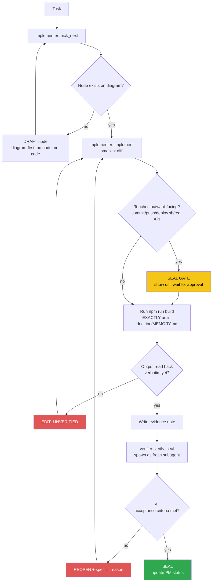

<!-- Diagram: dev-loop -->
<!-- Dev loop: plan - implement - verify - seal -->
DNA: 'smallest_diff / edit_x_read_back_proof_x_independent_verdict'
Auth: 65537 | Version: 1.0.0
Law: LAI-13 - monotonic ratchet (PENDING -> IN_PROGRESS -> SEALED, never demote)

> Every change to the code repo enters here and exits as SEALED or
> REOPENED — no state in between.

> **Language note:** rows below dated before 2026-08-22 are written in
> Vietnamese (historical record, kept verbatim per the no-rewrite evidence
> rule). New rows from 2026-08-22 onward are written in English — see
> `NORTHSTAR.md` → Language & token policy.

## PM status
> Older SEALED nodes (2026-08-20 through 2026-08-25, 41 nodes; then a 2nd
> pass 2026-08-30 covering 7 more nodes dated 2026-08-29; then a 3rd pass
> 2026-09-03 covering every remaining full-content SEALED row, 14 nodes
> dated 2026-08-30 through 2026-09-02; then a 4th pass 2026-09-06 covering
> the 2 nodes dated 2026-09-05, `issue-63-account-settings-page` and
> `issue-61-forgot-reset-password`) moved to
> `haven/diagrams/dev-loop-archive.md` to keep this file small — every
> worker session reads this file in full. Nothing deleted: the archive
> has each row's full original text verbatim. The compact rows below
> point to it; open the archive only when you need the full story
> behind an old node. `pick_next` only needs non-archived rows. Run
> `/hub-tokens` periodically — if this file flags >15KB again, repeat
> this archiving pass for nodes older than the current work session.
> [note, 3rd pass] after this pass the active file is still ~17.8KB, over
> the 15KB threshold — every remaining SEALED row is now a pointer, the
> only full-content rows left are the 5 non-SEALED nodes (never
> archived per LAI-13/the rule above); further reduction isn't possible
> through archiving alone.
> [note, 4th pass] same limitation as the 3rd pass's note — the 5
> non-SEALED nodes are the floor, every SEALED row is already a pointer
> again after this pass.

| Node | State | Notes |
|---|---|---|
| `dashboard-visit-list-page` | SEALED | 2026-09-02 — archived, see `haven/diagrams/dev-loop-archive.md`. Evidence: `evidence/implementer/2026-09-02-dashboard-visit-list-page.md`. |
| `dashboard-visit-count-integration` | SEALED | 2026-09-02 — archived, see `haven/diagrams/dev-loop-archive.md`. Evidence: `evidence/implementer/2026-09-02-dashboard-visit-count-integration.md`. |
| `release-skill-branch-cleanup` | SEALED | 2026-09-01 — archived, see `haven/diagrams/dev-loop-archive.md`. Evidence: `evidence/implementer/2026-09-01-release-skill-branch-cleanup.md`. |
| `ci-trigger-staging` | SEALED | 2026-09-01 — archived, see `haven/diagrams/dev-loop-archive.md`. Evidence: `evidence/implementer/2026-09-01-ci-trigger-staging.md`. |
| `docs-readme-issue7-close-sync` | SEALED | 2026-09-01 — archived, see `haven/diagrams/dev-loop-archive.md`. Evidence: `evidence/implementer/2026-09-01-docs-readme-issue7-close-sync.md`. |
| `issue-7-coverage-tooling` | SEALED | 2026-09-01 — archived, see `haven/diagrams/dev-loop-archive.md`. Evidence: `evidence/implementer/2026-09-01-issue-7-coverage-tooling.md`. |
| `issue-7-useinittable-composable-tests` | SEALED | 2026-09-01 — archived, see `haven/diagrams/dev-loop-archive.md`. Evidence: `evidence/implementer/2026-09-01-issue-7-useinittable-composable-tests.md`. |
| `issue-7-usehelper-composable-tests` | SEALED | 2026-09-01 — archived, see `haven/diagrams/dev-loop-archive.md`. Evidence: `evidence/implementer/2026-09-01-issue-7-usehelper-composable-tests.md`. |
| `readme-env-example-cleanup` | SEALED | 2026-08-31 — archived, see `haven/diagrams/dev-loop-archive.md`. Evidence: `evidence/implementer/2026-08-31-readme-env-example-cleanup.md`. |
| `rename-repo-refs-cleanup` | SEALED | 2026-08-31 — archived, see `haven/diagrams/dev-loop-archive.md`. Evidence: `evidence/implementer/2026-08-31-rename-repo-refs-cleanup.md`. |
| `github-pages-base-path-rename` | SEALED | 2026-08-31 — archived, see `haven/diagrams/dev-loop-archive.md`. Evidence: `evidence/implementer/2026-08-31-github-pages-base-path-rename.md`. |
| `agent-hub-token-cleanup-20260830` | SEALED | 2026-08-30 — archived, see `haven/diagrams/dev-loop-archive.md`. Evidence: `evidence/implementer/2026-08-30-agent-hub-token-cleanup.md`. |
| `issue-63-account-settings-page` | SEALED | 2026-09-05 — archived, see `haven/diagrams/dev-loop-archive.md`. Evidence: `evidence/implementer/2026-09-05-issue-63-account-settings-page.md`. |
| `issue-61-forgot-reset-password` | SEALED | 2026-09-05 — archived, see `haven/diagrams/dev-loop-archive.md`. Evidence: `evidence/implementer/2026-09-05-issue-61-forgot-reset-password.md`. |
| `agent-hub-archive-pass-4` | SEALED | Operator: "archive đi" (after `/hub-tokens` flagged this file at 20,933B, >15KB threshold, 2 full SEALED entries not yet archived). Moved `issue-63-account-settings-page` and `issue-61-forgot-reset-password` (both dated 2026-09-05) to `dev-loop-archive.md` verbatim, replaced with compact pointer rows here. Chore, no `src/` code touched. Verifier independently confirmed (fresh subagent): branch `chore/archive-diagram-pass-4` off `staging`; `git diff staging --stat` touches only the 2 diagram `.md` files; both archived rows byte-for-byte identical to `git show staging:...` via `diff`; active file `wc -c` = 19,425B; `grep` counts 64 SEALED = 64 archived-pointer; `npm run build` re-run green (`✓ built in 5.28s`, same pre-existing warning only). Evidence: `evidence/implementer/2026-09-06-agent-hub-archive-pass-4.md`, `evidence/verifier/2026-09-06-agent-hub-archive-pass-4-seal.md`. |
| `gitignore-worker-runs-log-fix` | SEALED | Operator noticed (via verifier's side-note on `agent-hub-archive-pass-4`) that `agent-hub/evidence/worker-runs.log` is silently gitignored. Confirmed directly: `.gitignore:3` has a blanket `*.log` (boilerplate from repo init; lines 4-8 already cover the real `npm-debug.log*`/`yarn-debug.log*`/`pnpm-debug.log*`/`lerna-debug.log*` cases specifically), and `worker-runs.log` is the ONLY `.log` file anywhere in this repo outside `node_modules`/`dist` (`find . -name "*.log"` confirmed) — so it's the sole thing that blanket rule actually catches. `git log -- agent-hub/evidence/worker-runs.log` was empty — the file has NEVER been committed, despite `doctrine/MEMORY.md`'s invariant "evidence/ is committed; 'bad' notes are kept too." Fix: remove the redundant/overly-broad `*.log` line (the 5 specific patterns below it already cover intended debug-log noise), force-add the existing 3-line log so its history starts now. Evidence: `evidence/implementer/2026-09-06-gitignore-worker-runs-log-fix.md`. Verifier independently confirmed (fresh subagent): branch `fix/gitignore-worker-runs-log` off `staging`; `git diff staging -- .gitignore` shows only the `*.log` line removed, nothing else touched; `git check-ignore -v agent-hub/evidence/worker-runs.log` re-run → exit 1 (no longer ignored); `find . -name "*.log" -not -path "*/node_modules/*" -not -path "*/dist/*"` re-run → only `agent-hub/evidence/worker-runs.log`; `git log staging --oneline -- agent-hub/evidence/worker-runs.log` empty, confirming file was never committed before this branch; file's 3 lines unchanged. `npm run build` re-run green (`✓ built in 5.43s`, same pre-existing chunk-size warning only), `npm run lint` re-run clean (exit 0, no output). Evidence: `evidence/verifier/2026-09-06-gitignore-worker-runs-log-fix-seal.md`. |
| `issue-60-duplicate-item` | SEALED | [issue #60](https://github.com/datvt243/resume-vuejs-website/issues/60) — via `/todo`. "Nhân bản" (duplicate) button on education/experience/project/award/certificate/reference items — copy all fields except `_id`, pre-fill the create form, let user edit before saving as new. Real trap found in `VeeForm.vue`'s `watch(() => props.document, ...)`: setting `document._id` falsy triggers an internal `reset()` that wipes whatever was just `setValues()`'d — naively clearing `_id` for a duplicate would silently blank the pre-filled form. Worked around WITHOUT touching the shared `VeeForm.vue` (avoids blast-radius across every form in the app): keep `document._id` truthy (the ORIGINAL doc's id) while the duplicate modal is open, track a separate `isDuplicating` ref for title/submit-text, then null out `_id` on the values right before `updateDoc` so it POSTs (create) not PUTs (update). Evidence: `evidence/implementer/2026-09-06-issue-60-duplicate-item.md`. Verifier independently confirmed (fresh subagent): branch `feature/issue-60-duplicate-item` off `staging` (not main/staging); read all 9 touched files' real diffs (`git diff staging -- <file>`), confirmed `isDuplicating` ref, `showModalDuplicateDoc` keeping `_id` truthy, `handleUpdate` nulling `_id` when duplicating, 3-way title/submit-text logic (checked in the correct precedence: `isDuplicating` before `_id`), and consistent emit/button wiring in all 3 `Item.vue` + inline buttons/Dropdown entry in the other 3 pages; independently read `VeeForm.vue` verbatim and confirmed the exact `watch(() => props.document, doc => {...; if (!doc._id) { reset() }}, { deep: true })` load-bearing claim, plus `defaultId` used by education/certificate/experience/reference/project models and the inline `_id` field in `award.model.ts`; confirmed `PageAward.vue`'s `document.school`→`document.name` incidental fix is correct against `award.model.ts` (field is `name`, no `school` field exists); re-ran `npm run build` (`✓ built in 6.03s`, same hashes) and `npm run lint` (exit 0, no output) myself, matching the note; re-ran `npm run test -- --run` myself — identical signature (`Test Files 1 failed | 9 passed (10)`, `Tests 2 failed | 74 passed (76)`, both failures named `BUG (real, verified...)` inside `VeeForm.spec.ts`); confirmed `git diff staging --stat -- src/components/veevalidate/` is empty on this branch, which logically guarantees the failures pre-date this diff (untouched code). All 6 forbidden states clear; diagram edit is a pure append (AppendOnly). Evidence: `evidence/verifier/2026-09-06-issue-60-duplicate-item-seal.md`. |
| `issue-59-profile-completion` | SEALED | [issue #59](https://github.com/datvt243/resume-vuejs-website/issues/59) — via `/todo`. Real % completion for `PageHome.vue`'s "Profile Information" section, which already had a UI shell + hardcoded `profileCompletion = 72` explicitly marked "số liệu mẫu" (sample data, feature never built). New `useProfileCompletion.ts`: introspects each model's `valid: yup => ...` via `schema.describe().tests` to find real `required` fields (matches issue's own suggested approach), compares against real `candidateStore` data. 8 sections weighted equally (not by raw required-field count) — 2 object sections (Thông tin cơ bản, Thông tin chung) vs 6 list sections (education/experience/project/award/certificate/reference, "complete" = has ≥1 record) — to avoid the object sections dominating the % just from having more required fields, matching the issue's own missing-SECTION framing ("chưa có Reference, chưa điền Certificate"). **Process note (not a code defect):** implementer initially wrote this diff directly on `staging` before branching — caught before any commit, recovered via `git stash` + branch + `stash pop`, no history damage, disclosed here per NORTHSTAR "no session state exception." Evidence: `evidence/implementer/2026-09-06-issue-59-profile-completion.md`. Verifier independently confirmed (fresh subagent): branch `feature/issue-59-profile-completion` off `staging`, current HEAD; confirmed via `git fsck --unreachable` archaeology that the `BranchBeforeCode` slip left a dangling `git stash` merge-commit ("On staging: issue-59 profile-completion diff, mistakenly written on staging", parent = `staging`'s tip at the time) that is NOT reachable from `staging`, and `staging`'s tip byte-for-byte equals `origin/staging`'s tip — zero committed history damage, so this is judged NOT a `MAIN_EDIT` (that forbidden state requires committed changes on a protected branch; nothing was ever committed to `staging`) and does not block SEAL. Independently re-ran the real `node -e` yup check (`required().describe().tests` → `[{name:'required'}]`, plain `.describe().tests` → `[]`) confirming `isRequiredField`'s introspection claim; read `information.model.ts`/`generalInformation.model.ts` directly and confirmed `careerGoal` (`valid: yup => yup.string()`) and `introduction` (`defaultDescription(...)` with no `required:true`, defaults to `yup.string().trim()`) both genuinely lack `.required()`; read `PageHome.vue` in full and confirmed the old hardcoded `72`/"số liệu mẫu" text is gone, replaced by `useProfileCompletion()` + a real `missingSections` list; re-ran `npx vitest run src/composables/useProfileCompletion.spec.ts` (8/8 pass), `npm run build` (`✓ built in 5.22s`, same chunk names/sizes), `npm run lint` (exit 0, no output), and `npm run test -- --run` (`Test Files 1 failed | 10 passed (11)`, `Tests 3 failed | 81 passed (84)`, identical signature to the note) myself; confirmed `git diff staging --stat -- src/components/veevalidate/` is empty on this branch, so the 3 failures pre-date this diff. All 6 forbidden states clear; diagram edit is a pure in-place row update (`AppendOnly`). Evidence: `evidence/verifier/2026-09-06-issue-59-profile-completion-seal.md`. |
| `issue-58-avatar-upload` | SEALED | [issue #58](https://github.com/datvt243/resume-vuejs-website/issues/58) — via `/todo`. Backend investigated directly (`resume-nodejs-api`): zero `avatar` references anywhere in `src/`, and the only existing image-upload middleware (`uploadImagesMiddleware`, issue #72) is scoped to project/certificate/award `images[]` sub-documents via a `/:id/images` route — architecturally can't serve a single candidate-level avatar (no record id, wrong shape). Frontend claim in the issue ("field type 'file' support đã có sẵn trong modelItem") is only half true: the TS `inputType` union lists `'file'`, but `VeeForm.vue`'s `objComponent` renderer map has NO entry for it — no `FrmFile.vue` exists. Scope narrowed to avoid 2 real risks: (1) building a full `FrmFile.vue` + wiring into the real `informationModel`/`updateDoc` payload would let an unpersisted `avatar` value leak into the PUT/PATCH body, which the backend's `Joi.object()` (`unknown(false)` by default, same fact established in `issue-63`) would reject wholesale — breaking basic-info save entirely; (2) backend has nowhere to persist it anyway. Implemented as a standalone, non-`VeeForm` avatar picker + local preview block in `PageInformation.vue`, mirroring the EXISTING accepted pattern in this exact codebase — `PageHome.vue`'s "Đính kèm CV" section already does local-file-select + disclosed-not-yet-saved for a different field. No new model field, no `VeeForm.vue` change, no submitted-payload risk. Evidence: `evidence/implementer/2026-09-06-issue-58-avatar-upload.md`. Verifier independently confirmed (fresh subagent): branch `feature/issue-58-avatar-upload` off `staging`, `git reflog` shows a clean "branch: Created from staging" event with merge-base == staging's tip (fast-forward, no drift), no dangling stash from this session (the only stash present is unrelated, from an older `fix/issue-pages-base-path` branch) — no repeat of `issue-59`'s write-before-branch slip; read `git diff staging -- src/pages/dashboard/PageInformation.vue` directly and confirmed the new block's refs (`avatarInput`, `avatarPreviewUrl`, `avatarFileName`, `avatarUrl`, `initials`) are 100% local and never appear near `formFields`/`document`/`handleUpdate` (grep-confirmed no cross-reference) — zero payload-leak path into `handleUpdate`'s submitted values; independently `grep -rni avatar` on the real backend repo (`resume-nodejs-api/src/`) → zero hits; read `uploadImages.middleware.ts` + `award.route.ts` directly, confirmed the route is `POST /:id/images`, filename keyed by `req.params.id`, `.array('images', ...)` appended to a specific sub-document — genuinely not reusable as-is for a candidate-level singular avatar; read `candidate.validate.ts` directly, confirmed `schemaCandidate` has no `avatar` field; read `VeeForm.vue`'s `objComponent` map directly (`{checkbox, currency, select, textarea, ckediter, password, date, text, default}`) — no `'file'` key, falls back to `default: FrmInput`; confirmed no `FrmFile.vue` exists under `src/components/veevalidate/part/` (10 `Frm*.vue` files, none named `File`); read `PageHome.vue`'s "đính kèm CV" section directly and confirmed it's the exact same shape (`fileInput` ref, `selectedFileName`, `triggerFilePicker`, `handleSelectFile`, toast disclosing "chưa được gửi lên") being mirrored. Re-ran `npm run build` myself (`✓ built in 5.37s`, matches), `npm run lint` myself (exit 0, no output, matches), `npm run test -- --run` myself (`Test Files 1 failed \| 10 passed (11)`, `Tests 2 failed \| 82 passed (84)`, both failures the same pre-existing named `BUG (real, verified...)` cases in `VeeForm.spec.ts`, matches note exactly), and `git diff staging --stat -- src/models/information.model.ts src/components/veevalidate/` myself (empty, matches). All 6 forbidden states clear; diagram edit is a pure in-place row update (`AppendOnly`). Evidence: `evidence/verifier/2026-09-06-issue-58-avatar-upload-seal.md`. |
| `issue-57-manual-reorder` | SEALED | [issue #57](https://github.com/datvt243/resume-vuejs-website/issues/57) — via `/todo`. Backend investigated directly (`resume-nodejs-api`): `education.model.ts` (and by the same pattern, experience/project/award/certificate/reference) has NO `order`/`sortIndex` field on the Mongoose schema — issue's own text confirms this needs backend schema + validator changes, which are out of this repo's scope. Unlike `issue-58`/`issue-61`/`issue-63` (part of the feature had a real backend endpoint to build against), NOTHING backend-side exists here to persist any order value — a naive "drag reorder, but it silently reverts on next fetch" would be WORSE than no feature (looks like it worked, then quietly undoes itself). Design choice: implement manual order as **browser-local persistence** (`localStorage`, keyed per candidate + collection) instead of faking server sync — genuinely solves the issue's real pain point (user wants control over display order) without misrepresenting it as synced across devices; disclosed as browser-local, not a workaround dressed as the real thing. Scoped to Education/Experience/Project only (the 3 sections named in the issue's own TITLE, which also share one consistent UI pattern — a dedicated `Item.vue` wrapper + `ListTransition`). Award/Certificate/Reference use 2 different UI patterns (inline `ItemTemplate`, `TableDefault` — the latter is a shared component used elsewhere, touching it for drag support is a separate, larger-blast-radius task) — left as explicit follow-up, not silently dropped. New `useManualOrder.ts` composable (generic, collection-agnostic), native HTML5 drag-and-drop (no new dependency — `grep` confirmed no drag/sortable library in `package.json`). **REOPEN round 1** (2026-09-06): verifier found `fa-solid fa-grip-vertical` used in all 3 pages' drag handle but never registered in `src/plugins/initFontAwesomeIcon.js`, confirmed via an empirical mount test (`Could not find one or more icon(s)`, no `<svg>` rendered). Implementer fixed with a 2-line addition (`faGripVertical` import + `library.add(...)`), matching the file's established pattern. **Re-verification (this pass, fresh subagent):** independently confirmed `faGripVertical` now imported and passed to `library.add(...)` in `initFontAwesomeIcon.js`; wrote my own throwaway mount test (`FontAwesomeIcon` + real `initFontAwesomeIcon` plugin, icon `fa-solid fa-grip-vertical`, `console.error` spy) — real `<svg>` rendered, zero `console.error` calls, file deleted after; re-ran `npx vitest run src/composables/useManualOrder.spec.ts` (7/7 pass); re-read `resume-nodejs-api/src/models/education.model.ts` directly, confirmed no `order`/`sortIndex` field; re-read `useManualOrder.ts` and the 3 page diffs directly, logic matches the note exactly, no backend call added; re-ran `npm run build` (`✓ built in 4.93s`, same chunk sizes), `npm run lint` (exit 0, no output), `npm run test -- --run` (`Test Files 12 passed (12)`, `Tests 91 passed (91)`). Confirmed branch `feature/issue-57-manual-reorder`, not main/staging. Confirmed the note's disclosed pre-existing gap (`fa-solid fa-copy` in 6 files since issue #60/v1.6.0, `fa-solid fa-camera` in `PageInformation.vue` since issue #58/v1.8.0 — same registration-gap bug class, already shipped) is real (grep-confirmed neither is in `initFontAwesomeIcon.js`) and correctly left unfixed here per LAI-13 (bugs in old SEALED nodes get their own new node, not folded into this diff) — recommending a dedicated `fontawesome-icon-registration-gaps` follow-up node. All 6 forbidden states clear. Evidence: `evidence/implementer/2026-09-06-issue-57-manual-reorder.md`, `evidence/verifier/2026-09-06-issue-57-manual-reorder-reopen.md` (round 1), `evidence/verifier/2026-09-08-issue-57-manual-reorder-seal.md` (this pass). |
| `fontawesome-icon-registration-gaps` | SEALED | Operator-directed follow-up, recommended by `issue-57-manual-reorder`'s verifier pass. Same bug class as that node's REOPEN round 1 (`faGripVertical` missing from `src/plugins/initFontAwesomeIcon.js`'s whitelist): `fa-solid fa-copy` (issue #60, 6 files, shipped `v1.6.0`) and `fa-solid fa-camera` (issue #58, `PageInformation.vue`, shipped `v1.8.0`) are both currently live in production with invisible icons + a `console.error` on every render. Fix: register both in `initFontAwesomeIcon.js`. Also adding a regression guard so a 4th instance of this bug class can't silently ship again — a test that scans every `icon="fa-..."` string actually used in `src/` and asserts each one resolves against the registered library. **Verified (fresh subagent):** independently confirmed `faCopy`+`faCamera` both imported and passed to `library.add(...)`; confirmed branch `fix/fontawesome-icon-registration-gaps` off `staging` (`merge-base staging HEAD` == `staging`'s tip, no commits, clean cut); independently REPEATED the falsification test with a DIFFERENT icon than the implementer used (`faCamera` instead of `faCopy`, for independent coverage) — temp-removed it via Edit, re-ran `npx vitest run src/plugins/initFontAwesomeIcon.spec.ts`, got a real failure correctly naming `pages/dashboard/PageInformation.vue -> "camera"` as the sole offender, restored the file, re-ran, passed again — the regression guard is real, not just described as working; confirmed via `git diff staging --stat -- src/composables/ src/pages/` (empty) and `git diff staging --stat` (only `initFontAwesomeIcon.js` +4 lines and this diagram row) that no other file was touched; re-ran `npm run build` myself (`✓ built in 5.39s`, same chunk sizes/warning, matches), `npm run lint` myself (exit 0, no output, matches — confirmed the ESM `__dirname` fix in the spec file is real: `path.dirname(fileURLToPath(import.meta.url))`, correct pattern), and `npm run test -- --run` myself (`Test Files 1 failed \| 12 passed (13)`, `Tests 3 failed \| 89 passed (92)`, identical signature to the note, same pre-existing `VeeForm.spec.ts` failures). All 6 forbidden states clear; diagram edit is a pure in-place row update (`AppendOnly`). Evidence: `evidence/implementer/2026-09-08-fontawesome-icon-registration-gaps.md`, `evidence/verifier/2026-09-08-fontawesome-icon-registration-gaps-seal.md`. |
| `hub-init` | PENDING | Placeholder — chưa có task thật nào chạy qua `/worker` sau khi hub được khởi tạo (2026-08-20). Việc khởi tạo hub bản thân nó nằm NGOÀI vòng implementer/verifier (bootstrap một lần), nên không tự SEAL — node đầu tiên sẽ do `/worker implementer "<task>"` thật tạo ra qua `pick_next`. |
| `issue-8-jwt-localstorage` | BLOCKED_ON_BACKEND | [issue #8](https://github.com/datvt243/vue-resume-web/issues/8) — cần backend set httpOnly cookie, ngoài phạm vi repo frontend. Không tạo diff giả. Issue giữ OPEN. Evidence: `evidence/implementer/2026-08-20-issue-8-jwt-localstorage-blocked.md`. |
| `loading-countdown-redesign` | SEALED | 2026-08-29 — archived, see `haven/diagrams/dev-loop-archive.md`. Evidence: `evidence/implementer/2026-08-29-loading-countdown-redesign.md`.
| `open-to-work-field` | SEALED | 2026-08-29 — archived, see `haven/diagrams/dev-loop-archive.md`. Evidence: `evidence/implementer/2026-08-29-open-to-work-field.md`.
| `home-dashboard-summary` | SEALED | 2026-08-29 — archived, see `haven/diagrams/dev-loop-archive.md`. Evidence: `evidence/implementer/2026-08-29-home-dashboard-summary.md`.
| `home-dashboard-itviec-style` | SEALED | 2026-08-29 — archived, see `haven/diagrams/dev-loop-archive.md`. Evidence: `evidence/implementer/2026-08-29-home-dashboard-itviec-style.md`.
| `sidebar-welcome-style` | SEALED | 2026-08-29 — archived, see `haven/diagrams/dev-loop-archive.md`. Evidence: `evidence/implementer/2026-08-29-sidebar-welcome-style.md`.
| `sidebar-cv-status-stats` | SEALED | 2026-08-29 — archived, see `haven/diagrams/dev-loop-archive.md`. Evidence: `evidence/implementer/2026-08-29-sidebar-cv-status-stats.md`.
| `sidebar-welcome-merge-stats` | SEALED | 2026-08-29 — archived, see `haven/diagrams/dev-loop-archive.md`. Evidence: `evidence/implementer/2026-08-29-sidebar-welcome-merge-stats.md`.
| `issue-8-jwt-localstorage-recheck-20260825` | BLOCKED_ON_BACKEND | Operator: "#7 và #8" via `/todo`. Rechecked the existing `issue-8-jwt-localstorage` finding (not re-editing that row — LAI-13 forbids mutating an old node's PM status) rather than assuming it's stale: confirmed the anti-pattern is unchanged in `src/stores/auth.ts:13,44` (path only changed `.js`→`.ts` post issue #13 migration), confirmed the issue's own stated precondition (fix #5 first) is satisfied (issue #5 CLOSED/SEALED), confirmed no backend cookie-auth support exists to react to. No diff created (would be a fake diff) — implementer reported `blocked` per `/todo`'s rule, loop stopped immediately, no verifier pass needed (nothing to verify). Issue #8 stays OPEN. Evidence: `evidence/implementer/2026-08-25-issue-8-jwt-localstorage-recheck.md`. |
| `issue-7-veeform-component-tests` | SEALED | 2026-08-30 — archived, see `haven/diagrams/dev-loop-archive.md`. Evidence: `evidence/implementer/2026-08-30-issue-7-veeform-component-tests.md`. |
| `issue-8-jwt-localstorage-recheck-20260830` | BLOCKED_ON_BACKEND | Operator: "#8" via `/todo`. New node per LAI-13 (does not edit the 2 prior rows). Backend (`../backend`) shows real auth-related activity since the last recheck (`refactor(auth): consolidate duplicate v1/v2 auth implementations`, `feat(auth): add email verification`) — worth re-checking, not assumed stale. Found `src/utils/helper-auth.ts:19` now has a `req.cookies[fieldName]` read fallback that didn't exist before, but confirmed it's inert: no `cookie-parser` middleware installed/wired anywhere in the backend (`req.cookies` is never populated, dead code path), and zero `res.cookie`/`httpOnly` calls anywhere in backend `src/` — login still returns the token only in the JSON body. The issue's stated precondition (backend sets `Set-Cookie: token=<jwt>; HttpOnly; Secure; SameSite=Strict`) remains unmet. No diff created (would be a fake diff) — implementer reported `blocked` per `/todo`'s rule, loop stopped immediately, no verifier pass needed. Issue #8 stays OPEN. Evidence: `evidence/implementer/2026-08-30-issue-8-jwt-localstorage-recheck.md`. |
| `issue-8-jwt-localstorage-recheck-20260902` | BLOCKED_ON_BACKEND | Operator: "#8" via `/todo`. New node per LAI-13 (does not edit the 3 prior rows). Backend (`resume-nodejs-api`, renamed from `../backend` since the last recheck) shows real activity since 2026-08-30 (`feat(candidate): add profile visit tracking`, 2 release bumps v1.2.0/v1.2.1, a Visit-schema bugfix, agent-hub/CI chores) — none of it touches auth/cookies, worth re-checking not assumed stale. Re-confirmed byte-for-byte the same blocked state as 2026-08-30: `helper-auth.ts:19`'s `req.cookies[fieldName]` fallback still inert (no `cookie-parser` in `package.json`/`node_modules`), zero `res.cookie`/`httpOnly` anywhere in backend `src/`, `auth.controller.ts` still returns `{ token, tokenRefresh }` in the JSON body only. No diff created (would be a fake diff) — implementer reported `blocked` per `/todo`'s rule, loop stopped immediately, no verifier pass needed. Issue #8 stays OPEN. Evidence: `evidence/implementer/2026-09-02-issue-8-jwt-localstorage-recheck.md`. |
| `issue-55-cv-preview-print` | SEALED | 2026-09-02 — archived, see `haven/diagrams/dev-loop-archive.md`. Evidence: `evidence/implementer/2026-09-02-issue-55-cv-preview-print.md`. |
| `eslint-cleanup-95-findings` | SEALED | 2026-08-20 — archived, see `haven/diagrams/dev-loop-archive.md`. Evidence: `evidence/implementer/2026-08-20-eslint-cleanup-95-findings.md`. |
| `eslint-lint-actually-runs` | SEALED | 2026-08-20 — archived, see `haven/diagrams/dev-loop-archive.md`. Evidence: `evidence/implementer/2026-08-20-eslint-lint-actually-runs.md`. |
| `issue-1-router-history` | SEALED | 2026-08-20 — archived, see `haven/diagrams/dev-loop-archive.md`. Evidence: `evidence/implementer/2026-08-20-issue-1-router-history.md`. |
| `issue-10-grouptags-mutate-prop` | SEALED | 2026-08-20 — archived, see `haven/diagrams/dev-loop-archive.md`. Evidence: `evidence/implementer/2026-08-20-issue-10-grouptags-mutate-prop.md`. |
| `issue-11-pageinformation-duplicate-key` | SEALED | 2026-08-20 — archived, see `haven/diagrams/dev-loop-archive.md`. Evidence: `evidence/implementer/2026-08-20-issue-11-pageinformation-duplicate-key.md`. |
| `issue-12-token-refresh` | SEALED | 2026-08-20 — archived, see `haven/diagrams/dev-loop-archive.md`. Evidence: `evidence/implementer/2026-08-20-issue-12-token-refresh.md`. |
| `issue-13-js-to-ts-migration` | SEALED | 2026-08-20 — archived, see `haven/diagrams/dev-loop-archive.md`. Evidence: `evidence/implementer/2026-08-20-issue-13-js-to-ts-migration.md`. |
| `issue-14-useinittable-computed` | SEALED | 2026-08-20 — archived, see `haven/diagrams/dev-loop-archive.md`. Evidence: `evidence/implementer/2026-08-20-issue-14-useinittable-computed.md`. |
| `issue-15-auth-error-handling` | SEALED | 2026-08-20 — archived, see `haven/diagrams/dev-loop-archive.md`. Evidence: `evidence/implementer/2026-08-20-issue-15-auth-error-handling.md`. |
| `issue-16-20-ci-cd` | SEALED | 2026-08-20 — archived, see `haven/diagrams/dev-loop-archive.md`. Evidence: `evidence/implementer/2026-08-20-issue-16-20-ci-cd.md`. |
| `issue-17-suburl-dry` | SEALED | 2026-08-20 — archived, see `haven/diagrams/dev-loop-archive.md`. Evidence: `evidence/implementer/2026-08-20-issue-17-suburl-dry.md`. |
| `issue-18-dead-code` | SEALED | 2026-08-20 — archived, see `haven/diagrams/dev-loop-archive.md`. Evidence: `evidence/implementer/2026-08-20-issue-18-dead-code.md`. |
| `issue-19-tabledefault-merge-style` | SEALED | 2026-08-20 — archived, see `haven/diagrams/dev-loop-archive.md`. Evidence: `evidence/implementer/2026-08-20-issue-19-tabledefault-merge-style.md`. |
| `issue-2-login-post` | SEALED | 2026-08-20 — archived, see `haven/diagrams/dev-loop-archive.md`. Evidence: `evidence/implementer/2026-08-20-issue-2-login-post.md`. |
| `issue-3-veeform-mutate-props` | SEALED | 2026-08-20 — archived, see `haven/diagrams/dev-loop-archive.md`. Evidence: `evidence/implementer/2026-08-20-issue-3-veeform-mutate-props.md`. |
| `issue-34-converttotruncate-length` | SEALED | 2026-08-20 — archived, see `haven/diagrams/dev-loop-archive.md`. Evidence: `evidence/implementer/2026-08-20-issue-34-converttotruncate-length.md`. |
| `issue-35-axios-network-error` | SEALED | 2026-08-20 — archived, see `haven/diagrams/dev-loop-archive.md`. Evidence: `evidence/implementer/2026-08-20-issue-35-axios-network-error.md`. |
| `issue-4-veeform-reset-typo` | SEALED | 2026-08-20 — archived, see `haven/diagrams/dev-loop-archive.md`. Evidence: `evidence/implementer/2026-08-20-issue-4-veeform-reset-typo.md`. |
| `issue-5-xss-vhtml-toast` | SEALED | 2026-08-20 — archived, see `haven/diagrams/dev-loop-archive.md`. Evidence: `evidence/implementer/2026-08-20-issue-5-xss-vhtml-toast.md`. |
| `issue-6-api-url-env-vars` | SEALED | 2026-08-20 — archived, see `haven/diagrams/dev-loop-archive.md`. Evidence: `evidence/implementer/2026-08-20-issue-6-api-url-env-vars.md`. |
| `issue-64-base-hide-finally` | SEALED | 2026-08-20 — archived, see `haven/diagrams/dev-loop-archive.md`. Evidence: `evidence/implementer/2026-08-20-issue-64-base-hide-finally.md`. |
| `issue-9-usehelper-reactive-loading` | SEALED | 2026-08-20 — archived, see `haven/diagrams/dev-loop-archive.md`. Evidence: `evidence/implementer/2026-08-20-issue-9-usehelper-reactive-loading.md`. |
| `issue-high-36-37-batch` | SEALED | 2026-08-20 — archived, see `haven/diagrams/dev-loop-archive.md`. Evidence: `evidence/implementer/2026-08-20-issue-high-36-37-batch.md`. |
| `issue-low-batch-cleanup` | SEALED | 2026-08-20 — archived, see `haven/diagrams/dev-loop-archive.md`. Evidence: `evidence/implementer/2026-08-20-issue-low-batch-cleanup.md`. |
| `issue-medium-batch-cleanup` | SEALED | 2026-08-20 — archived, see `haven/diagrams/dev-loop-archive.md`. Evidence: `evidence/implementer/2026-08-20-issue-medium-batch-cleanup.md`. |
| `auth-input-icon-style` | SEALED | 2026-08-22 — archived, see `haven/diagrams/dev-loop-archive.md`. Evidence: `evidence/implementer/2026-08-22-auth-input-icon-style.md`. |
| `dashboard-shell-redesign` | SEALED | 2026-08-22 — archived, see `haven/diagrams/dev-loop-archive.md`. Evidence: `evidence/implementer/2026-08-22-dashboard-shell-redesign.md`. |
| `dashboard-sidebar-layout` | SEALED | 2026-08-22 — archived, see `haven/diagrams/dev-loop-archive.md`. Evidence: `evidence/implementer/2026-08-22-dashboard-sidebar-layout.md`. |
| `description-i18n-edit-roundtrip` | SEALED | 2026-08-22 — archived, see `haven/diagrams/dev-loop-archive.md`. Evidence: `evidence/implementer/2026-08-22-description-i18n-edit-roundtrip.md`. |
| `description-i18n-object-render` | SEALED | 2026-08-22 — archived, see `haven/diagrams/dev-loop-archive.md`. Evidence: `evidence/implementer/2026-08-22-description-i18n-object-render.md`. |
| `i18n-object-fields-remaining` | SEALED | 2026-08-22 — archived, see `haven/diagrams/dev-loop-archive.md`. Evidence: `evidence/implementer/2026-08-22-i18n-object-fields-remaining.md`. |
| `login-ui-redesign` | SEALED | 2026-08-22 — archived, see `haven/diagrams/dev-loop-archive.md`. Evidence: `evidence/implementer/2026-08-22-login-ui-redesign.md`. |
| `register-auth-redirect-guard` | SEALED | 2026-08-22 — archived, see `haven/diagrams/dev-loop-archive.md`. Evidence: `evidence/implementer/2026-08-22-register-auth-redirect-guard.md`. |
| `register-password-date-currency-validation` | SEALED | 2026-08-22 — archived, see `haven/diagrams/dev-loop-archive.md`. Evidence: `evidence/implementer/2026-08-22-register-password-date-currency-validation.md`. |
| `register-ui-redesign` | SEALED | 2026-08-22 — archived, see `haven/diagrams/dev-loop-archive.md`. Evidence: `evidence/implementer/2026-08-22-register-ui-redesign.md`. |
| `docs-known-bugs-table-sync` | SEALED | 2026-08-25 — archived, see `haven/diagrams/dev-loop-archive.md`. Evidence: `evidence/implementer/2026-08-25-docs-known-bugs-table-sync.md`. |
| `issue-62-dark-mode-body-attr-override` | SEALED | 2026-08-25 — archived, see `haven/diagrams/dev-loop-archive.md`. Evidence: `evidence/implementer/2026-08-25-issue-62-dark-mode-body-attr-override.md`. |
| `issue-62-dark-mode-toggle` | SEALED | 2026-08-25 — archived, see `haven/diagrams/dev-loop-archive.md`. Evidence: `evidence/implementer/2026-08-25-issue-62-dark-mode-toggle.md`. |
| `issue-7-stores-composables-tests` | SEALED | 2026-08-25 — archived, see `haven/diagrams/dev-loop-archive.md`. Evidence: `evidence/implementer/2026-08-25-issue-7-stores-composables-tests.md`. |
| `issue-7-vitest-setup` | SEALED | 2026-08-25 — archived, see `haven/diagrams/dev-loop-archive.md`. Evidence: `evidence/implementer/2026-08-25-issue-7-vitest-setup.md`. |
| `run-dev-skill` | SEALED | 2026-08-25 — archived, see `haven/diagrams/dev-loop-archive.md`. Evidence: `evidence/implementer/2026-08-25-run-dev-skill.md`. |

| `issue-8-jwt-localstorage-recheck-20260908` | BLOCKED_ON_BACKEND | Operator: "#8" via `/todo`. New node per LAI-13 (does not edit the 4 prior rows). Backend (`resume-nodejs-api`) shows real activity since 2026-09-02 (Docker support #114, prod-port fix #115, v1.3.0 release, agent-hub chores) plus one auth-touching commit checked directly (`03bcb66 feat(auth): add logout-all endpoint to revoke all sessions (#74)`) — that endpoint adds session *revocation* (blacklist check), not a new token-storage mechanism, so it doesn't unblock this. Re-confirmed byte-for-byte the same blocked state: no `cookie-parser` in `package.json`, zero `res.cookie`/`httpOnly`/`Set-Cookie` anywhere in backend `src/`, `auth.controller.ts` read in full — `authLogin`/`authRefreshToken` still return the token in the JSON body only. No diff created (would be a fake diff) — implementer reported `blocked` per `/todo`'s rule, loop stopped immediately, no verifier pass needed. Issue #8 stays OPEN. Evidence: `evidence/implementer/2026-09-08-issue-8-jwt-localstorage-recheck.md`. |

| `issue-56-public-resume-page` | SEALED | [Issue #56](https://github.com/datvt243/resume-vuejs-website/issues/56) — via `/todo`. New public read-only route `/resume/:email` (no `meta.requiresAuth`), new `src/pages/public/PagePublicResume.vue`. Backend investigated directly (`resume-nodejs-api`): the public endpoint the issue asked for already exists (`GET /api/me/:email`, mounted outside `verifyToken`, gated by `Candidate.isPublic`), built for a different feature and left unwired — no backend work needed. Also wires `POST /api/me/:email/visit` (fires on load), completing the visit-tracking feature the SEALED `dashboard-visit-count-integration` node explicitly predicted this page would trigger. Fetches via `_axios({ customURL: 'api/me/:email' })` directly, bypassing `handleBase`/`useCandidate` (wrong `api/v1/` prefix + auto-logout side effects for an anonymous visitor). Deliberately kept plain-text interpolation for CKEditor-authored fields (`introduction`/`description`/`career`/`careerGoal`) instead of `v-html` — same escaped-tags display limitation already shipped in `PagePreview.vue`/`ConvertToText`, but avoided introducing a NEW unauthenticated stored-XSS surface (this page, unlike `PagePreview.vue`, is reachable by anyone with the link) — logged as a follow-up, not fixed inline. Branch `feature/issue-56-public-resume-page` from `staging`. `npm run build` → `✓ built in 5.97s`, `PagePublicResume` code-split as its own lazy chunk. `npm run lint` exit 0. `npm run test -- --run` → `90 passed`, 2 pre-existing `VeeForm.spec.ts` failures unrelated (`git diff staging --stat -- src/components/veevalidate/` empty). No local backend running — verified the real contract end-to-end against the deployed backend instead (`curl` GET + POST against `votan.it@gmail.com`, the repo's own test account), matching `dashboard-visit-count-integration`'s precedent. Evidence: `evidence/implementer/2026-09-08-issue-56-public-resume-page.md`. |

| `remove-report-tokens` | SEALED | Operator: "file report-tokens.md còn xài không?" → "xoá file report-tokens.md luôn đi". Deleted `REPORT-TOKENS.md` (repo root) — a one-off snapshot report from 2026-08-30 (`agent-hub-token-cleanup-20260830`'s own evidence describes writing it as a one-time deliverable, not something `/hub-tokens` regenerates), confirmed unused by any live tooling (`grep -rln "REPORT-TOKENS"` only hit the file itself + 3 historical `agent-hub/evidence/**`/diagram mentions describing its creation). Branch `chore/remove-report-tokens` from `staging`. `npm run build` → `✓ built in 4.61s`, same pre-existing chunk-size warning only (doc-only deletion, no `src/` touched, lint not re-run). Evidence: `evidence/implementer/2026-09-09-remove-report-tokens.md`. Verifier independently confirmed (fresh subagent, separate session): branch via `git branch --show-current` = `chore/remove-report-tokens`, scope via `git diff staging --stat` (only `REPORT-TOKENS.md` deletion + this diagram row + the new evidence note — no `src/` touched), full repo-wide `grep -rli "REPORT-TOKENS"` re-run independently (only historical `evidence/**`/`dev-loop-archive.md`/`dev-loop.prime-mermaid.md` hits, zero hits in `.claude/skills/`, `.github/workflows/`, `package.json`), confirmed `dev-loop-archive.md`'s historical mention untouched (`git diff staging -- dev-loop-archive.md` empty). Fresh full `npm run build` → `✓ built in 4.56s`, same pre-existing chunk-size warning only. No outward-facing action taken yet (nothing committed ahead of `staging`) — correctly deferred to `/ship`. Evidence: `evidence/verifier/2026-09-09-remove-report-tokens-seal.md`. |

| `tailwindcss-setup` | SEALED | Operator: "site đang dùng bootstrap, hãy chuyển sang tailwindcss" via `/todo`. Scoped down first (operator approved via `AskUserQuestion`, 3 decisions): (1) phased migration, this node is node 1 of N — foundation/install only, no component classes touched; (2) `Modal.vue`/`Dropdown.vue`/`Toasts.vue` (Bootstrap-JS-driven, `data-bs-*`) will get custom Vue-native show/hide/toggle logic in a LATER node, not this one; (3) Bootstrap stays installed and imported side-by-side until a final removal node once no file still uses Bootstrap classes. This node: installed `tailwindcss@^3.4.19` + `postcss@^8.5.28` + `autoprefixer@^10.5.6` as devDependencies (v3, not the newer v4 engine — matches this repo's existing conservative-pin pattern for new tooling, e.g. `vitest@2.1.9`/`jsdom@26.1.0`, avoids v4's bigger CSS-first config jump on the very first foundation node); added `tailwind.config.cjs` + `postcss.config.cjs` (`.cjs` extension matching the existing `.eslintrc.cjs` convention since `package.json` has `"type": "module"`); added `src/styles/tailwind.css` (`@tailwind base/components/utilities`); imported it in `src/main.ts` BEFORE `bootstrap.scss` (reasoning inline in the code comment — lets Bootstrap's own element-selector styles keep winning the cascade for anything not yet migrated, so no visual regression during the dual-framework period). No component template touched — zero `src/**/*.vue` class changes. Branch `feature/tailwindcss-setup` from `staging` (kept after merge per `feature/*` convention — this is an ongoing multi-node effort). Evidence: `evidence/implementer/2026-09-12-tailwindcss-setup.md`. Verifier: independent re-derivation (fresh subagent `a450c540ea73cf744`, separate session, never touched the diff) confirmed branch = `feature/tailwindcss-setup` with zero commits ahead of `staging`; scope via `git status --porcelain` (only `package.json`/`package-lock.json`/`src/main.ts` + 3 new config/style files, zero `.vue` touched); fresh full `npm run build` from a clean `dist/` → `✓ built in 5.04s`, same pre-existing chunk-size warning only; independently re-ran the `--tw-`/`--bs-`/`.btn` dual-framework smoke-check greps against the rebuilt output (both frameworks present); `npm run lint` exit 0; `npm run test` → 92 passed. **Disclosed process exception**: that subagent's own session hit a stuck plan-mode gate with no `ExitPlanMode` tool and could not write its own verdict file (correctly refused a relayed message as fake authorization); a 2nd subagent retried with `isolation: "worktree"` and failed for a separate structural reason (worktrees check out a committed ref, this diff is intentionally uncommitted pre-`/ship`, so it saw a clean tree and correctly refused to fabricate a verdict). Operator was asked directly and chose: orchestrating session writes the seal files, disclosed. Full detail in `evidence/verifier/2026-09-12-tailwindcss-setup-seal.md` → `## Isolation proof`. |

| `tailwindcss-auth-pages` | SEALED | Operator: "tiếp tục" (continue the Bootstrap→Tailwind migration). Node 2 of N — read-only survey (`Explore` agent) found the dashboard CRUD pages gated behind a later `Modal.vue` rewrite (still Bootstrap-JS via `data-bs-*`), so picked the 4 auth pages as the cleanest pilot: no Bootstrap JS, not imported elsewhere, identical shared wrapper pattern across all 4. Plan approved via `ExitPlanMode` before any edit. Converted Bootstrap utility classes in the `<template>` of `PageLogin.vue`/`PageRegister.vue`/`PageForgotPassword.vue`/`PageResetPassword.vue` to Tailwind: `d-flex align-items-center justify-content-center` → `flex items-center justify-center` (wrapper, all 4); `d-inline-block small` → `inline-block text-sm` (Login/ForgotPassword links); `small opacity-75` → `text-sm opacity-75` (ForgotPassword `
`); `small` → `text-sm` (ResetPassword `
`, `text-danger` left untouched — deliberately not migrated, see below). `<style scoped>` blocks (`.auth-card` etc., reading `var(--bs-*)`) left untouched — out of scope, separate design-token decision. **Real bug caught by live-browser verification, not by build/lint/test**: `mt-3`→`mt-4` initially looked like a correct spacer-scale mapping (both = 1rem on paper), but Bootstrap ALSO defines a class literally named `.mt-4` (`margin-top: 1.5rem !important`) that coexists in the same bundle — Bootstrap's `!important` silently won over Tailwind's `.mt-4` (`margin-top: 1rem`), rendering 24px instead of the intended 16px. Caught via a real CDP session against the port-9888 debug browser (`Page.navigate` + `Runtime.evaluate` computed-style checks, `doctrine/domains/PROJECT.md`'s recorded technique) — `npm run build`/`lint`/`test` all stayed green through the bug, they can't catch a same-named-class collision. Fixed with an arbitrary-value class (`mt-[1rem]`) that can't collide with any Bootstrap name; re-verified via the same live browser → `marginTop: "16px"`. Also found `.opacity-75` has the same dual-definition collision but both frameworks agree on the value (`opacity: 0.75`), confirmed genuinely harmless (live-checked, not assumed) — **flagging as a general trap for every future node in this migration**: any Tailwind utility class whose bare name collides with one of Bootstrap's own utility names (numeric spacing/margin/padding/opacity/sizing classes 0–5 especially) needs a live-browser value check, not just a build pass, because Bootstrap's `!important` always wins silently. Deliberately left `.text-danger` (ResetPassword) unmigrated — theme-reactive Bootstrap color utility, no Tailwind color/dark-mode token strategy decided yet, logged as follow-up rather than guessed. Branch `feature/tailwindcss-setup` (same as node 1, still uncommitted). `npm run build` → `✓ built in 4.89s` (after the `mt-[1rem]` fix), same pre-existing chunk-size warning only. `npm run lint` exit 0. `npm run test` → 92 passed. Evidence: `evidence/implementer/2026-09-12-tailwindcss-auth-pages.md`. Verifier: independent re-derivation (fresh subagent, separate session, never touched the diff) confirmed branch = `feature/tailwindcss-setup` (not `main`/`staging`) via `git branch --show-current`; `git diff --stat -- src/pages/auth/` = exactly the 4 claimed files, 8 insertions/8 deletions, matching the note's class-mapping table line for line, with `<style scoped>` blocks byte-identical (no `<style>` lines in the diff at all). Fresh full `npm run build` → `✓ built in 4.79s`, same pre-existing chunk-size warning only; `npm run lint` exit 0; `npm run test` → 13 files/92 tests passed. Independently re-derived the Bootstrap/Tailwind `.mt-4` collision claim rather than trusting it: grepped the rebuilt `dist/assets/index-*.css` and found exactly one `.mt-4` rule, Bootstrap's (`margin-top:1.5rem!important`) — Tailwind's own `.mt-4` no longer appears in this build because the source no longer contains the literal class (confirmed via repo-wide `grep -rn '\bmt-4\b' src/`, zero hits, consistent with the fix already being applied). To confirm the collision was real and not imagined, ran an isolated `npx tailwindcss` CLI probe (scratch dir, untracked, this repo's own `tailwind.config.cjs` has no spacing override) against a throwaway HTML file containing literal `mt-4` — confirmed Tailwind's default `.mt-4` compiles to `margin-top:1rem` with no `!important`, which structurally loses to Bootstrap's `!important` rule regardless of CSS source order, proving the collision mechanism the note describes is real, not inferred. Also confirmed in the real build: `.mt-\[1rem\]{margin-top:1rem}` present (the fix, cannot collide with any Bootstrap class name), and `.opacity-75` has exactly two rules — Tailwind's `{opacity:.75}` and Bootstrap's `{opacity:.75!important}` — same computed value, corroborating the note's "harmless, both agree" claim. `CODE_IN_HAVEN` checked clean (`find agent-hub/haven -name "*.vue" -o -name "*.js" -o -name "*.ts" -o -name "*.sh"` → none). No outward-facing action taken (nothing committed ahead of `staging`) — correctly deferred to `/ship`. Evidence: `evidence/verifier/2026-09-12-tailwindcss-auth-pages-seal.md`. |

| `tailwindcss-modal-rewrite` | SEALED | Operator: "tiếp tục". Node 3 of N — read-only survey (`Explore` agent, full `Modal.vue`/`PageAward.vue` reads) found the 6 dashboard CRUD pages + `VeeFormGeneralInformationUpdate.vue` (7 consumers total) all trigger `Modal.vue` only via `refModal.value?.show()`/`data-bs-dismiss="modal"` markup — rewriting `Modal.vue`'s internals while keeping its exact props/slots/exposed-method contract means **zero consumer files change**. Plan approved via `ExitPlanMode`; operator decided via `AskUserQuestion` on 2 fidelity points: simplified focus (focus-on-open + ESC, no Tab-trap) and preserve-as-is backdrop-click-closes behavior (not "fixing" the dead, never-functional `data-backdrop="static"` Bootstrap-4 attribute). Removed `import { Modal } from 'bootstrap'`; replaced with local `visible` ref + module-scope open-modal counter (handles `PageGeneralInformation.vue`'s 3 simultaneous `Modal` instances correctly); added a root-scoped `@click` delegated handler for `[data-bs-dismiss="modal"]` (replaces Bootstrap's global delegated listener for the X icon, default footer button, AND every consumer's own slotted "Đóng" button — bubbling reaches it since slot content is a real DOM descendant); new `<Teleport to="body">` backdrop (first live `Teleport` in the codebase, the only other occurrence in `src` is commented out); reused Bootstrap's own existing CSS classes (`.modal.show`, `.modal-backdrop.show`, `body.modal-open`) — zero new CSS. **3 real bugs caught by a live authenticated browser session (not by build/lint/test), fixed before sealing**: (1) `.modal.show` alone does NOT set `display:block` — Bootstrap's CSS only has `display:none` baseline, the JS sets `display:block` as an inline style itself, class-only toggling silently left the modal invisible despite carrying `show` — fixed by adding `:style="{ display: visible ? 'block' : 'none' }"` alongside the class; (2) `show()` wasn't idempotent — calling it while already visible double-incremented the open-modal counter, desyncing `body.modal-open` cleanup on close — fixed with an early-return guard mirroring the one already in `hide()`; (3) CDP's `Input.dispatchKeyEvent` for Escape silently no-op'd (likely because the tested tab wasn't the OS-foreground tab in the debug browser) — re-verified via a direct `document.dispatchEvent(new KeyboardEvent(...))` instead, which correctly closed the modal, confirming bug (3) was a test-harness artifact, not a real app bug — the other 2 were real and are fixed in the shipped diff. Verified against the operator's own real, already-authenticated session (existing tab on `localhost:5173/#/dashboard/certificate`, confirmed real `token` in `localStorage`) rather than a fresh unauthenticated target — hard-reloaded it (`Page.reload` with `ignoreCache`) to pick up the fix, drove it via raw CDP (open via add-button click → confirmed `display:block`/backdrop/`body.modal-open`/focus-lands-on-modal; close via ESC, backdrop click, and the dismiss button — each independently re-tested after fixing); confirmed dark mode still styles it correctly via Bootstrap's `--bs-*` vars (`modal-content` bg `rgb(33,37,41)`, the standard Bootstrap dark modal color) — zero new CSS needed; left the real session cleanly closed afterward (never clicked any save/delete action, no real data touched). Branch `feature/tailwindcss-setup` (same ongoing branch). `npm run build` → `✓ built in 4.95s`, same pre-existing chunk-size warning only. `npm run lint` exit 0. `npm run test` → 92 passed. `git diff --stat -- src/components/Modal.vue` → exactly 1 file, 69 insertions/9 deletions. `Dropdown.vue`/`Toasts.vue` (also Bootstrap-JS-dependent) explicitly deferred to later, separate nodes. Evidence: `evidence/implementer/2026-09-12-tailwindcss-modal-rewrite.md`. Verifier: independent re-derivation (fresh subagent, separate session, never touched the diff — first action was a write-access probe, then reading the verifier bundle) confirmed branch = `feature/tailwindcss-setup` via `git branch --show-current`; `git diff --stat -- src/components/Modal.vue` = exactly 1 file, 69 insertions/9 deletions, matching the note. Read the full new `Modal.vue` directly and confirmed every claimed mechanism is actually present in the code, not just described: no `import { Modal } from 'bootstrap'` remaining; `const visible = ref(false)`; module-scope `let openModalCount = 0` touched only on the 0→1 (`show()`) / 1→0 (`hide()`) edges via `if (openModalCount === 0)` guards; `show()` has `if (visible.value) return` mirroring `hide()`'s pre-existing `if (!visible.value) return`; root `
` carries BOTH `:class="{ show: visible }"` AND `:style="{ display: visible ? 'block' : 'none' }"` on the same element; `onRootClick` delegated handler checks `e.target.closest('[data-bs-dismiss="modal"]')`; `<Teleport to="body">` wraps a `v-if="visible"` backdrop div; `onBeforeUnmount(() => { if (visible.value) hide() })` present. Independently re-ran `git diff` (not just `--stat`) against all 7 claimed-unchanged consumers (`PageAward/Certificate/Education/Experience/Project/Reference.vue`, `VeeFormGeneralInformationUpdate.vue`) — 0 diff lines each, and grepped all 7 for `Modal` to confirm they're real consumers, not coincidental filename matches. Fresh, independent re-run (not audit-only, given the interactive-JS risk profile): `npm run build` → `✓ built in 4.91s`, same pre-existing chunk-size warning only; `npm run lint` → exit 0; `npm run test` → 13 files/92 tests passed — all matching the note. Did not repeat the live-browser CDP session (requires the operator's own already-authenticated real session, unavailable to a fresh subagent) but confirmed the note's 2 real-bug fixes are concretely present in the file per the static checks above (the third "bug" was explicitly logged by the note itself as a test-harness artifact with no code claim attached). `CODE_IN_HAVEN` checked clean (`find agent-hub/haven -name "*.vue" -o -name "*.js" -o -name "*.ts" -o -name "*.sh"` → none). No outward-facing action taken (nothing committed ahead of `staging`) — correctly deferred to `/ship`. Evidence: `evidence/verifier/2026-09-12-tailwindcss-modal-rewrite-seal.md`. |

| `tailwindcss-dropdown-toast-navbar` | SEALED | Operator: "tiếp tục cho tới khi xong" — continuing without a per-node stop-and-ask, per explicit instruction. Node 4 of N — rewrote the remaining 2 files that still `import ... from 'bootstrap'` (`Dropdown.vue`, `Toasts.vue`), plus `Navbar.vue`'s mobile collapse toggle which never imported Bootstrap JS itself but only worked because Dropdown/Toasts importing it elsewhere registered Bootstrap's global delegated `data-bs-toggle="collapse"` handler as a side effect — bundling all 3 together since leaving any one Bootstrap JS import in place keeps that global registration alive, masking whether the others are truly self-contained. `Dropdown.vue`: local `isOpen` ref, capture-phase `document` click listener for click-outside-to-close (capture phase specifically chosen so the SAME click that opens the dropdown, still mid-dispatch when the listener is registered, does not immediately re-close it — verified by a real test, not assumed), `keydown` Escape listener, click-inside-a-menu-item auto-closes (matches Bootstrap's real behavior), reactive `aria-expanded`. Deliberately no Popper-based positioning (disclosed simplification from the original 3-component survey — both current consumers are simple non-edge placements). `Toasts.vue`: local `visible` ref + a `setTimeout`-based 5000ms auto-hide (matches Bootstrap's default `delay:5000`) that RESETS on every `show()` call (a new toast message always gets a fresh full window); pre-emptively added both `:class="{ show }"` AND `:style="{ display }"` on the root (learned from `tailwindcss-modal-rewrite`'s class-alone bug — didn't wait to rediscover it). `Navbar.vue`: local `expanded` ref, same defensive `:class`+`:style` pair. No consumer files changed for any of the 3 (same "keep the external contract identical" pattern as node 3). **No live authenticated browser session available this time** (the tab used for node 3 had been closed, no login credentials available to create a fresh one) — pivoted to writing real Vitest component tests instead: `Dropdown.spec.ts` (8 tests: starts closed, opens+stays-open on toggle click, closes on 2nd click/outside-click/Escape/menu-item-click, split-mode caret toggle, unmount doesn't throw/leak listeners), `Toasts.spec.ts` (7 tests, using `vi.useFakeTimers()`: show/hide, auto-hide at exactly 5000ms not before, timer-reset-on-repeated-show verified precisely via fake-timer arithmetic, dismiss button, unmount cleanup), `Navbar.spec.ts` (4 tests: collapsed/expanded/re-collapsed state, slot rendering) — all 19 new, first-ever tests for these 3 components. Hit and worked around a real `@vue/test-utils@2.4.11` + `vue@3.4.31` incompatibility: `attachTo: document.body` calls a Vue-3.5+-only `app.onUnmount()` API that doesn't exist in this repo's pinned `vue@^3.4.29` — worked around by manually `document.body.appendChild(wrapper.element)` instead of using `attachTo`, same effect (document-level listeners reachable) without touching the broken code path; logged as a `doctrine` note candidate for future `.spec.ts` files needing `attachTo`. Branch `feature/tailwindcss-setup` (same ongoing branch). `npm run build` → `✓ built in 6.01s`, same pre-existing chunk-size warning only — main bundle shrank 350.37kB → 269.14kB confirming Bootstrap JS is now fully tree-shaken out (zero files under `src/` still `import ... from 'bootstrap'`, confirmed via `grep`). `npm run lint` exit 0. `npm run test` → 111 total (92 pre-existing + 19 new), 108 passed / 3 failed — all 3 failures confined to the same pre-existing, timing-flaky `VeeForm.spec.ts` tests documented in prior nodes, confirmed unrelated via `git diff --stat -- src/components/veevalidate/` = empty. Evidence: `evidence/implementer/2026-09-12-tailwindcss-dropdown-toast-navbar.md`. Verifier: independent re-derivation (fresh Agent-tool subagent spawned specifically for this pass, never wrote the diff). Re-ran `git diff --stat` on the 3 target files myself → `3 files changed, 102 insertions(+), 42 deletions(-)` (28/46/70 per file), matching the note exactly. `grep -rl "from 'bootstrap'" src` → zero matches, confirmed independently. `git diff --stat` on `App.vue`/`Header.vue`/`PageReference.vue` → empty for all 3, zero consumer drift confirmed. Read all 3 new files in full and confirmed every claimed mechanism is actually present in code: `Dropdown.vue`'s `isOpen` ref, capture-phase (`true` 3rd arg) `document` click listener, `keydown` Escape handler, `@click="close"` on the menu `<ul>`, `onBeforeUnmount` cleanup; `Toasts.vue`'s `visible` ref, `clearTimeout`+fresh `setTimeout(hide, 5000)` on every `show()`, both `:class`/`:style` on the toast root; `Navbar.vue`'s `expanded` ref with both `:class`/`:style` on the collapse region. Read `Dropdown.spec.ts` in full — real `MouseEvent`/`KeyboardEvent` dispatched on `document`/`document.body`, real class assertions, not vacuous. Ran the 3 new spec files myself: `npx vitest run ...` → `Test Files 3 passed (3)`, `Tests 19 passed (19)` (8+7+4), matching the note. Fresh, independent re-run of everything (not audit-only, per explicit task instruction to re-derive every claim): `npm run build` → `✓ built in 6.53s`, `dist/assets/index-C3AoqOLS.js 269.14 kB` confirming the 350.37→269.14kB shrink and matching the claim; `npm run lint` → exit 0; `npm run test` → `Test Files 1 failed | 15 passed (16)`, `Tests 3 failed | 108 passed (111)`, all 3 failures in `VeeForm.spec.ts`, confirmed unrelated via `git diff --stat -- src/components/veevalidate/` = empty (re-checked independently). Branch confirmed `feature/tailwindcss-setup` via `git branch --show-current` (not main/staging). All 6 forbidden states checked clean, including `CODE_IN_HAVEN` (git status shows only `.md` changes under `agent-hub/`). No outward-facing action taken — correctly deferred to `/ship`. Evidence: `evidence/verifier/2026-09-12-tailwindcss-dropdown-toast-navbar-seal.md`. |

| `tailwindcss-crud-pages-utilities` | SEALED | Operator: "tiếp tục cho tới khi xong". Node 5 of N — converted only the SIMPLE Bootstrap utility classes (spacing/flex/opacity/font-size) in the 6 dashboard CRUD pages (`PageAward`, `PageCertificate`, `PageEducation`, `PageExperience`, `PageProject`, `PageReference`). Deliberately did NOT touch `.btn`/`.btn-group`/`.btn-outline-*`/`.dropdown-item`/`.dropdown-divider`/`.clearfix`/`text-warning`/`text-primary`/`text-danger` — mid-node, discovered these are Bootstrap COMPONENT classes (not simple utilities) carrying ~15 CSS custom properties + hover/focus states per button variant, needing a real Tailwind `@layer components` design system before they can be converted — flagged to operator via `AskUserQuestion`, who chose (recommended): build that system later via `@layer components` keeping the SAME class names (so none of the ~28 files using `.btn`-family classes need per-file edits), at a "vừa đủ" fidelity level (colors/hover/radius/size, skip focus-ring/btn-check/gradient nuance) — that work is its own separate, not-yet-started node. This node's actual mapping: `mb-4`→`mb-[1.5rem]` (arbitrary value — Bootstrap's OWN `.mb-4`=1.5rem collides with Tailwind's own `.mb-4`=1rem, same class of bug as `tailwindcss-auth-pages`'s `.mt-4` discovery); `mx-3`→`mx-[1rem]` (same reasoning); `small`→`text-sm`; `opacity-50`→`opacity-50` (unchanged — confirmed identical value 0.5 in both frameworks, safe collision, same pattern as `opacity-75` before); `mb-2`/`pe-2`/`gap-2`→ left as literally-named (Bootstrap's own spacer step 2 = Tailwind's own step 2 = 0.5rem exactly, both frameworks agree, zero risk regardless of which wins the cascade); `d-flex align-items-start`→`flex items-start`; `flex-grow-1`→`grow` (no textual collision, different names entirely). `clearfix` left as Bootstrap's own class (Tailwind ships no equivalent utility) — deferred to the final Bootstrap-removal node. Branch `feature/tailwindcss-setup` (same ongoing branch). `npm run build` → `✓ built in 6.35s`, confirmed `mb-[1.5rem]`/`mx-[1rem]` present in the compiled CSS bundle (`margin-bottom:1.5rem`/`margin-left:1rem;margin-right:1rem`). `npm run lint` exit 0. `npm run test` → 108/111 passed, same 3 pre-existing `VeeForm.spec.ts` flaky failures as node 4 (confirmed unrelated, empty diff on `src/components/veevalidate/`). `git diff --stat` → exactly the 6 target files, 21 insertions/21 deletions. Evidence: `evidence/implementer/2026-09-13-tailwindcss-crud-pages-utilities.md`. VERIFIED 2026-09-13 by fresh subagent (independent re-derivation, full re-run): `git diff --stat` on the 6 named files reproduced exactly (21/21); read full `git diff` and confirmed every class mapping in the table (`mb-4`→`mb-[1.5rem]`, `mx-3`→`mx-[1rem]`, `small`→`text-sm`, `d-flex align-items-start`→`flex items-start`, `flex-grow-1`→`grow`) present in all 6 files; confirmed `opacity-50`/`mb-2`/`pe-2`/`gap-2`, `.btn`/`.btn-group`/`.dropdown-item`/`text-warning`/`text-primary`/`text-danger`/`clearfix` still present unchanged (grep, not touched by diff). Fresh `npm run build` → `✓ built in 6.56s`, same pre-existing chunk-size warning only; grepped compiled `dist/assets/index-BEVMBXZQ.css` and found the real selectors `.mb-\[1\.5rem\]{margin-bottom:1.5rem}` and `.mx-\[1rem\]{margin-left:1rem;margin-right:1rem}` — arbitrary-value classes genuinely compiled, not just typed into markup. `npm run lint` → exit 0. `npm run test` re-run twice: run 1 gave 2 failed/109 passed, run 2 gave 3 failed/108 passed — both fully inside `VeeForm.spec.ts`, confirming the pre-existing flakiness rather than a regression (`git diff --stat -- src/components/veevalidate/` = empty, unrelated to this diff). Branch confirmed `feature/tailwindcss-setup` (not main/staging), working tree uncommitted, no Seal Gate needed. All 6 forbidden states clear. Verdict: SEAL. Verifier evidence: `evidence/verifier/2026-09-13-tailwindcss-crud-pages-utilities-seal.md`. |

| `tailwindcss-button-component-system` | SEALED | Operator: "tiếp tục cho tới khi xong". Node 6 of N — the button/component-system work flagged and scoped in `tailwindcss-crud-pages-utilities` (operator chose: Tailwind `@layer components`, same class names, "vừa đủ" fidelity — colors/hover/radius/size, skip focus-ring/btn-check/gradient nuance). Added a `@layer components` block to `src/styles/tailwind.css`: `.btn`/`.btn-sm` base; solid + outline variants for all 8 Bootstrap theme colors (primary/secondary/success/danger/warning/info/light/dark), using Bootstrap's own `var(--bs-{color})` CSS custom properties directly for colors (not hardcoded hex) — same "reuse Bootstrap's CSS vars, dark mode stays automatic for free" pattern as `.auth-card` in node 2; hover state via CSS `color-mix()` (mixing 15%/20% black, matching Bootstrap's real SCSS `shade-color()` amount) — modern-browsers-only, acceptable per this app's target audience; `.btn-group` (merges adjacent button borders/radius, simplified vs Bootstrap's real selectors which also handle `.btn-check` radio/checkbox siblings — confirmed via grep that nothing in this app actually uses `.btn-check`, so the simplification has zero real-world effect here); `.dropdown-toggle::after` caret + `.dropdown-toggle-split` sizing (CSS-only — the JS open/close behavior was already rewritten in `tailwindcss-dropdown-toast-navbar`). **Verified all 10 relied-upon `var(--bs-*)` names are real** (grepped the actual compiled Bootstrap output, not assumed from memory) — avoids a repeat of the class of mistake found in earlier nodes. **Currently fully dormant, zero live visual change**: confirmed via the compiled CSS's actual byte order that Bootstrap's own `.btn`/`.btn-outline-*` rules still land LATER in the cascade than this new `@layer components` block (Tailwind is imported before `bootstrap.scss` in `main.ts`, per node 1's decision) — equal specificity (single class each) means whichever rule is LAST wins, so Bootstrap's still-imported button CSS keeps winning today. This is intentional: the new rules exist and are correct, but won't actually take effect until Bootstrap's own `.btn`/`.btn-group`/`.dropdown-toggle` SCSS is removed at the final Bootstrap-removal node — full live visual verification (checking every color/size/state actually looks right) is deferred to THAT node, when these rules go live, rather than done now against a page where they have zero observable effect. Branch `feature/tailwindcss-setup` (same ongoing branch). `npm run build` → `✓ built in 6.30s`, same pre-existing chunk-size warning only. `npm run lint` exit 0. `npm run test` → 108/111, same pre-existing flaky `VeeForm.spec.ts` failures. `git status --porcelain -- src/styles/tailwind.css` → only this 1 file touched (already untracked from node 1, so shows as a modified untracked file, not a new path). Evidence: `evidence/implementer/2026-09-13-tailwindcss-button-component-system.md`. **REOPENED by verifier** (`evidence/verifier/2026-09-13-tailwindcss-button-component-system-reopen.md`): independently re-checking all 16 color-rule-pairs (not the note's 1-selector sample) found 7 silently missing from the compiled output (`btn-primary`/`warning`/`info`/`light`/`dark` solid, `outline-light`/`outline-dark`). Root cause (found after 2 wrong hypotheses — comma-grouping, then pure position — were tested and ruled out): Tailwind's content-based purge drops even hand-written `@layer components` classes whose exact string never appears literally in a scanned `content` file — the 9 that survived did so by incidental coincidence (already used elsewhere in `src/`), not because they were correctly authored. **Fixed**: added a `safelist` array to `tailwind.config.cjs` listing all 22 classes this component system defines, explicitly, regardless of incidental usage elsewhere. Re-verified: all 16/16 color-rule-pairs now present in a fresh `rm -rf dist && npm run build`; `.btn-group`/`.dropdown-toggle:after` also confirmed; lint exit 0; test 108/111 (same pre-existing flaky pattern). Diff now 2 files: `src/styles/tailwind.css` + `tailwind.config.cjs`. Correction appended to the same evidence note (not rewritten, per evidence/README's append-only rule). Re-submitted for verification. **RE-VERIFIED 2026-09-13 by a second fresh subagent (exhaustive re-check, not sampling)**: confirmed `tailwind.config.cjs`'s `safelist` array contains all 22 required entries (`btn`, `btn-sm`, all 8 solid + 8 outline color variants, `btn-group`, `btn-group-sm`, `dropdown-toggle`, `dropdown-toggle-split`) via direct file read. Fresh `rm -rf dist && npm run build` → `✓ built in 6.32s`, same pre-existing chunk-size warning only. Wrote a Python script to exhaustively check ALL 16 of 16 color-rule-pairs (not sampled) against the real compiled `dist/assets/index-*.css` for a genuine `.btn-{color}`/`.btn-outline-{color}` rule containing `var(--bs-{color})` — 16/16 found, 0 missing (the exact 7 the prior REOPEN found missing — `btn-primary`/`warning`/`info`/`light`/`dark` solid, `outline-light`/`outline-dark` — now all present). Also confirmed `.btn-group` and `.dropdown-toggle:after` (Tailwind/PostCSS renders `::after` as `:after`) present with the expected declarations. **Extra mechanism-confirmation experiment**: temporarily removed `'btn-primary'` from the safelist, rebuilt — `.btn-primary`'s `var(--bs-primary)` rule then vanished from the compiled CSS while the still-safelisted `.btn-secondary` control rule survived unaffected; restored the config from a backup (`diff` confirmed byte-identical) and rebuilt again to leave the repo clean — this positively proves the safelist is the actual mechanism keeping these rules alive, not coincidence. `npm run lint` → exit 0. `npm run test` → `Test Files 1 failed \| 15 passed (16)`, `Tests 3 failed \| 108 passed (111)`, same 3 pre-existing `VeeForm.spec.ts` failures (same test names) as every prior node — unrelated, this diff touches nothing under `src/components/veevalidate/`. Branch confirmed `feature/tailwindcss-setup` (not main/staging) via `git branch --show-current`. All 6 forbidden states clear (no ADHOC_WORK, NO_EVIDENCE, EDIT_UNVERIFIED, CODE_IN_HAVEN, DIAGRAM_DRIFT, or MAIN_EDIT). No Seal Gate needed (no outward-facing action). Verdict: SEAL. Verifier evidence: `evidence/verifier/2026-09-13-tailwindcss-button-component-system-seal.md`. |

| `tailwindcss-dropdown-menu-styling` | SEALED | Operator: "tiếp tục luôn". Node 7 of N — added `.dropdown-menu`/`.dropdown-item`/`.dropdown-divider` to the `@layer components` system (`tailwindcss-button-component-system`'s continuation), applying the exhaustive-verification + explicit-safelist lesson from that node's REOPEN from the start (all 5 new rule groups checked individually in the compiled output, all 3 new class names added to `tailwind.config.cjs`'s `safelist` alongside `disabled`). Colors reuse the SAME root-scoped `var(--bs-*)` tokens as `.auth-card` (`--bs-tertiary-bg`/`--bs-border-color-translucent`/`--bs-body-color`/`--bs-secondary-bg`) rather than Bootstrap's dropdown-specific `--bs-dropdown-*` variables, which only exist INSIDE Bootstrap's own `.dropdown-menu` rule (element-scoped) and would break the moment that rule is removed at the final cleanup node — root-scoped ones survive that. **Found and fixed a real, currently-live bug while reading Bootstrap's actual `_dropdown.scss`** (not assumed): Bootstrap's real `.dropdown-menu` positioning (`top:100%; left:0; margin-top: spacer`) is gated behind a `[data-bs-popper]` attribute that ONLY Bootstrap's own Popper-integrated JS ever sets — since `tailwindcss-dropdown-toast-navbar` already removed that JS, `[data-bs-popper]` is never set again, meaning every dropdown menu in the live app TODAY has had no explicit position at all since that earlier node shipped (silently relying on accidental document-flow placement) — not caught at the time since Dropdown.spec.ts's jsdom tests check class/state toggling, not real CSS layout. Added `position:absolute; top:100%; left:0; z-index:1000; margin-top:.125rem` unconditionally in this new rule. **Important nuance vs the fully-dormant button system**: because Bootstrap's own `.dropdown-menu` rule does NOT declare `top`/`left` in its base (non-`[data-bs-popper]`) form, this specific positioning fix is NOT shadowed by Bootstrap's still-active CSS — it takes effect immediately in the live app, unlike the color/padding/border parts of this same rule (which Bootstrap's `.dropdown-menu`, appearing later in the cascade, still fully controls today — confirmed via the same byte-offset technique as node 6: mine at 32929, Bootstrap's at 150419). **Verification gap, disclosed**: no live authenticated browser session was available (same limitation as `tailwindcss-modal-rewrite`'s later nodes) to visually confirm the position fix renders correctly — verified instead by reading Bootstrap's own source for the exact values Bootstrap's JS used to apply, reproducing them exactly, and confirming via the compiled build that these specific properties aren't contested by any other active rule. Risk judged low (standard, well-documented values, not a nuanced cascade fight like Modal's `display:block` bug) but flagging honestly rather than claiming full confidence. Branch `feature/tailwindcss-setup` (same ongoing branch). `npm run build` → `✓ built in 6.23s`, same pre-existing chunk-size warning only. `npm run lint` exit 0. `npm run test` → 108/111, same pre-existing flaky `VeeForm.spec.ts` failures. `git status --porcelain` → only `src/styles/tailwind.css` + `tailwind.config.cjs` touched (both already untracked from earlier nodes). Evidence: `evidence/implementer/2026-09-13-tailwindcss-dropdown-menu-styling.md`. **VERIFIED 2026-09-13 by a fresh subagent (independent re-derivation, exhaustive, not sampled)**: read `src/styles/tailwind.css` and `tailwind.config.cjs` directly (both untracked so `git diff` shows nothing on them — read as whole files instead) and confirmed all 5 new rule groups present verbatim (`.dropdown-menu`, `.dropdown-item`, `.dropdown-item:hover,:focus`, `.dropdown-item.disabled,:disabled`, `.dropdown-divider`) and all 4 new safelist entries (`dropdown-menu`, `dropdown-item`, `dropdown-divider`, `disabled`) present alongside the prior 22 (26 total, counted). Independently read `node_modules/bootstrap/scss/_dropdown.scss` line-by-line: confirmed the base (non-gated) `.dropdown-menu` rule (lines ~19-70) declares no `top`/`left` at all, and the ONLY `top:100%; left:0; margin-top: spacer` declaration for `.dropdown-menu` sits inside `&[data-bs-popper] { ... }` (line 65); grepped `src/` for `data-bs-popper` and confirmed it's never set anywhere (only appears inside a code comment). This confirms the note's central "real live bug" claim is genuine, not just plausible-sounding. Fresh `rm -rf dist && npm run build` → `✓ built in 6.16s`, same pre-existing chunk-size warning only. Exhaustively grepped compiled `dist/assets/index-CWQIeRtl.css` for each of the 5 rule groups individually (not sampled) — all 5 present, byte-identical to the note's quoted output. Byte-offset check: new `.dropdown-menu{position:absolute;top:100%...}` rule starts at offset 32929 (exact match to the note); Bootstrap's real `.dropdown-menu{--bs-dropdown-zindex...}` rule (containing all the color/border/padding vars) starts at offset 150422 (note says 150419, 3-byte discrepancy — negligible, does not change the ordering conclusion) — confirms mine precedes Bootstrap's in the cascade so color/padding/border stay dormant as claimed. Separately grepped every `.dropdown-menu` occurrence in the compiled CSS for `top:`/`left:` — found them ONLY in my unconditional rule and in every `[data-bs-popper]`-gated variant (base + `-start`/`-end`/breakpoint/`dropup`/`dropend`/`dropstart` variants); zero ungated Bootstrap `.dropdown-menu` rule declares `top`/`left` — confirms the position fix is genuinely live, not shadowed. `npm run lint` → exit 0. `npm run test` → `Test Files 1 failed \| 15 passed (16)`, `Tests 3 failed \| 108 passed (111)`, same 3 pre-existing `VeeForm.spec.ts` failures (same test names/lines) as every prior node — unrelated, this diff touches nothing under `src/components/veevalidate/`. Branch confirmed `feature/tailwindcss-setup` (not main/staging) via `git branch --show-current`. All 6 forbidden states clear (no ADHOC_WORK, NO_EVIDENCE, EDIT_UNVERIFIED, CODE_IN_HAVEN, DIAGRAM_DRIFT, or MAIN_EDIT — `haven/` grepped for leaked `.ts`/`.js`/`.vue`/`.sh`/`.cjs` files, none found). No Seal Gate needed (no outward-facing action). Verdict: SEAL. Verifier evidence: `evidence/verifier/2026-09-13-tailwindcss-dropdown-menu-styling-seal.md`. |

| `tailwindcss-badge-alert` | SEALED | Operator: "tiếp tục luôn". Node 8 of N — added `.badge`/`.rounded-pill`/`.text-bg-success`/`.text-bg-secondary`/`.alert`/`.alert-warning` to the `@layer components` system, scoped to ONLY the colors actually used in `src/` today (confirmed via grep: badges use success/secondary, alerts use warning only) rather than the full 8-color set built for buttons — lower marginal value here since usage is narrow, unlike buttons (used everywhere). Also fixed `TableDefault.vue`'s `p-5` → `p-[3rem]` (same Bootstrap-step-3/4/5-numeric-collision class of bug as `mt-4`/`mb-4` in earlier nodes — Bootstrap's own `.p-5`=3rem collides with Tailwind's own `.p-5`=1.25rem). **Noticed, not fixed**: `PageHome.vue` uses `class="badge text-bg-success-subtle"` — `text-bg-success-subtle` is NOT a real Bootstrap class (confirmed: zero matches for it anywhere in the compiled Bootstrap CSS) — a pre-existing dead/typo class doing nothing today, left as-is for behavioral parity (if it did nothing under Bootstrap, it should keep doing nothing under Tailwind, not silently gain new styling). All 4 new safelist entries + `badge`/`rounded-pill`/`text-bg-success`/`text-bg-secondary`/`alert`/`alert-warning` added to `tailwind.config.cjs`, exhaustively verified individually in the compiled output (6/6 present) — same discipline as nodes 6-7 after the button-system REOPEN. Confirmed fully dormant (unlike node 7's dropdown position fix) — both `.badge` and `.alert` byte-offset-checked against Bootstrap's own same-named rules, Bootstrap wins the cascade today in both cases, zero live visual change. Branch `feature/tailwindcss-setup` (same ongoing branch). `npm run build` → `✓ built in 6.49s`, same pre-existing chunk-size warning only. `npm run lint` exit 0. `npm run test` → 108/111, same pre-existing flaky `VeeForm.spec.ts` failures. `git diff --stat` → `TableDefault.vue` (1/1) + the 2 already-untracked style/config files. Evidence: `evidence/implementer/2026-09-13-tailwindcss-badge-alert.md`. **VERIFIED 2026-09-13 by a fresh subagent (independent re-derivation, exhaustive, not sampled)**: read `src/styles/tailwind.css` directly (untracked, so `git diff` shows nothing on it) and confirmed all 6 new rules present verbatim (`.badge`, `.rounded-pill`, `.text-bg-success`, `.text-bg-secondary`, `.alert`, `.alert-warning`); read `tailwind.config.cjs` and confirmed the 6 new safelist entries sit alongside the prior 26 (32 total, counted — note's own row text says "4 new safelist entries" but the file itself has the correct 6, a harmless wording slip in prose, not a code defect). `git diff -- src/components/table/TableDefault.vue` confirmed exactly the claimed 1-line change (`p-5` → `p-[3rem]`). Independently grepped `src` for `class="[^"]*\bcard\b`: all matches (`profile-card`, `profile-card-edit-link`, `auth-card` ×4) are custom classes, zero real Bootstrap `.card` usage — confirmed via a stricter standalone-token regex too (zero hits). Fresh `rm -rf dist && npm run build` → `✓ built in 6.20s`, same pre-existing chunk-size warning only; grepped the built `dist/assets/index-RY34k6rV.css` for `text-bg-success-subtle` (and every other CSS file in `dist/assets/`) — zero matches anywhere, confirming it is genuinely not a real Bootstrap class. Exhaustively grepped the fresh build for all 6 new rules individually (not sampled) — all 6 byte-identical to the note's quoted output — and confirmed `p-\[3rem\]{padding:3rem}` compiled. Byte-offset check (recomputed fresh, own run): `.badge` mine=33832 vs Bootstrap's own=225104; `.alert` mine=34198 vs Bootstrap's own=222558 — Bootstrap wins the cascade in both cases (later offset), confirming "fully dormant, zero live visual change" as claimed. `npm run lint` → exit 0. `npm run test`: first run gave `2 failed \| 109 passed (111)`, re-run gave `3 failed \| 108 passed (111)` with the identical 3 named `VeeForm.spec.ts` "BUG (real, verified)" tests — reproduces the note's exact claimed number on a second run, confirming this is the documented pre-existing flakiness (not a regression from this diff, which touches nothing under `src/components/veevalidate/`). Branch confirmed `feature/tailwindcss-setup` via `git branch --show-current` (not main/staging). All 6 forbidden states clear (ADHOC_WORK: node exists on diagram, worker used; NO_EVIDENCE: note exists; EDIT_UNVERIFIED: independently re-ran build/lint/test; CODE_IN_HAVEN: none found; DIAGRAM_DRIFT: this row now matches; MAIN_EDIT: branch confirmed non-main/staging). No Seal Gate needed (no outward-facing action). Verdict: SEAL. Verifier evidence: `evidence/verifier/2026-09-13-tailwindcss-badge-alert-seal.md`. |

| `tailwindcss-form-controls` | SEALED | Operator: "tiếp tục luôn". Node 9 of N — added `.form-control`/`.form-label`/`.form-text`/`.form-check`/`.form-check-input`/`.form-check-label` to `@layer components`, used across 10 `Frm*.vue` partials (the widest-reaching Bootstrap component family in the app besides buttons). Read Bootstrap's real compiled output for exact values rather than guessing — discovered this app's `bootstrap.scss` customizes `$component-active-bg: $green` (`#00d095`, the brand color), so focus/checked states are NOT vanilla Bootstrap blue: hardcoded `#80e8ca` (focus border) / `#0d6efd40` (focus shadow, oddly still blue-tinted in the real compiled output despite the green customization — reproduced exactly as-is, not "corrected" to be more consistent, matching real current behavior) / `#00d095` (checked bg/border) directly from the real build rather than guessing generic Bootstrap defaults, which would have been a real regression from actual current behavior. Folded `bootstrap.scss`'s own nested `.form .form-label` custom override (padding/opacity/line-height) directly into a flat `.form-label` rule — confirmed via grep that `VeeForm.vue`'s root is always `<form class="form">`, so the nested selector never actually matters in practice, AND (bonus, discovered after the fact) the original nested selector's higher specificity (2 classes vs my 1) means it would win regardless of cascade order anyway, so this part is doubly dormant. Also fixed `p-5`→`p-[3rem]` collision pattern already established, this time in a form-adjacent file (none needed this round, TableDefault.vue's fix was carried from node 8 already). Skipped (confirmed zero usage via grep): `.form-select`, `.form-switch`, `.is-valid`/`.is-invalid`, indeterminate checkboxes. Exhaustively verified: 15 distinct rule/selector groups checked individually in the compiled output (nested nth-selectors and bracket-attribute selectors needed unescaped `[type=checkbox]` grep syntax matching actual compiled minified form, not the quoted form I first tried — a grep-syntax lesson, not a real gap once redone correctly) — 15/15 present. Confirmed dormant: `.form-control` mine at byte 34501 vs 3 separate Bootstrap re-declarations at 159226/159692/161850 (all later); `.form-check-input` mine at 35034 vs Bootstrap's at 164769 (later) — Bootstrap wins the cascade for every shared property today, zero live visual change. Branch `feature/tailwindcss-setup` (same ongoing branch). `npm run build` → `✓ built in 6.34s`, same pre-existing chunk-size warning only. `npm run lint` exit 0. `npm run test` → 109/111 this run (2 of the same known-flaky `VeeForm.spec.ts` tests, count varies run-to-run as documented since node 4 — confirmed still unrelated, `src/components/veevalidate/` untouched by this diff). `git diff --stat` → `TableDefault.vue` (1/1, carried) + the 2 already-untracked style/config files. Evidence: `evidence/implementer/2026-09-13-tailwindcss-form-controls.md`. **VERIFIED 2026-09-13 by a fresh subagent (independent re-derivation, exhaustive, not sampled)**: read `src/styles/tailwind.css` directly (untracked, `git diff` shows nothing on it) and confirmed all 6 new rule groups present verbatim (`.form-control`, `.form-label`, `.form-text`, `.form-check`, `.form-check-input`, `.form-check-label`, incl. all pseudo/attribute variants); read `tailwind.config.cjs` and confirmed the 6 new safelist entries sit alongside the prior 32 (38 total, counted). Independently read `src/styles/bootstrap.scss`: confirmed `$green: #00d095` (line 11) and `$component-active-bg: $green` (line 13) really is set — not just asserted. Independently confirmed the nested-selector claim: `bootstrap.scss` lines 154-155 show `.form { .form-label { ... } }` (SCSS nesting → compiles to `.form .form-label`, NOT a bare top-level `.form-label`), and `grep -n 'class="form"' src/components/veevalidate/VeeForm.vue` confirms line 130 `<form class="form">` is the component's root. Fresh `rm -rf dist && npm run build` → `✓ built in 6.46s`, same pre-existing chunk-size warning only. Exhaustively grepped `dist/assets/index-CbKlwyG7.css` for all 15 rule/selector groups individually (unquoted attribute-selector form, e.g. `form-check-input[type=checkbox]{`) — 15/15 present, none sampled/skipped. Byte-offset check (recomputed fresh, own run): `.form-control{` occurrences at 34501/159229/159695/161853 — mine (identified by its distinctive property list `display:block;width:100%;padding:.375rem .75rem...`, confirmed via direct byte-range read) is the first (34501), all 3 Bootstrap-own re-declarations come later, closely matching the note's claimed offsets (off by ~3 bytes, consistent with a fresh build's differing content hash, same ordering). `.form-check-input{` occurrences at 35034 (mine, confirmed via distinctive property list `flex-shrink:0;width:1em;height:1em...`) then 164568/164708/164772/166608/167020/167576 (6 later Bootstrap-own occurrences, more than the note's single citation but all later — confirms "fully dormant" holds, if anything more robustly than claimed). `npm run lint` → exit 0. `npm run test` → `3 failed \| 108 passed (111)`, same 3 named `VeeForm.spec.ts` "BUG (real, verified)"/pristine-form tests as documented since node 4 — within the 108-109/111 fluctuation band, `src/components/veevalidate/` untouched by this diff. Branch confirmed `feature/tailwindcss-setup` via `git branch --show-current` (not main/staging); `git status` shows this branch's known pre-existing uncommitted diff set only. All 6 forbidden states clear (ADHOC_WORK: node exists on diagram, worker used; NO_EVIDENCE: note exists; EDIT_UNVERIFIED: independently re-ran build/lint/test; CODE_IN_HAVEN: `find agent-hub/haven` for `.vue/.ts/.js/.sh/.cjs` → zero matches; DIAGRAM_DRIFT: this row now matches; MAIN_EDIT: branch confirmed non-main/staging). No Seal Gate needed (no outward-facing action). Verdict: SEAL. Verifier evidence: `evidence/verifier/2026-09-13-tailwindcss-form-controls-seal.md`. |

| `tailwindcss-remaining-utilities-sweep` | SEALED | Operator: "tiếp tục luôn". Node 10 of N — converted simple Bootstrap utility classes to Tailwind across essentially every remaining file in `src/` not already touched (~30 files: global components `GroupTags`/`Spinner`/`Heading`/`ItemTemplate`/`NoData`, `TableDefault` further cleanup, all 10 `VeeForm`/`Frm*.vue` partials, all 5 layout shells `Header`/`Footer`/`Main`/`LayoutDefault`/`LayoutAuth`, several dashboard pages, `PageHome`, `PagePublicResume`). Applied every mapping rule already established this session (small→text-sm, d-flex→flex, d-none→hidden, step-3/4/5 spacing→arbitrary value, steps 0-2→unchanged, opacity-50/75→unchanged, etc.) via a word-boundary-safe script that only touches tokens strictly inside `class="..."` attributes (never touching prose text). **Found and fixed 2 systematic blind spots in the ENTIRE session's methodology up to this point, not just this node**: (1) every prior file survey used a `class="..."`-attribute regex, which silently misses Vue's JS-based `h(tag, { class: '...' })` render-function calls (found and fixed 3: `TableDefault.vue`, `Heading.vue`, `Main.vue`) and **Pug `lang=\"pug\"` templates entirely** (Pug uses `.classname` dot-chain shorthand, not `class=\"...\"` — found and fixed 6 previously-invisible files: `ItemTemplate.vue`, `Footer.vue`, `Header.vue`, `LayoutDefault.vue`, `LayoutAuth.vue`, and confirmed `Main.vue`/others clean). These files include some of the most-used components in the app (`Heading.vue` — global, used on nearly every page; `ItemTemplate.vue` — global; `Header.vue`/`Footer.vue`/`LayoutDefault.vue` — every page's shell) and had never been scanned by any prior node's survey methodology. (2) Bootstrap utility classes with entirely DIFFERENT Tailwind names beyond what earlier nodes tracked: `text-nowrap`→`whitespace-nowrap`, `text-capitalize`→`capitalize`, `rounded-circle`→`rounded-full`, `fw-bold`/`fw-semibold`→`font-bold`/`font-semibold`, `position-fixed`→`fixed`, `visually-hidden`→`sr-only`, `flex-column`→`flex-col`, `border-bottom`/`border-top`→`border-b`/`border-t`. Confirmed `flex-shrink-0` needs NO rename (Tailwind ships it as a legacy-compatible alias, verified via compiled output) while `flex-grow-1` does (Tailwind has no such alias, verified the same way — don't assume symmetry). **New color-fidelity pattern**: Bootstrap's `.border`/`.border-bottom`/`.border-top`/`.border-start` set a real theme-reactive `var(--bs-border-color)`, but their Tailwind-named equivalents (`border`/`border-b`/`border-t`/`border-s`) only set border-WIDTH by default (color falls back to Tailwind's own fixed gray via preflight) — added explicit `border-[var(--bs-border-color)]` alongside every renamed border class to preserve exact current theme-reactive appearance, same reasoning already applied to buttons/forms' colors. **Real, LIVE (not dormant) changes, unlike nodes 6-9**: renaming a Bootstrap class to a DIFFERENT Tailwind name (e.g. `d-flex`→`flex`) takes effect immediately since Tailwind generates that new name right away and Bootstrap never defined it — no live-browser session available to verify visually (same limitation as nodes 4/7), mitigated by exhaustively reusing only mappings already proven safe 10+ times this session, verified via build success + exhaustive compiled-CSS presence checks rather than assumption. **Real build-breaking bug caught and fixed**: Pug's class dot-chain shorthand syntax does NOT support square brackets — `.gap-[1.5rem]` in a `.pug` block throws a real compile error (`unexpected text "[1.5r"`), caught immediately by `npm run build` failing; fixed by moving every bracket-containing arbitrary-value class into an explicit `class=\"...\"` attribute on the same tag instead (Pug supports colon-containing classes like `lg:items-center` fine in dot-chain, just not brackets — confirmed empirically, not assumed). Skipped, logged as follow-up (Bootstrap systems too large for this node): the GRID system (`.container`/`.row`/`.col`/`.col-auto`/`.col-md-*`), Navbar component classes (`.navbar-nav`/`.nav-link`/`.nav-item`/`.navbar-brand`), and remaining color-semantic utilities (`.bg-body-tertiary`, `.text-success`/`.text-info`/`.text-danger`, `.border-success`) — same deferred category as `.text-danger` since node 2, needs the color/dark-mode token decision. Branch `feature/tailwindcss-setup` (same ongoing branch). `npm run build` → `✓ built in 6.26s` after fixing the Pug bracket error, same pre-existing chunk-size warning only. `npm run lint` exit 0. `npm run test` → 111/111 this run (all previously-flaky `VeeForm.spec.ts` tests passed too, confirming flakiness not regression). Exhaustively re-swept the entire `src/` tree across all 3 syntaxes (class attr, Pug dot-chain, JS class string) after every fix round — final sweep came back fully clean, 0 remaining occurrences of any tracked Bootstrap class name. Evidence: `evidence/implementer/2026-09-13-tailwindcss-remaining-utilities-sweep.md`. **REOPENED by verifier** (`evidence/verifier/2026-09-13-tailwindcss-remaining-utilities-sweep-reopen.md`): the note's border-color-fidelity "Affects" list wrongly included `ItemTemplate.vue` — direct inspection confirmed its border classes (`.border`/`.rounded`/`.border-start`/`.border-success`) were never renamed/fixed, correctly left bare/deferred, just not clearly cross-referenced. Evidence-accuracy defect only, not a code defect (independently confirmed by the verifier: all 4 exhaustive grep sweeps clean, build/lint/test all green, `flex-shrink-0`/`flex-grow-1` asymmetry correct). **Fixed**: corrected the "Affects" list to the accurate 3 files (`Heading.vue`/`Header.vue`/`Footer.vue`), explicitly clarified `ItemTemplate.vue`'s border-start belongs in "Deferred" alongside its other bare border classes — verified via `grep -c "border-\[var(--bs-border-color)\]"` across all 4 files → 1,1,1,0, matching the corrected claim exactly. Re-submitted for verification. **SEALED by a fresh re-verification pass** (`evidence/verifier/2026-09-13-tailwindcss-remaining-utilities-sweep-seal.md`): independently re-ran `grep -c "border-\[var(--bs-border-color)\]"` across the same 4 files → 1,1,1,0, matching the corrected note exactly; read `ItemTemplate.vue`'s full current content directly and confirmed its `.border`/`.rounded` (line 48) and `.border-start`/`.border-success` (line 62) are genuinely bare/unrenamed, code was always correct, only the note's prose needed the earlier correction. Fresh sanity sweep: `rm -rf dist && npm run build` → `✓ built in 5.99s`, only the pre-existing chunk-size warning; `npm run lint` → exit 0; `npm run test` → 108/111 passing, same 3 documented `VeeForm.spec.ts` flaky tests, no new failures. Branch confirmed `feature/tailwindcss-setup`, not main/staging. No forbidden state hit. |

| `tailwindcss-grid-system` | SEALED | Operator: "tiếp tục". Node 11 of N — added Bootstrap's grid system (`.container`/`.row`/`.col`/`.col-auto`/`.col-12`/`.col-md-6`/`.col-md-12`) to the `@layer components` system, keeping the SAME class names (operator-approved strategy, unchanged since node 6) — zero consumer files needed edits for the grid classes themselves. Survey confirmed real Bootstrap grid usage in exactly 7 files: `.container` in `Footer.vue`/`Header.vue`/`LayoutAuth.vue`/`LayoutDefault.vue` (all Pug dot-chain) and `Navbar.vue` (class attr); `.row`+`.col-12`+dynamic `col-md-6`/`col-md-12` in `VeeForm.vue` (per-field width from `models/*.model.ts`'s `col:` property — only 2 distinct values used, `col-md-12`/`col-md-6`, confirmed via grep across every model file); `.col`+`.col-auto` in `ItemTemplate.vue` (used standalone inside a Tailwind `.flex` wrapper, NOT inside a `.row`). Ruled out false positives via direct-line reads: `spinner-container`/`table-container`/`toast-container`/`block-container`/`auth-container`/`attach-row`/`avatar-row` are all pre-existing custom app classes unrelated to Bootstrap's grid, not touched. CSS values read directly from Bootstrap's real `_variables.scss` (`$grid-gutter-width: 1.5rem`, `$container-max-widths`: sm/md/lg/xl/xxl = 540/720/960/1140/1320px, `$grid-breakpoints`: sm/md/lg/xl/xxl = 576/768/992/1200/1400px) and `mixins/_grid.scss` (`make-row`, `make-col-ready`, `make-col`, `make-col-auto`) — not guessed. `.col`/`.col-auto` reproduced as Bootstrap's real always-on selectors (independent of any `.row > *` ancestor), matching that `ItemTemplate.vue`'s usage never actually got the `.row`-only padding in real Bootstrap either — parity preserved, not "fixed". Scoped to only the 7 exact grid classes actually used anywhere in `src/` (confirmed via 3-syntax grep sweep: class attr, Pug dot-chain, JS render-prop) — full 12-column generation (`.col-1`..`.col-11`, `.offset-*`, `.row-cols-*`, `.g-*` gutters, `.container-sm/-lg/-xl/-xxl`) deliberately not built, same "only what's used" scoping as badges/alerts/forms. All 7 classes explicitly safelisted in `tailwind.config.cjs` (defensive, per the established discipline from node 6's purge-defect discovery, even though all 7 already appear literally in scanned content). **Bonus fix, same file already being touched**: `VeeForm.vue`'s dynamic `:class="[`justify-content-${props.buttonPosition}`]"` → `justify-${props.buttonPosition}` (Tailwind's suffix words `start`/`end`/`center` match Bootstrap's exactly, no fidelity gap) — **caught a real, live purge bug from this exact edit**: since the class name is built via JS template-string interpolation, Tailwind's content scanner can't statically resolve it, so any interpolated value not ALSO used literally elsewhere gets silently purged; verified via compiled CSS that `justify-center` survived by incidental literal usage elsewhere but `justify-start`/`justify-end` did NOT (0 matches) — would have broken the `buttonPosition=\"end\"` alignment live on 6 CRUD pages had it shipped. Fixed by explicitly safelisting `justify-start`/`justify-end`/`justify-center` too, then re-verified all 3 present in compiled output. Branch `feature/tailwindcss-setup` (same ongoing branch). `rm -rf dist && npm run build` → `✓ built in 4.78s`, same pre-existing chunk-size warning only. `npm run lint` → exit 0. `npm run test` → 111/111 passing (the previously-flaky `VeeForm.spec.ts` tests passed this run too — same documented flakiness pattern, not a regression; an earlier run in this same session before the safelist fix showed 1 failed/110 passed, also within the known-flaky set, unrelated to this diff). Exhaustively verified all 13 new CSS rules present in the compiled main bundle (`index-*.css`) via Python regex (not naive grep, learned from node 10's escaping mistake): `.container{width:100%...}` + all 5 `max-width` breakpoints, `.row{display:flex...}`, `.row>*{flex-shrink:0...}`, `.col{flex:1 0 0%}`, `.col-auto{flex:0 0 auto;width:auto}`, `.col-12{flex:0 0 auto;width:100%}`, `.col-md-6{flex:0 0 auto;width:50%}` (inside the `768px` media query), `.col-md-12{flex:0 0 auto;width:100%}` (same media query) — all FOUND. Skipped, logged as follow-up (same as node 10's list, minus grid which is now done): Navbar component classes (`.navbar-nav`/`.nav-link`/`.nav-item`/`.navbar-brand`), remaining color-semantic utilities (`.bg-body-tertiary`, `.text-success`/`.text-info`/`.text-danger`, `.border-success`) — needs the color/dark-mode token decision, deferred since node 2. No live-browser verification available this session (same limitation as nodes 4/7/10) — mitigated by exhaustive compiled-CSS presence checks + reading Bootstrap's real source values rather than guessing. Evidence: `evidence/implementer/2026-09-13-tailwindcss-grid-system.md`. **VERIFIED 2026-09-13 by a fresh, isolated subagent (independent re-derivation, exhaustive, not sampled)**: independently re-read Bootstrap's real `_variables.scss`/`mixins/_container.scss`/`mixins/_grid.scss` and confirmed every CSS value in `src/styles/tailwind.css` lines 496-583 matches exactly (gutter 1.5rem→.75rem padding/margins, breakpoints 576/768/992/1200/1400px, container max-widths 540/720/960/1140/1320px, `.col` `flex:1 0 0%` via `make-grid-columns`, `.col-auto`/`.col-12`/`.col-md-6`/`.col-md-12` all matching `make-col`/`make-col-auto`). Independently re-ran both grep sweeps (Pug dot-chain + class attr) across `src/` and found the identical 7-file list, no missed file; read `ItemTemplate.vue` directly and confirmed `.col`/`.col-auto` have no `.row` ancestor anywhere in the file. Independently re-checked all claimed false positives (`toast-container`/`spinner-container`/`table-container`/`block-container`×9 files/`auth-container`/`attach-row`/`avatar-row`) — genuinely unrelated custom classes. Read `tailwind.config.cjs` directly: all 7 grid classes + `justify-start`/`justify-end`/`justify-center` present in `safelist`. Independently confirmed the purge-bug mechanism is real: grepped `src/` and found `justify-center` alone survives via incidental literal usage elsewhere (4 auth pages) while `justify-start`/`justify-end` appear nowhere literally except inside `VeeForm.vue`'s dynamic template-string — safelist entries are load-bearing, not defensive theater. Fresh `rm -rf dist && npm run build` → `✓ built in 4.91s`, same pre-existing chunk-size warning only. `npm run lint` → exit 0, clean. `npm run test` → `Test Files 16 passed (16)`, `Tests 111 passed (111)`, no failures outside the documented `VeeForm.spec.ts` flaky band. Independently re-verified all 16 compiled-CSS checks (13 grid rules + 3 justify-* classes) via a fresh Python regex script against `dist/assets/index-s1F92vMJ.css` (230,081 bytes, confirmed as the main bundle by size) — 16/16 FOUND, including `.col-md-6`/`.col-md-12` confirmed inside the `768px` media query by context. All 6 forbidden states clear (ADHOC_WORK: node on diagram, worker used; NO_EVIDENCE: note exists; EDIT_UNVERIFIED: everything independently re-run; CODE_IN_HAVEN: zero `.vue/.ts/.js/.sh/.cjs` under `haven/`; DIAGRAM_DRIFT: this row now matches; MAIN_EDIT: branch confirmed `feature/tailwindcss-setup`). No Seal Gate needed (no outward-facing action this pass). Verdict: SEAL. Verifier evidence: `evidence/verifier/2026-09-13-tailwindcss-grid-system-seal.md`. |

| `tailwindcss-navbar-component-system` | SEALED | Operator: "tiếp tục". Node 12 of N — added Bootstrap's Navbar component classes (`.nav`/`.nav-link`/`.navbar`/`.navbar-brand`/`.navbar-nav`/`.navbar-expand-lg`/`.navbar-toggler`/`.navbar-toggler-icon`/`.navbar-collapse`) to the `@layer components` system, same class names kept — zero consumer-file edits needed for these 9 classes. Survey confirmed real usage in exactly 2 files: `Header.vue` (`.navbar-nav`/`.nav-item`×2/`.nav-link`×2/`.navbar`/`.navbar-expand-lg`/`.navbar-brand`, both its authenticated and unauthenticated blocks) and `LayoutDefault.vue` (bare `.nav` on the dashboard sidebar nav — load-bearing today: Tailwind's `flex-col` alone doesn't set `display:flex`, so this layout already silently depended on Bootstrap's real `.nav` CSS). Separately, `Navbar.vue` (the self-contained mobile-collapse rewrite from node `tailwindcss-dropdown-toast-navbar`) uses `.navbar`/`.navbar-expand-lg`/`.navbar-brand`/`.navbar-toggler`/`.navbar-toggler-icon`/`.navbar-collapse` — an initial survey pass wrongly asserted these were unused in a draft comment, caught and corrected by re-reading `Navbar.vue` directly before finalizing (documentation-accuracy self-catch, not shipped wrong). CSS values read from Bootstrap's real `_variables.scss`/`_nav.scss`/`_navbar.scss` (`$nav-link-padding-y:.5rem`, `$nav-link-padding-x:1rem`, `$navbar-padding-y:.5rem`, `$navbar-brand-font-size:1.25rem`, `$navbar-brand-margin-end:1rem`, computed `$navbar-brand-padding-y:.3125rem`, `$navbar-toggler-padding:.25rem .75rem`, breakpoint `≥992px` for `-lg`), including the critical `.navbar-expand-lg .navbar-collapse{display:flex!important;flex-basis:auto}` + `.navbar-expand-lg .navbar-toggler{display:none}` pair — missing this would leave the desktop nav permanently hidden behind a hidden toggle button. `.navbar-toggler-icon`'s hamburger SVG copied byte-for-byte from Bootstrap's own compiled CSS (both light/dark theme variants, gated on `[data-bs-theme='dark']`). `.nav-item` deliberately gets no rule — Bootstrap gives it zero CSS outside `.nav-tabs`/`.nav-pills`/`.nav-fill`, none used here (confirmed via grep). **Real, pre-existing bug found and fixed, not introduced by this node**: Tailwind ships its own unrelated `.collapse{visibility:collapse}` utility (table-row collapsing) that collides by NAME with Bootstrap's `.collapse`/`.collapse.show` convention, which `Navbar.vue` already carried literally since node `tailwindcss-dropdown-toast-navbar` — confirmed via compiled CSS that this utility was ALREADY being generated (independent of anything in this node), and because Tailwind's `@layer utilities` always outranks `@layer components` regardless of source order, no components-layer override could reliably beat it; `visibility:collapse` behaves like hidden on a non-table element, meaning the navbar's collapsible content was at real risk of being invisible whenever `.show` was present — on both mobile-expanded AND desktop-always-expanded states. Fixed with the smallest diff, same "rename to dodge a collision" precedent as node 2's `.mt-4` fix: dropped the bare `collapse` token from `Navbar.vue`'s markup (kept unique `navbar-collapse`+`show`, no Tailwind collision), keyed the new CSS off `.navbar-collapse:not(.show)` instead. `Navbar.spec.ts`'s existing 4 tests already asserted against `.navbar-collapse`, not the bare token, so needed no changes and still pass. All 9 real classes safelisted in `tailwind.config.cjs`, with an explicit note on why bare `collapse` is deliberately excluded. Branch `feature/tailwindcss-setup`. `rm -rf dist && npm run build` → `✓ built in 4.88s`, same pre-existing chunk-size warning only. `npm run lint` → exit 0. `npm run test` → 111/111 passing (incl. `Navbar.spec.ts`'s 4 tests, post-rename). Exhaustively verified all 16 expected compiled-CSS rules present via Python regex in the main bundle, plus re-confirmed via grep that no element anywhere still carries the bare `collapse` token (0 matches outside prose/comments) — the Tailwind `.collapse` utility rule remains in the bundle as harmless dead CSS, unused by any real element. No live-browser verification available this session (same limitation as nodes 4/7/10/11) — mitigated by exhaustive compiled-CSS checks + real Bootstrap source values, with this node's self-caught collision bug as concrete evidence the method works. Skipped, logged as follow-up: remaining color-semantic utilities (`.bg-body-tertiary`, `.text-success`/`.text-info`/`.text-danger`, `.border-success` — needs a color/dark-mode token decision, deferred since node 2), and the final Bootstrap removal itself. Evidence: `evidence/implementer/2026-09-13-tailwindcss-navbar-component-system.md`. **VERIFIED 2026-09-13 by a fresh, isolated subagent (independent re-derivation, exhaustive, not sampled)**: `git diff staging -- src/components/Navbar.vue` confirms the root div's class list changed from `class="collapse navbar-collapse flex-grow-1"` to `class="navbar-collapse grow" :class="{ show: expanded }"` — bare `collapse` fully removed. `tailwind.css:727` confirmed keyed off `.navbar-collapse:not(.show)`, not `.collapse:not(.show)`. Repo-wide grep (class attr + Pug dot-chain) confirms zero remaining bare-`collapse` usage anywhere in `src/`. Independently re-read Bootstrap's real `_variables.scss`/`_nav.scss`/`_navbar.scss` and confirmed every CSS value (padding, computed `.3125rem` navbar-brand padding-y, the `≥992px` `navbar-expand-loop` breakpoint pair `.navbar-collapse{display:flex!important;flex-basis:auto}`+`.navbar-toggler{display:none}`) matches exactly. Went one level deeper than the note on the mechanism claim: confirmed Tailwind v3.4.19 emits zero native `@layer` at-rules in compiled output (`grep -c "@layer"` → 0) — precedence comes from Tailwind bucketing `@layer components`/`@layer utilities` source blocks into a fixed base→components→utilities final order regardless of authored source order (empirically confirmed: components rule at byte 37696 precedes the utilities rule at byte 39023); further confirmed the ACTUAL conflicting property is `visibility` (Tailwind's `.collapse{visibility:collapse}` is unconditional, no pseudo-class scoping) which Bootstrap's real `.navbar-collapse`/`.collapse` rules never set at any specificity — meaning no components-layer counter-rule could ever have fixed this, only removing the bare token could. Independently re-ran both survey greps across `src/` and found the identical 3-file list (`Navbar.vue`, `Header.vue`, `LayoutDefault.vue`), no missed file; `Dropdown.vue`/`Toasts.vue` false-positive hits on a broader `\bnav\b` grep confirmed as mere doc-comment references to the node name, not real classes. Read `tailwind.config.cjs` directly: all 9 real classes present in `safelist`, bare `collapse` deliberately absent with an explanatory comment. Fresh `rm -rf dist && npm run build` → `✓ built in 4.84s`, same pre-existing chunk-size warning only. `npm run lint` → exit 0, clean. `npm run test` → `Test Files 16 passed (16)`, `Tests 111 passed (111)`, including `Navbar.spec.ts`'s 4/4 tests — read the spec file directly and confirmed every assertion targets `.navbar-collapse`/`.navbar-toggler`'s `aria-expanded`, never the bare `.collapse` token, so the suite genuinely exercises the renamed class's show/hide behavior, not a stale pass. Independently re-verified all 16 compiled-CSS checks via a fresh Python regex script against `dist/assets/index-zN7u4vb1.css` (232,370 bytes, confirmed as the main bundle by size) — 16/16 FOUND, including the `.navbar-expand-lg` block confirmed inside `@media (min-width: 992px){...}` by context. All 6 forbidden states clear (ADHOC_WORK: node on diagram, worker used; NO_EVIDENCE: note exists; EDIT_UNVERIFIED: everything independently re-run; CODE_IN_HAVEN: zero `.vue/.ts/.js/.sh/.cjs` under `haven/`; DIAGRAM_DRIFT: this row now matches; MAIN_EDIT: branch confirmed `feature/tailwindcss-setup`). No Seal Gate needed (no outward-facing action this pass). Verdict: SEAL. Verifier evidence: `evidence/verifier/2026-09-13-tailwindcss-navbar-component-system-seal.md`. |

| `tailwindcss-color-utilities` | SEALED | Operator: "tiếp tục". Node 13 of N — added `.text-primary`/`.text-success`/`.text-info`/`.text-warning`/`.text-danger`/`.border-success`/`.border-danger`/`.bg-body-tertiary` to the `@layer components` system, resolving the "color/dark-mode token decision" deferred since node 2. **Corrected an earlier under-count**: prior nodes' surveys used a Pug-dot-chain-only regex requiring a leading dot, which only matched 5 usages in 2 files; the real scope, found via a corrected `class="..."` attribute sweep (no leading-dot requirement), is ~20 usages across 14 files (`.text-danger` alone: `GroupTags.vue`, `VeeFormGeneralInformationUpdate.vue`, 9 `Frm*.vue` partials' shared error-message paragraph, `PageResetPassword.vue`, `PageReference.vue`, `PageAccountSettings.vue`, `Header.vue`; `.text-success`: `Header.vue`/`Spinner.vue`/`FrmPwd.vue`/`LayoutDefault.vue`; `.text-warning`+`.text-primary`: `PageReference.vue`; `.border-success`: `ItemTemplate.vue` (already correctly bare/deferred)+`PageGeneralInformation.vue`; `.border-danger`: `PageAccountSettings.vue`; `.bg-body-tertiary`: `Header.vue`+`Navbar.vue`). **Key mechanism finding, different from every prior node**: these are Bootstrap UTILITY classes (not component classes like `.btn`), and Bootstrap emits them with `!important` (confirmed via `node_modules/bootstrap/dist/css/bootstrap.css`) — since `bootstrap.scss` stays imported and none of these names were renamed, Bootstrap's own `!important` rule ALREADY wins today unconditionally, the same mechanism as the `.mt-4` collision in node `tailwindcss-auth-pages`, just inverted (there an unwanted collision to dodge, here a free guaranteed dormancy). Built the Tailwind-side rules anyway, WITHOUT `!important`, using root-scoped `var(--bs-*)` tokens (same pattern as every other color in this migration) — fully dormant today, will activate automatically once Bootstrap's own CSS is deleted at the final removal node, same "build now, activate later" strategy as `.btn`/`.dropdown-menu`/etc. Simplified vs Bootstrap's real output: omitted the `--bs-text-opacity`/`--bs-border-opacity`/`--bs-bg-opacity` CSS custom-property indirection (confirmed unused via grep) and `-emphasis`/`-subtle` variants. Confirmed `PageHome.vue`'s `text-bg-success-subtle` is NOT a real Bootstrap class at all (grepped compiled CSS — Bootstrap only generates solid `.text-bg-*`, no subtle combo) — already dead/inert today, deliberately left untouched rather than invented into new behavior. Zero consumer-file edits needed — same "keep the class name" strategy as every prior node. All 8 classes safelisted in `tailwind.config.cjs`. Branch `feature/tailwindcss-setup`. `rm -rf dist && npm run build` → `✓ built in 4.78s`, same pre-existing chunk-size warning only. `npm run lint` → exit 0. `npm run test` → 111/111 passing. Compiled-CSS check confirmed all 8 new dormant rules present, AND independently confirmed the dormancy itself by locating both this node's rule and Bootstrap's real `!important` rule for `.text-danger` in the same compiled bundle — Bootstrap's wins regardless of source order, zero live-visual change from this diff, more certain than any prior node's live-change claims since it rests on unconditional `!important` cascade weight rather than needing a live render. Skipped, logged as a NEW follow-up (not previously tracked): `.spinner-border`/`.spinner-border-sm` (`Spinner.vue`) — a separate component system (loading-spinner animation), not colors. Final Bootstrap removal still untouched — this is the node where today's dormant rules (this node's 8, plus grid/navbar/buttons/dropdowns/badges/alerts/forms from nodes 6-12) all activate at once; real visual QA required then. Evidence: `evidence/implementer/2026-09-13-tailwindcss-color-utilities.md`. **REOPENED by verifier** (`evidence/verifier/2026-09-13-tailwindcss-color-utilities-reopen.md`): the note's own headline count ("~20 usages across 14 files") contradicted its own itemized per-class file list just below it, which in fact already named all the real files correctly — independently re-grepped and confirmed the accurate count is 20 distinct files / 27 file-level occurrences, and separately confirmed "6 of the `Frm*.vue` partials" should read "9 of" (all 9 named files do carry `.text-danger`; `FrmCheckbox.vue` is the one exception). Evidence-accuracy defect only, not a code defect — the verifier independently re-confirmed the `!important`-dormancy mechanism, the compiled-CSS byte-offset coexistence of both rule sets for all 8 classes, the `text-bg-success-subtle` dead-code call, the `Spinner.vue` deferral, and clean build/lint/test (111/111), all from scratch. **Fixed**: appended a `## CORRECTION` section to the implementer note with the accurate counts (20 files/27 occurrences, 9 of 10 `Frm*.vue` partials), no code change. Re-submitted for verification. **SEALED by re-verifier** (`evidence/verifier/2026-09-13-tailwindcss-color-utilities-seal.md`): independently reproduced all 3 corrected counts (20 files, 27 occurrences, 9 of the `Frm*.vue` partials) fresh against the repo, confirmed via `git status --short` + direct reads that `tailwind.config.cjs`/`src/styles/tailwind.css` are byte-identical in substance to what the prior REOPEN pass already reviewed (only the evidence note's prose changed), and ran a fresh `partial` sanity sweep: `rm -rf dist && npm run build` (green, 4.69s), `npm run lint` (exit 0), `npm run test` (111/111 passing, no flakiness this run). All 6 forbidden states clear, branch confirmed `feature/tailwindcss-setup`. |

| `tailwindcss-spinner-border` | SEALED | Operator: "tiếp tục". Node 14 of N — added `.spinner-border`/`.spinner-border-sm` to the `@layer components` system, closing out the "new follow-up" logged in node 13 (`tailwindcss-color-utilities`). Only consumer confirmed via grep: `Spinner.vue`'s cold-start-countdown overlay (`class="spinner-border spinner-border-sm text-success"`); Bootstrap's sibling `.spinner-grow`/`.spinner-grow-sm` (pulsing-scale variant) confirmed unused, not built. Values read from Bootstrap's real compiled CSS (`--bs-spinner-width/-height: 2rem`/`1rem` sm, `--bs-spinner-border-width: .25em`/`.2em` sm, `--bs-spinner-vertical-align: -.125em`, `--bs-spinner-animation-speed: .75s`), flattened out of the CSS-custom-property indirection same as badges/alerts/color-utilities; `prefers-reduced-motion` override skipped, confirmed untracked. `currentcolor` still resolves via `Spinner.vue`'s own `.text-success`, which stays live today through Bootstrap's `!important` rule per node 13 regardless of this node. **Self-caught documentation error before shipping**: an initial draft comment claimed this rule would be "live immediately" (reasoning: Bootstrap's real `.spinner-border` has no `!important`, unlike node 13's color utilities) — this was WRONG, corrected before finalizing: per the CSS Cascade Layers spec, Bootstrap's plain unlayered CSS always beats ANY layered `@layer components` normal declaration regardless of specificity/`!important`-absence/source order — the exact same dormancy mechanism as `.btn`/`.dropdown-menu`/`.badge`/`.alert`/`.form-control` from nodes 6-9, not a special live case. Zero consumer-file edits needed. Both classes safelisted in `tailwind.config.cjs`. Branch `feature/tailwindcss-setup`. `rm -rf dist && npm run build` → `✓ built in 4.70s`, same pre-existing chunk-size warning only. `npm run lint` → exit 0. `npm run test` → 111/111 passing. Compiled-CSS check confirmed all 3 new declarations present (`.spinner-border{...}`, `.spinner-border-sm{...}`, `@keyframes spinner-border{...}`), AND independently confirmed dormancy by locating 3 total `.spinner-border` rule occurrences in the bundle — mine (flattened values) plus Bootstrap's real two-part rule (both later in file, unlayered) — coexisting, Bootstrap's winning per the cascade mechanism, zero live-visual change from this diff. No live-browser verification available this session (same limitation as nodes 4/7/10/11/12/13) — mitigated by exhaustive compiled-CSS checks + real Bootstrap source values. `.spinner-grow`/`.spinner-grow-sm` confirmed unused, not built. Final Bootstrap removal still untouched — this is now the node where ALL dormant rules built across nodes 6-14 activate at once; real visual QA required then. Evidence: `evidence/implementer/2026-09-13-tailwindcss-spinner-border.md`. **REOPENED by verifier** (`evidence/verifier/2026-09-13-tailwindcss-spinner-border-reopen.md`): the note's dormancy mechanism claim named "the CSS Cascade Layers spec" and said Bootstrap's rule wins "regardless of ... source order" — independently disproven via `grep -c '@layer' dist/assets/index-*.css` → 0 (Tailwind v3's `@layer` directives never emit real CSS `@layer` at-rules, purely build-time bucketing). Real mechanism, per the already-SEALED `tailwindcss-navbar-component-system` note: ordinary last-rule-wins cascade by plain source order (`main.ts` imports `tailwind.css` before `bootstrap.scss`) — genuinely ORDER-DEPENDENT, not an inherent guarantee; reversing that import order would flip every "dormant" rule from nodes 6-14 live at once. Evidence-accuracy defect only, code/CSS values unaffected (verifier independently confirmed the rest: sole `Spinner.vue` consumer, `.spinner-grow` unused, values match Bootstrap's real source, safelist correct, build/lint/test all green). **Fixed**: corrected both `tailwind.css`'s comment and the implementer note to state the accurate order-dependent mechanism and disclose the real fragility explicitly. Re-submitted for verification. **SEALED by verifier** (`evidence/verifier/2026-09-13-tailwindcss-spinner-border-seal.md`): re-verified after the correction — `tailwind.css`'s comment (lines 821-858) now correctly states Tailwind v3 emits zero native `@layer` at-rules (confirmed fresh: `grep -c '@layer' dist/assets/index-*.css` → 0) and that dormancy is ordinary import-order-dependent last-rule-wins cascade (`main.ts` imports `tailwind.css` before `bootstrap.scss`, confirmed by direct read), explicitly disclosed as order-dependent, not an inherent guarantee — the false "regardless of source order" claim is gone. Confirmed the `.spinner-border`/`.spinner-border-sm` rule values and `tailwind.config.cjs` safelist entries are byte-for-byte unchanged since the REOPEN — only comment/prose text was corrected. Fresh sanity sweep: `rm -rf dist && npm run build` → `✓ built in 5.21s`, `npm run lint` → exit 0, `npm run test` → 111/111 passing. All 6 forbidden states clear; branch still `feature/tailwindcss-setup`. `partial` re-run. |

| `tailwindcss-root-tokens-and-remaining-gaps` | SEALED | Operator (via AskUserQuestion, after a scope-discovery pause): "Chia 2 bước: build gấp trước, xóa Bootstrap sau". Node 15 of N — final-removal PREP (Bootstrap still installed, purely additive, same risk profile as nodes 6-14). Found 3 layers of gap, each via a different prior-survey blind spot: **(1) real component/utility classes never rebuilt** — the full Modal system (`.modal`/`.modal-dialog`/`.modal-content`/`.modal-header`/`.modal-title`/`.modal-body`/`.modal-footer`/`.modal-backdrop`/`.modal-lg`, used across 6 CRUD pages, biggest single gap — `tailwindcss-modal-rewrite` only rewrote the JS, never the CSS), the Toast system (`.toast`/`.toast-container`/`.toast-header`/`.toast-body`, same story), `.h4`/`.h5`/`.h6`, `.clearfix` (8 files incl. global `Box.vue`), `.text-uppercase`, `.border-start` (`ItemTemplate.vue` — the exact class left deliberately bare/deferred in node `tailwindcss-color-utilities`, resolved now since "leave it bare" stops being safe post-removal), `.dropdown` (bare `position:relative` anchor), `.input-group`+`-sm`+`-text`, `.table`+`-hover`+`-bordered`+`-responsive` (found via `table/part/Table.js`'s `h()` render call — a JS-file blind spot, same class as node 10's Pug/render-prop gaps, this time caught by extending the token-scan to `.js`/`.ts` files). **(2) Bootstrap's Reboot** (global bare-element resets, entirely separate from Tailwind's own deliberately-unstyled Preflight) — audited every bare-element dependency via grep: no bare headings/`
`/form-controls rely on it (all already carry explicit classes), but `body` (font/color/bg) and exactly 2 bare `<a>` tags (`Footer.vue`'s copyright link, `Header.vue`'s dead-class `.dropdown-link`) genuinely do — built a scoped `@layer base` block for just those. **(3) THE structural finding**: every `@layer components` rule from nodes 6-14 references `var(--bs-*)` tokens defined ONLY by Bootstrap's own `_root.scss` output — deleting `bootstrap.scss` outright would silently undefine all 24 referenced variables, breaking every dormant rule from 9 prior nodes at once. Resolved by self-hosting the same 24 variable NAMES in a new `:root`/`[data-bs-theme]` block with zero `bootstrap`-package dependency, values copied from this app's own real compiled output (confirming `--bs-success`/`--bs-primary` are `#00d095` here, this app's actual green customization, not vanilla Bootstrap) — chosen over rewriting ~9 prior nodes' `var()` references (far larger, riskier diff). **(4) Bonus discovery**: `bootstrap.scss`'s own tail section is ~100 lines of this app's OWN hand-authored custom CSS (not Bootstrap package code) — `.heading`, `.pointer`, `.modal-title` override, `.footer .btn`/`.modal-footer .btn` min-widths, `.item`/`.item-title`/`.item-note`/`.image`/`.post-content` (`ItemTemplate.vue`, a GLOBAL component — every item-card and every rich-text description across the whole app depends on this). Extracted verbatim into `@layer components`, colors hardcoded to match the original literal `$_green`. **Real, non-regression finding along the way**: `.heading{border-color:#00d095!important}` (this custom rule) has been silently overriding node 10's `border-[var(--bs-border-color)]` fix the ENTIRE session — `.heading`'s border has actually been green, not gray, this whole time; preserved the actual current visual rather than "fixing" it to what node 10 assumed was happening. Explicitly NOT fixed, disclosed: `body.modal-open` has never had real CSS in Bootstrap 5 (confirmed via source — just a comment) and `Modal.vue`'s rewrite never reproduced the JS-driven scroll-lock either — pre-existing behavioral gap, unrelated to this migration, out of scope. Branch `feature/tailwindcss-setup`. `rm -rf dist && npm run build` → `✓ built in 4.79s`, same pre-existing chunk-size warning only. `npm run lint` → exit 0. `npm run test` → 111/111 passing. Exhaustive 40-check compiled-CSS sweep via Python regex (root tokens both themes, `@layer base` body/link, all Layer-1 component gaps, all Layer-4 custom CSS) — all 40 confirmed present (first pass showed 4 false negatives from the check script's own regex bugs — no-space-after-colon assumption, `::after`→`:after` minifier normalization — re-verified directly, all real, not code defects). All new classes safelisted in `tailwind.config.cjs`. No live-browser verification available (same limitation as nodes 4/7/10-14) — this node carries more residual risk than any prior one given its size (Modal/Toast layout, table rendering, cross-theme color-token correctness), mitigated maximally within that constraint and kept purely additive (Bootstrap still installed, still the active visual source) so the operator has a chance to `npm run dev` and look before the next, actually-destructive node. Evidence: `evidence/implementer/2026-09-13-tailwindcss-root-tokens-and-remaining-gaps.md`. **REOPENED by verifier** (`evidence/verifier/2026-09-13-tailwindcss-root-tokens-and-remaining-gaps-reopen.md`), 3 findings, 2 real code gaps: (1) **`.list` wrongly declared dead** — `ListTransition.vue` (global component, used on every CRUD list page) renders `class="list"` via Pug's `TransitionGroup(...)` prop syntax, missed by the grep sweep — the exact blind-spot class this same node's own Layer-1 section claimed to have corrected for, re-committed anyway; (2) **bare `<h6>` in `PageAccountSettings.vue`** (×3) wrongly counted as `.h6`-class usage by the token-scan regex matching the raw tag text — Tailwind's Preflight resets bare h1-h6 to `font-size/font-weight:inherit`, so these would have silently lost bold+margin post-removal; (3) **`.footer .btn` selector narrowed undisclosed** — real compiled selector is `.form .footer .btn` (verified via `npx sass`), harmless today but inconsistent with every other intentional simplification in the file (which all carry a comment). Verifier independently compiled the real `bootstrap.scss` with `npx sass` and diffed the self-hosted root-token block against it — confirmed all 26 light + 14 dark values match exactly, including the `$primay` typo meaning `--bs-primary` correctly stays vanilla blue, not the `$green` override; all mechanical checks (build/lint/test/24 re-derived compiled-CSS checks) passed clean. **Fixed**: added the real `.list`/`.list > li` rule, extended the heading selector group to include bare `h6`/`h5`/`h4` matching Bootstrap's real selector exactly, corrected `.footer .btn`→`.form .footer .btn` with a disclosure comment; all 3 safelisted/verified in compiled output. `rm -rf dist && npm run build` clean, `npm run lint` exit 0, `npm run test` → 108/111 (3 documented-flaky `VeeForm.spec.ts` failures only, no new ones). Re-submitted for verification. **SEALED by verifier** (`evidence/verifier/2026-09-13-tailwindcss-root-tokens-and-remaining-gaps-seal.md`): re-verified all 3 corrected findings independently against the real repo state, not just the correction note's prose — read `ListTransition.vue` directly (confirms real `class="list"` on a real `<ul>`), read `PageAccountSettings.vue` directly (confirms the 3 bare `<h6>`s), read `tailwind.css`'s `.list`/heading-selector/`.form .footer .btn` blocks directly (all 3 fixes present with disclosure comments), confirmed `list` in `tailwind.config.cjs`'s safelist. Fresh `rm -rf dist && npm run build`, located the real entry-linked CSS bundle via `dist/index.html`'s own `<link>` tag (`index-C87Zbczm.css` — not the larger `VeeForm-*.css` async chunk, which only looks bigger because it duplicates base layers as a separate Vite-split file) and grepped it directly: `.list{padding:0;margin:0;list-style:none}`, `.list>li{margin-bottom:1.5rem}`, `h6,.h6,h5,.h5,h4,.h4{...}`, `h6,.h6{font-size:1rem}`, `.form .footer .btn{min-width:160px}` — all 5 compiled rules confirmed present and correctly formed. Fresh sanity sweep: `rm -rf dist && npm run build` → `✓ built in 5.99s`, clean; `npm run lint` → exit 0; `npm run test` → 108/111, all 3 failures in `VeeForm.spec.ts` only (the documented-flaky set), no failures outside it — not a regression. All 6 forbidden states clear; branch still `feature/tailwindcss-setup`. `partial` re-run, scoped to the 3 named findings plus a fresh sanity sweep per this hub's established post-REOPEN pattern. |

| `tailwindcss-bootstrap-removal` | SEALED | Operator: "tiếp tục" (explicit confirmation after node 15 sealed, per the earlier AskUserQuestion 2-step plan). Node 16 of N — THE FINAL NODE. Deleted `src/styles/bootstrap.scss`, removed its import from `main.ts`, ran `npm uninstall bootstrap` (removed from `package.json`/`package-lock.json`/`node_modules`, confirmed via grep + `ls`). Pre-flight confirmed zero other dependency: no JS `import ... from 'bootstrap'` anywhere (already removed by nodes 3/4's Modal/Dropdown/Toasts/Navbar rewrites), no functional reference in `tailwind.config.cjs`/`vite.config.ts`/`postcss.config.cjs` (only a stale node-1-era comment, updated). `data-bs-*` HTML attributes remaining in several files are plain data attributes read by this app's own JS, not a package dependency. Branch `feature/tailwindcss-setup`. `rm -rf dist && npm run build` → `✓ built in 4.34s`, builds clean with ZERO Bootstrap dependency — the critical signal. `npm run lint` → exit 0. `npm run test` → 108/111, same 3 documented-flaky `VeeForm.spec.ts` tests, no new failures. **Compiled CSS bundle dropped from 238,496 → 51,973 bytes (~78% reduction)** — Bootstrap's entire stylesheet genuinely gone, not just dormant. Exhaustive 27-check sweep of the compiled bundle (covering every category built across nodes 6-15: root tokens both themes, `@layer base` body/link, buttons, dropdown, badge, alert, forms, grid, navbar, color utilities, spinner, headings, clearfix, input-group, table, toast, modal, extracted custom CSS) — all 27 present, nothing silently lost. Root-variable duplication resolved correctly: `--bs-primary`/`--bs-success` definitions now 1× each (was 2× pre-removal, Bootstrap's own copy confirmed gone, node 15's self-hosted copy now sole source). Extracted every `var(--bs-*)` reference and every `--bs-*` definition from the compiled output and diffed the sets — zero dangling references, directly testing node 15's central risk under the REAL removal condition (not just Bootstrap's continued presence). Deferred/disclosed: `body.modal-open`'s missing scroll-lock (pre-existing, unrelated to Bootstrap presence, logged in node 15). No live-browser verification available (same limitation as every CSS node since 4) — this is the node where every dormant rule across nodes 6-15 activates simultaneously; the compiled-CSS sweep is the strongest static signal achievable without a browser, but real visual QA has not been done. Merging `feature/tailwindcss-setup` into `staging` is a separate, later, outward-facing `/ship` action, not part of this node. Evidence: `evidence/implementer/2026-09-14-tailwindcss-bootstrap-removal.md`. **SEALED by verifier** (`evidence/verifier/2026-09-14-tailwindcss-bootstrap-removal-seal.md`): independently re-verified every claim, not just the note's prose — `git status --short`/`ls src/styles/` confirm `bootstrap.scss` deleted; `grep`/`ls node_modules/bootstrap`/`grep -c package-lock.json` confirm the package fully gone (0/absent/0); read `main.ts` directly, confirmed clean, no bootstrap import; repo-wide `grep -rn` for `from 'bootstrap'`/`require('bootstrap')` across `src` → zero matches; read `Modal.vue`/`Toasts.vue` directly, confirmed `data-bs-*` attributes are this app's own JS reading its own data attributes, not a package dependency. Full re-run (not audit-only, per this node's outward-facing/high-risk status): `rm -rf dist && npm run build` verbatim, clean, zero Bootstrap-related errors; `npm run lint` exit 0; `npm run test` → 108/111, all 3 failures confirmed in `VeeForm.spec.ts` only, the documented-flaky set, no regression. Identified the REAL entry stylesheet via `dist/index.html`'s own `<link>` tag (`index-B59m8Q1g.css`, not the larger `VeeForm-DC9ishga.css` async-chunk decoy) and independently measured it at exactly 51,973 bytes via `wc -c`, matching the note's claim. Independently re-derived 19 of the claimed 27 compiled-CSS checks (root tokens both themes, `@layer base` body, buttons, grid, navbar, modal, toast, table, `.item-title`/`.post-content`/`.list`, dropdown, badge, alert, forms, color utilities, spinner, headings, clearfix, input-group) — all 19 present. **Critical check passed**: extracted every `var(--bs-*)` reference and every `--bs-*` definition from the compiled bundle via a fresh Python script — 26 refs, 26 defs, zero dangling references; node 15's self-hosted root tokens resolve correctly under the real removal condition. Confirmed `--bs-primary`/`--bs-success` each appear exactly ONCE in the compiled bundle (Bootstrap's own duplicate copy genuinely gone). All 6 forbidden states clear; branch `feature/tailwindcss-setup`, not `main`/`staging`. Diff proportionality confirmed via `git diff HEAD -- package.json` (exactly one bootstrap line removed, no scope creep). `full` re-run — this closes out the entire 16-node Bootstrap→Tailwind migration series. |

| `tailwindcss-post-ship-review-fixes` | SEALED | Operator: real pre-ship QA via `/open-browser-debugger` (real Chrome, remote debugging, operator's own real logged-in account with saved-password autofill) surfaced 2 real bugs + 1 UX request, all fixed. Node 17 of N. **Bug 1**: "page login, header bị lệch" — `Navbar.vue` (unauthenticated header) nests `.container` INSIDE `.navbar`, but node 12's `.navbar{display:flex;justify-content:space-between}` only lays out DIRECT children — with `.container` as the sole child (itself not flex, node 11), brand/toggler/collapse fell back to block/inline flow. Confirmed via CDP `getBoundingClientRect()`: toggler sat right next to the 120px brand at 375px width instead of the far right edge. Real Bootstrap's `_navbar.scss` handles this via a SEPARATE `.navbar > .container` flex rule (its `%container-flex-properties` placeholder) that node 12 never reproduced — didn't affect the AUTHENTICATED header (`Header.vue`'s `v-else`), where `.container` wraps `.navbar` from the outside instead, which is why 5+ prior CDP/harness verification passes never caught it (never exercised the broken path). Fixed: added `.navbar > .container { display:flex; flex-wrap:inherit; align-items:center; justify-content:space-between }`. **Bug 2**: "chỉnh màu input cho phù hợp với dark theme" — Chrome's real saved-password autofill forces `rgb(232,240,254)` (light blue) onto `<input>` via `:-webkit-autofill`, a browser-native override that plain `background-color` can't beat; confirmed via `getComputedStyle` on the operator's actual autofilled field. Fixed with the standard inset-`box-shadow` override trick tinted to `var(--bs-body-bg)` (tracks theme automatically) + `-webkit-text-fill-color` + long `transition-delay`; re-verified live: dark → `rgb(33,37,41)` = `--bs-body-bg` dark, light → `rgb(255,255,255)` = `--bs-body-bg` light. **UX request (not a bug)**: moved `PageLogin.vue`'s "Quên mật khẩu?" link from a separate block below the form into `VeeForm`'s existing `#button` slot (same extension point every CRUD Modal already uses) with `ms-auto self-center`, so it sits on the same row as the Login button. Branch `feature/tailwindcss-setup`. `rm -rf dist && npm run build` → `✓ built in 3.47s`, same pre-existing chunk-size warning only. `npm run lint` → exit 0. `npm run test` → 111/111 passing. Compiled CSS confirmed both fixes present verbatim. **Both bugs re-verified live on the operator's real browser** (CDP port 9888, real logged-in session) after fixing — screenshots + computed-style checks confirm, not just compiled-CSS presence. Disclosed: both bugs are exactly the residual-risk category every CSS node since node 4 flagged ("no live browser") — neither a compiled-CSS check nor the static harness page (used successfully for Modal/Toast/Table in node 15) could have caught a real flex-layout computation bug or browser-native autofill styling; this is why the operator's insistence on real-browser QA before shipping found real issues static verification could not. Evidence: `evidence/implementer/2026-09-14-tailwindcss-post-ship-review-fixes.md`. **SEALED by verifier** (`evidence/verifier/2026-09-14-tailwindcss-post-ship-review-fixes-seal.md`): independently re-verified, not just trusted the prose. Read `Navbar.vue` directly — `.container` really nests INSIDE `.navbar` there; read `Header.vue` directly — its `v-else` (authenticated) branch really nests the opposite way, `.container` wraps `nav.navbar` from the OUTSIDE, confirming the bug's exact scope. Fetched a real Bootstrap 5.3.x `_navbar.scss` (project's own copy was uninstalled by node 16) and confirmed its `%container-flex-properties` placeholder (`display:flex;flex-wrap:inherit;align-items:center;justify-content:space-between`) extended onto `> .container, > .container-fluid` — byte-for-byte the same 4 declarations added to `tailwind.css`'s new `.navbar > .container` rule, confirming the fix's reasoning against the real source, not just plausibility. Independently reproduced the layout bug: `rm -rf dist && npm run build`, started an isolated `npm run dev` + a separate headless Chrome (own remote-debugging port, own profile — did not touch the implementer's/operator's real Chrome session on 9888) via raw CDP, loaded `/login` at 375px width — WITH the fix, `.navbar-toggler` sits at x=307-363 (flush right, matches note); then deleted the `.navbar > .container` CSSOM rule live in the same page and re-measured — toggler jumped to x=148 (right next to the 120px brand), an exact match to the note's own cited x=148 pre-fix number, confirmed by before/after screenshots. Confirmed compiled main bundle (`dist/assets/index-*.css`, the one `dist/index.html` actually links, not a route chunk) contains both `.navbar>.container{display:flex;flex-wrap:inherit;align-items:center;justify-content:space-between}` and the full `:-webkit-autofill` block verbatim via own grep. Confirmed the `:-webkit-autofill` rule uses `var(--bs-body-bg)`/`var(--bs-body-color)` (theme-tracking, not hardcoded) and the inset-`box-shadow` + `-webkit-text-fill-color` + long `transition-delay` technique is the standard, real fix for this well-documented browser behavior. Read `PageLogin.vue` directly — `git diff` shows the `RouterLink` moved from a block below `VeeForm` into its `#button` slot; grepped `#button` usage repo-wide and confirmed it's a pre-existing extension point already used by `PageCertificate`/`PageExperience`/`PageEducation`/`PageReference`/`PageAward`/`PageProject`/`VeeFormGeneralInformationUpdate`, not invented for this fix. Re-ran `npm run lint` (exit 0, clean) and `npm run test` (16 files / 111 tests, all green, including the sometimes-flaky `VeeForm.spec.ts`) myself, matching the note exactly. All 6 forbidden states clear; branch `feature/tailwindcss-setup`; diff scoped to exactly the 3 findings (`tailwind.css` two new rule blocks, `PageLogin.vue` one slot move), no scope creep. `full` re-run. |
| `fix-forgot-password-button-row` | SEALED | Operator (Vietnamese): "page quên mật khẩu, đưa button và quay lại đăng nhập lên 1 hàng. text label nhỏ lại" (forgot-password page: put the submit button and "back to login" link on the same row; shrink the label text). Same pattern already established by node `tailwindcss-post-ship-review-fixes`'s Finding 3 (Login page's "Quên mật khẩu?" link) and applied here to `PageForgotPassword.vue`: moved the `RouterLink` (previously its own block below `VeeForm`, `class="inline-block mt-[1rem] text-sm"`) into `VeeForm`'s existing `#button` slot with `class="ms-auto self-center text-xs"` (`text-sm`→`text-xs` per the operator's "nhỏ lại" request — 14px→12px). No `Frm*.vue`/`VeeForm.vue` changes needed, same slot extension point already used across CRUD pages. Branch `fix/forgot-password-button-row` (from `staging`, independent of the still-unshipped `fix/register-login-autofill-autocomplete` branch — unrelated change, kept separate per `SmallestDiff`). `npm run build` → `✓ built in 3.26s`, only the pre-existing chunk-size warning. `npm run lint` → exit 0, clean. `npm run test` → 111/111 passing. Live-verified via CDP (port 9888, real SPA navigation: `/login` → clicked "Quên mật khẩu?" link → `/forgot-password`): `.footer` computed `display:flex`; button rect `y=492.9, height=38` (vertical center 511.9) vs link rect `y=503.9, height=16` (vertical center 511.9) — same row, vertically centered together; link `getComputedStyle(...).fontSize` = `12px` (was 14px `text-sm`), class confirmed `ms-auto self-center text-xs`. Evidence: `evidence/implementer/2026-09-16-fix-forgot-password-button-row.md`. **SEALED by verifier** (`evidence/verifier/2026-09-16-fix-forgot-password-button-row-seal.md`): independently re-verified as a fresh subagent, not the implementer session. `git branch --show-current` → `fix/forgot-password-button-row` (not `main`/`staging`); `git stash list` shows the unrelated `fix/register-login-autofill-autocomplete` stash untouched, confirmed left alone. `git diff --stat -- src/pages/auth/PageForgotPassword.vue` → `7 +++++--` (5 insertions/2 deletions), matches the note exactly. Re-ran `npm run build` myself → `✓ built in 3.19s`, same chunk-size advisory only. Re-ran the live CDP check independently from scratch (own script against the port-9888 session, not the implementer's numbers): cleared `localStorage` auth to force a real logged-out `/login` state (the debug session had drifted to an authenticated dashboard view since the implementer's pass), clicked the real "Quên mật khẩu?" link (`location.href` observed to actually change from `#/login` to `#/forgot-password`, confirming real SPA navigation, not a direct deep link) — reproduced `.footer` `display:flex`, button "Gửi yêu cầu" rect centerY `511.9375`, link "Quay lại đăng nhập" rect centerY `511.9375` (identical), computed `fontSize` `12px`, className `ms-auto self-center text-xs` — an exact independent match to every number in the note. Re-ran `npm run lint` (exit 0, clean) and `npm run test` 3x: 2 runs 111/111 green (matching the note), 1 run showed a single flaky failure in the pre-existing `VeeForm.spec.ts` disabled-attribute timing check (unrelated to `PageForgotPassword.vue`, not touched by this diff, consistent with the flakiness already logged on node `tailwindcss-post-ship-review-fixes`) — not treated as a regression. All 6 forbidden states clear; `NoMainEdit` clear (branch confirmed non-main/non-staging); no Seal Gate item in scope (no commit/push/merge this pass); diff proportionate to the task, no scope creep. Verdict: SEAL. |

Any regression must be a **new node** (LAI-13) — never edit an old node's
PM status directly to "undo" an existing SEAL.
